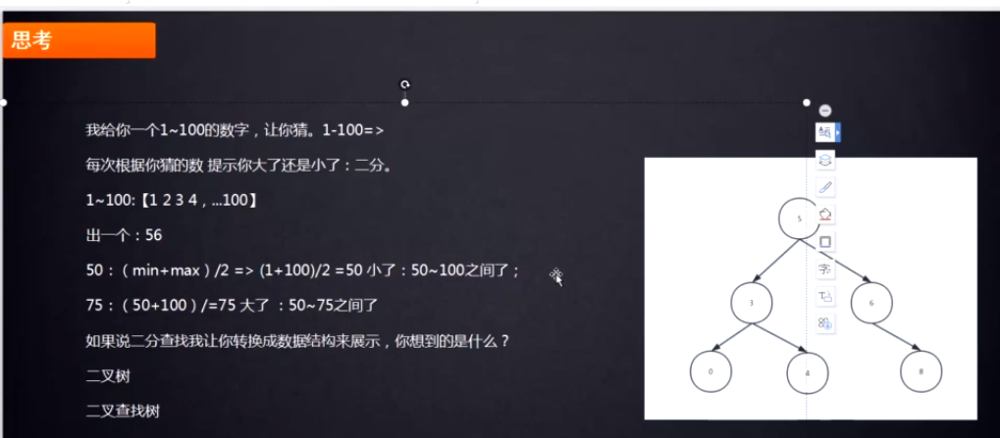
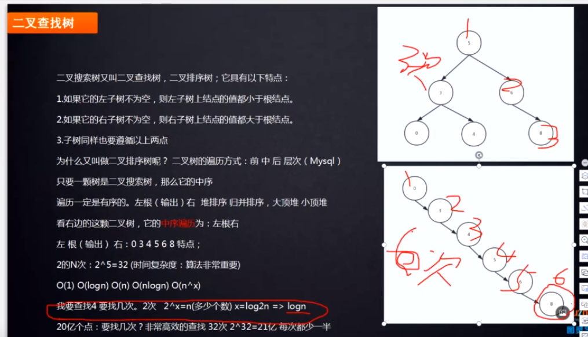
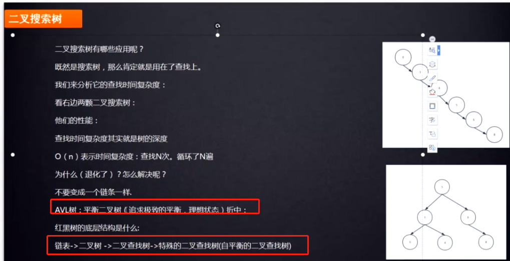
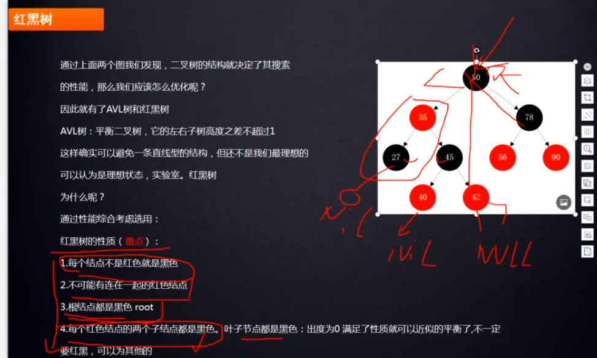
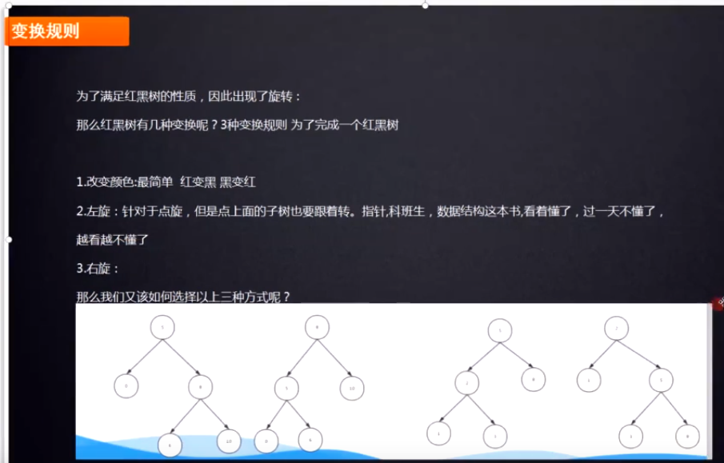
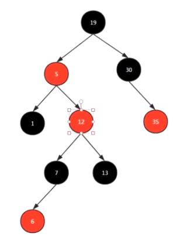
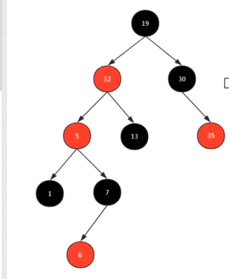

# 你所知道的查找算法有哪些?

- 暴力: 遍历for
- 二分查找: 能做二分查找有一个条件: 有序
- 哈希: 最高效的算法,O(1),
- 索引: 搜索引擎(Lucene)
- bfs&dfs: 图论里面的遍历,所以也可以被称为查找算法.
- 平衡树
- B+树
- B-tree
- 红黑树: 高效的查找算法数据结构,查询、插入、删除操作的时间复杂度均为O(log n)
- 二叉搜索树

# 二分查找转换成什么数据结构

# 二叉搜索树的退化

    二叉查找树可能退化成一条链.
    
    二叉查找树设计的初衷就是想让你用二分查找,提高查询效率,但是如果二叉查找树退化成一条链后,时间复杂度变成O(n).违背了初衷.

    比如,如果有21亿个节点,如果退化成一条链表,查询次数最多为21次,这也太多了,如果是平衡的二叉搜索树,最多32次即可.

# 二叉搜索树的退化解决方案
    
    为了解决二叉搜索树退化成一条链的问题，引出了理想平衡二叉树.
    
    理想平衡的二叉查找树: 追求极致平衡,是一种理想状态,实际应用几乎遇不到这种情况.而且维护成本太高.
    
    我们降低了平衡的标准,所以引入了"适度平衡的二叉搜索树(叫做BBST)"
    
>根据平衡的标准和规则不同,常见的BBST(不是理想平衡,而是适度平衡二叉搜索树)包括AVL树和红黑树.一般我们所说的"平衡二叉搜索树"就是指BBST.
    
AVL树(BBST的一种)具有二叉查找树的全部特性,每个节点的左子树和右子树的高度差最多等于1.基于这种特点就可以保证不会出现一条链的情况

    通过AVL树，我们解决了二叉查找树的缺点。对于有 n 个节点的AVL树，最坏的查找时间复杂度也为 O(logn)。

# 为什么有了AVL这种平衡二叉搜索树还需要红黑树这种平衡二叉搜索树？

虽然avl树解决了二叉查找树退化为一条链的问题，能够把查找时间控制在 O(logn)，不过却不是最佳的，因为avl树要求每个节点的左子树和右子树的高度差至多等于1，这个要求实在是太严了，导致每次进行插入/删除节点的时候，几乎都会破坏avl树的规则，进而我们都需要通过左旋和右旋来进行调整，使之再次成为一颗符合要求的平衡树。

显然，如果在那种插入、删除很频繁的场景中，avl树需要频繁的进行调整，这会使avl树的性能大打折扣，为了解决这个问题，于是有了红黑树

与avl树不同的是，红黑树在插入、删除等操作，不会像avl树那样频繁着破坏avl树的规则，所以不需要频繁的调整，这也是我们为什么大多数情况下使用红黑树的原因

    不过，如果你要说，单单在查找方面的效率的话，avl树比红黑树快,因为avl树更加平衡,树的高度更低.
    所以，也可以说: 红黑树是一种不大严格的平衡树。也可以说是一个折中发方案。放松了平衡的标准.
    红黑树也是平衡二叉树里面的一种.平衡二叉树是一个全集,红黑树是一个子集.

    红黑树的结构: 特殊的二叉查找树.是一种自平衡的二叉查找树

    红黑树就是为了避免二叉树退化成一条链,以及避免像avl树一样,在插入和删除很频繁的场景下,需要频繁的进行调整而诞生的.

    查询、插入、删除操作的时间复杂度均为O(log n)

# 红黑树的特点

    具有二叉查找树的特点的基础之上,要满足红黑树的独特性质,要做很多操作.是不容易的.
    红黑树的5个规则：
    
    1. 每个节点不是红色就是黑点
    2. 根节点都是黑点
    3. 不可能有连在一起的红色节点
    4. 每个叶子节点都是黑色的空节点（NIL），也就是说，叶子节点不存数据
    5. 每个节点，从该节点出发到达叶子节点的所有路径上，都包含相同数目的黑色节点
    

    所有插入的节点是红色.

# 为了要满足红黑树这些性质,要怎么做?

    变换规则是写死的.
    

    什么时候左旋?什么时候右旋?

# 变换演示

    第一步: 先找到6的位置,也就是在7的左边.

    6和7都是红色,不满足红黑树的规定.
    
    此时6的叔叔节点13也是红色的情况下,要变颜色
    
    第二步: 先把6的父节点7和叔叔节点13都变为黑色,把6的爷爷变为红色.
    此时我们把要操作的点变为爷爷节点12了,因为6已经满足红黑树的性质了.

    此时12为红色,12的叔叔节点30位黑色,且当前的节点12为右子树的情况下,
    此时满足左旋的情况,就要左旋.
    

    此时要操作的节点变为了5,节点5是红色,叔叔节点是黑色,但是节点5是左子树,此时满足右旋的条件,就要进行右旋.

    右旋比左旋复杂一步,有一个变颜色的过程.
    把当前节点5的父节点12变为黑色,爷爷节点19变为红色.
    

    
# 参考

- [视频](https://www.bilibili.com/video/av70884620?p=4)