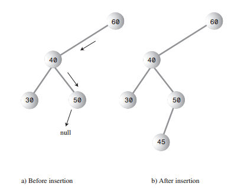
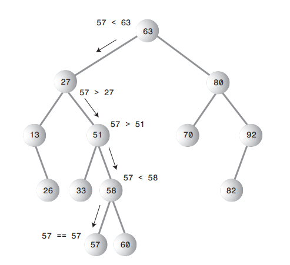
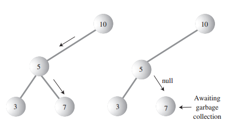
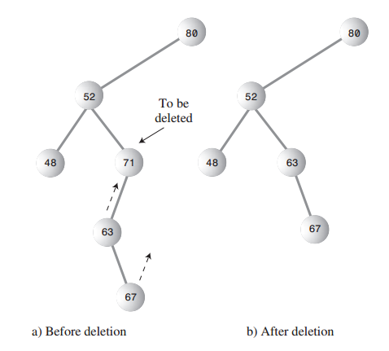

# 二叉树

## 概述

二叉树(Binary Tree)整合了`有序数组和链表`的优点:

- 在一个有序数组中，查找的时间复杂度为O(logN)，但是插入和删除比较慢.
- 在链表中，插入和删除操作的时间复杂度比较快，为O(1)，但是查找比较慢，时间复杂度为O(N).
- 二叉树结合了有序数组的查找快和链表的添加、删除快的优点。

## 常用术语

1. 二叉树(binary tree)：如果树中每个节点最多最多有2个子节点。这样的树就称为二叉树
2. 父节点(Parent Node)：每个节点(除了根)都恰好有一条边向上连接到另外一个节点，上面这个节点就称之为下面这个节点的父节点。
3. 子节点(Child Node)：每个节点都可能有一条或者多条边向下连接到其他节点，下面的这些节点就称为它的子节点。
4. 叶节点(Leaf Node)：没有子节点的节点称之为叶节点。
5. 子树(Child Tree)：每个节点都可以作为子树的根。
6. 访问(Access)：当程序控制流程到达某个节点时，就称为访问这个节点。通常是为了在这个节点进行某种操作，例如查看节点某个数据字段的值。
7. 遍历(tranverse)：遍历树意味着要遵循某种特定的条件访问树中的所有节点。
9. 层(level)：一个节点的层数是指从根节点开始到这个节点有多少"代"。假设根是第0层，它的子节点就是第一层，它的孙节点就是第二层，以此类推
10. 关键字(keys)：对象中通常有一个字段被指定为关键字值，如果用圆表示一个对象，那么一般将对象的这个字段的值显示在这个圆中。
11. 二叉搜索树(binary search tree)：如果我们给二叉树加一个额外的条件，就可以得到一种被称作二叉搜索树(binary search tree)的特殊二叉树。二叉搜索树要求：一个节点的左子节点的关键字值小于这个节点，右子节点的关键字大于或等于这个父节点。
12. 非平衡树(Unbalanced Tree)：非平衡树指的是它们大部分节点在根的一边或者另一边。也有可能树总体是平衡的，但是个别的子树是不平衡的.例如我们在树中插入1到100， 如果第一个插入的是90，那么意味着根节点是90，那么意味着大部分节点都会在左子树上。

## 二叉搜索树的相关操作 

### 插入做操

如果插入的关键字比当前节点小，则应该插入左边，否则应该插入右边。如果左子节点(或右)不为空，则应该继续判断，如此递归，直到找到某个节点的左子节点(或者右子节点)为null的那个节点，将这个节点设置为其左子节点(或者右子节点)。

特别的，如果树的根节点为null，则这个节点直接设置为根节点。

### 查找操作

查找操作与插入操作按照相同的逻辑找到合适的位置，不同的是，如果一个节点的关键字值等于查找关键字，则返回这个节点。如果找到最后一层都没有找到这个节点，则返回null。

查找最小值：找最小值时，先走到根的左子节点处，然后接着走到那个节点的左子节点，如此类推，直到找到一个没有左子节点的那个节点，这个节点的值就是最小值。

查找最大值：找最大值时，先走到根的右子节点处，然后接着走到那个节点的右子节点，如此类推，直到找到一个没有右子节点的那个节点，这个节点的值就是最大值。

### 删除操作

删除操作是二叉树中相对复杂的。分为三种情况：

1. 要删除的节点是叶节点，也就是没有子节点，直接删除

2. 要删除的节点(A)有一个子节点(B)，A的父节点是P。那么只要将P的子节点设置为B即可。当然，如果A原来是P的左子节点，那么就将B设置为P的左子节点，如果A是P的右子节点，就将B设置为P的右子节点。

3. 要删除的节点有两个子节点。这是最复杂的一种情况，因为删除当前节点(A)后，我们要确定其左子节点(AL)还是右子节点(AR)挂到当前节点的父节点上(P)。事实上，任选一种都可以。难题在于，假设是左子节点(AL)挂到了P上，那么右字节点(AR)应该如何处理呢？关于这个，笔者有一个窍门：如果是将左子节点(AL)挂到了P上，那么就将右字节点(AR)挂到以AL为根节点的子树的值最大的那个节点；如果是将右子节点(AR)挂到了P上，那么就将左字节点(AL)挂到以AR为根节点的子树的值最小的那个节点。

## 二叉树的效率

在二叉树是一棵满树的情况下，每一层对应的总节点数如下：

假设层数用L表示，树的总结点数用N表示，可以看到L与N满足以下关系：`N=2^L-1`
, 两边都加上1,得到: `N+1=2^L`,  则有：`L=log2(N+1)`

对于二叉搜索树来说，不管插入还是查找、还是删除，都需要先找到对应的节点，而树有几层，也就意味着最多会查找多少次。因此查找的时间复杂度最大就是O(logN)。对于添加和删除操作，查到要操作的节点后，其它操作都是固定的，在大O表示法中这段操作消耗的时间可以忽略不计。意味着，对于插入和删除操作，时间复杂度最大的情况下，也是O(logN)。

[来源](http://www.tianshouzhi.com/api/tutorials/basicalgorithm/308)