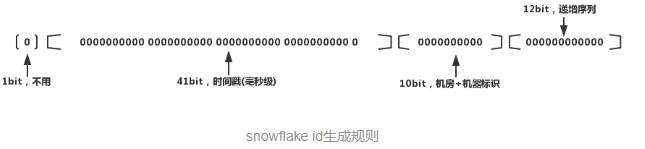

# 单机环境中生产唯一ID

在过去单机系统中，生成唯一ID比较简单，可以使用mysql的自增主键或者oracle中的sequence, 在分布式系统中，以上策略就会有问题了，就会有重复ID的情况了

# 为什么分布式系统需要用到ID生成系统

在分布式系统中，有时候需要对大量的数据进行唯一标识(需要使用全局唯一ID的)。

如在美团点评的金融、支付、餐饮、酒店、猫眼电影等产品的系统中，数据日渐增长，对数据库的分库分表后需要有一个唯一ID来标识一条数据或消息，数据库的自增ID显然不能满足需求；

特别一点的如订单号、骑手、优惠券也都需要有唯一ID做标识。此时一个能够生成全局唯一ID的系统是非常必要的。

>本文讲述的案例不仅仅局限全局唯一的ID作为数据库主键，也可以适用于其他分布式环境中的唯一标示，比如全局唯一事务ID，日志追踪时的唯一标示等。

首先，需要确定全局唯一ID是整型还是字符串？如果是字符串，那么现有的UUID(生成的就是字符串)就完全满足需求，不需要额外的工作。缺点是字符串作为ID占用空间大，索引效率比整型低。如果采用整型作为ID，那么首先排除掉32位int类型，因为范围太小，必须使用64位long型.

采用整型作为ID时，如何生成自增、全局唯一且不重复的ID？

# 业务系统对ID号的要求有哪些呢？

1. 全局唯一性：不能出现重复的ID，最基本的要求。
2. 趋势递增：在主键的选择上面我们应尽量使用有序的主键保证写入性能。
3. 单调递增：保证下一个ID一定大于上一个ID。
4. 信息安全：如果ID是连续递增的，恶意用户就可以很容易的窥见订单号的规则，从而猜出下一个订单号，如果是竞争对手，就可以直接知道我们一天的订单量。所以在某些场景下，需要ID无规则。
5. 需要ID生成系统可用性极高。想象以下，如果ID生成系统瘫痪，那么整个业务无法进行下去，那将是一次灾难。
6. ID尽可能的短,减少存储的空间以及增加查询的效率
7. 可用的时间足够久,一些类SNOWFLAKE的算法会在64位的ID中利用部分位数（如41）代表时间戳，当这部分时间戳的空间用完了，这个服务就不work了
   
>第3、4两个需求是互斥的，无法同时满足。

因此，总结ID生成系统还需要满足如下的需求：

1. 高可用，可用性达到5个9或4个9。
2. 高QPS，性能不能太差，否则容易造成线程堵塞。
3. 平均延迟和TP999(保证99.9%的请求都能成功的最低的延迟)延迟都要尽可能低,

---
    QPS(query per second): 每秒查询速率,对服务器在规定时间内所处理请求多少的衡量标准.
    TPS(transactions per second): 服务器每秒处理的事务数.
---

# ID生成系统的类型(ID生成方案)

- UUID(不需要独立的服务器,可以本地生成)
- SnowFlake雪花算法
- 数据库自增ID机制
- 第三方软件生成（Redis）
- MongoDB的ObjectId(不需要独立的服务器,可以本地生成)

## UUID

UUID一般用36个字符(32个16进制字符+4个-)表示,UUID是指在一台机器在同一时间中生成的"字符序列"在"所有机器"中都是唯一的。按照开放软件基金会(OSF)制定的标准计算，用到了`以太网卡地址、当前纳秒级时间、芯片ID码和许多可能的数字.`

UUID由以下几部分的组合：

1. 当前时间。
2. 全局唯一的IEEE机器识别号: 如果有机器的网卡，从网卡MAC地址获得这个机器识别码，没有网卡以其他方式获得。

标准的UUID格式为：xxxxxxxx-xxxx-xxxx-xxxx-xxxxxxxxxxxx (8-4-4-4-12)，以连字号分为五段形式的36个字符，示例：550e8400-e29b-41d4-a716-446655440000.

>Java标准类库中已经提供了UUID的API: `UUID.randomUUID()`

从理论上讲，如果一台机器每秒产生1000万GUID，则可以保证（概率意义上）3240年不重复

优点: 

- 简单,UUID可以做到防止ID冲突,而且是本地生成，没有网络消耗,不需要远程调用,时延低,效率非常高.
- 扩展性好，基本可以认为没有性能上限

缺点(太长+无序): 

- 生成的 ID 是无序性的，不能做到趋势递增
- UUID太长，不易存储,16字节128位(因为2个16进制字符用一个字节表示,所以32个字符,用16个字节表示)，通常以36长度的字符串(还有4个-)表示，很多场景不适用。
- 信息不安全：基于MAC地址生成UUID的算法可能会造成MAC地址泄露，这个漏洞曾被用于寻找梅丽莎病毒的制作者位置。
- 由于是字符串并且不是递增，所以不太适合用作主键，比如做DB主键的场景下，UUID就非常不适用。
- UUID往往用字符串存储，作为主键建立索引查询效率低(索引关联效率较低)，常见优化方案为“转化为两个uint64整数存储”或者“折半存储”（折半后不能保证唯一性）

## SnowFlake雪花算法

雪花ID生成的是一个64位的二进制正整数，然后转换成10进制的数。64位二进制数由如下部分组成：



优点:

- 简单高效，生成速度快,无网络调用，高效可靠.
- 时间戳在高位，自增序列在低位，整个ID是趋势递增的，按照时间有序递增。
- 灵活度高，可以根据业务需求，调整bit位的划分，满足不同的需求。

缺点: 

- 依赖机器的时钟，如果服务器时钟回拨，会导致重复ID生成。
- 在分布式环境上，每个服务器的时钟不可能完全同步，有时会出现不是全局递增的情况(但是是趋势递增的)。

## 数据库自增ID机制(来自Flicker的解决方案)

利用数据库自增ID + replace_into实现唯一ID的获取,Oracle可以用SEQUENCE，MySQL可以用主键的AUTO_INCREMENT,

```sql
create table t_global_id(
    id bigint(20) unsigned not null auto_increment,
    stub char(1) not null default '',
    primary key (id),
    unique key stub (stub)
) engine=MyISAM;
```

```sql
  当我们插入记录后，执行SELECT * from t_global_id，查询结果就是这样的：
  
  +-------------------+------+
  | id                | stub |
  +-------------------+------+
  | 72157623227190423 | a    |
  +-------------------+------+
  
  在我们的应用端需要做下面这两个操作，在一个事务会话里提交：
  # 每次业务可以使用以下SQL读写MySQL得到ID号
  replace into t_golbal_id(stub) values('a');
  # 可以递增的获取上次插入的id
  select last_insert_id();
  
  这样我们就能拿到不断增长且不重复的ID了。到上面为止，我们只是在单台数据库上生成ID
```

replace into跟insert功能类似，不同点在于：replace into首先尝试插入数据列表中，如果发现表中已经有此行数据（根据主键或唯一索引判断）则先删除，再插入。否则直接插入新数据。

当然为了避免数据库的单点故障，最少需要两个数据库实例，通过区分auto_increment的起始值和步长来生成奇偶数的ID。如下：

```sql
Server1：
auto-increment-increment = 2
auto-increment-offset = 1

Server2：
auto-increment-increment = 2
auto-increment-offset = 2
```

优点: 

- 简单,充分借助数据库的自增ID机制，可靠性高
- 生成有序的ID,数字ID天然排序，对分页或者排序这样的需求,效率会更高

缺点: 

- `在单个数据库`或`读写分离`或`一主多从`的情况下，只有一个主库可以生成。有单点故障的风险。
- 在性能达不到要求的情况下，想要水平扩展比较困难.
- 依赖数据库，当数据库异常时整个系统不可用
- 不同数据库语法和实现不同，数据库迁移的时候或多数据库版本支持的时候需要处理
- 数据在插入前，无法获得ID。数据在插入后，获取的ID虽然是唯一的，但一定要等到事务提交后，ID才算是有效的。有些双向引用的数据，不得不插入后再做一次更新，比较麻烦。

### 优化方案

针对主库单点，如果有多个Master库，则每个Master库设置的起始数字不一样，步长一样，可以是Master的个数。比如：Master1 生成的是 1，4，7，10，Master2生成的是2,5,8,11 Master3生成的是 3,6,9,12。这样就可以有效生成集群中的唯一ID，也可以大大降低ID生成数据库操作的负载。

我们可以部署N台数据库实例，每台设置成不同的初始值，自增步长为机器的台数。每台的初始值分别为1,2,3...N，步长为N。

```
A：1，1+N，1+2N
B：2，2+N，2+2N
C：3，3+N，3+2N
```


以上方案虽然解决了性能问题，但是也存在很大的局限性：

- 系统水平扩容困难：系统定义好步长之后，增加机器之后调整步长困难。如果要添加机器怎么办？假设现在只有一台机器发号是1,2,3,4,5（步长是1），这个时候需要扩容机器一台。可以这样做：把第二台机器的初始值设置得比第一台超过很多，比如14（假设在扩容时间之内第一台不可能发到14），同时设置步长为2，那么这台机器下发的号码都是14以后的偶数。然后摘掉第一台，把ID值保留为奇数，比如7，然后修改第一台的步长为2。让它符合我们定义的号段标准，对于这个例子来说就是让第一台以后只能产生奇数。扩容方案看起来复杂吗？貌似还好，现在想象一下如果我们线上有100台机器，这个时候要扩容该怎么做？简直是噩梦。
- 数据库压力大：每次获取一个ID都必须读写一次数据库。当然对于这种问题，也有相应的解决方案，就是每次获取ID时都批量获取一个区间的号段到内存中，用完之后再来获取。数据库的性能提高了几个量级。
- 也是强依赖与数据库，并且如果其中一台挂掉了那就不是绝对递增了。

## 第三方软件生成（Redis）

采用一个集中式ID生成器，它可以是Redis，也可以是ZooKeeper.

一般来说，越是复杂的方案，越不可靠，并且测试越痛苦。

Redis实现了一个原子操作INCR和INCRBY实现递增的操作。当使用数据库性能不够时，可以采用Redis来代替，同时使用Redis集群来提高吞吐量。可以初始化每台Redis的初始值为1,2,3,4,5，然后步长为5。各个Redis生成的ID为：

```
A：1，6，11，16，21
B：2，7，12，17，22
C：3，8，13，18，23
D：4，9，14，19，24
E：5，10，15，20，25
```

优点

- 不依赖于数据库，灵活方便，且性能优于数据库。
- 数字ID天然排序，对分页或者需要排序的结果很有帮助。

缺点：

- 这种方式最大的缺点是复杂性太高，需要严重依赖第三方服务，而且代码配置繁琐。
- 这个都不是最大的问题,可以解决.

## MongoDB的ObjectId(唯一性是ObjectId的最终诉求)

可以放到客户端进行ID 的生成，没有单点故障，性能也有一定保证，而且不需要独立的服务器。

是一种全数字的全局唯一ID，为什么我比较喜欢呢，首先它是全数字，保存和计算都比较简单(想一下MySQL数据库中对数字以及字符串的处理效率)，而且从这个ID中可以得到一些额外的信息，不想一些UUID、sha等字符串对我们几乎没有太大帮助.

>本算法来自于mongodb

ObjectId使用12字节的存储空间，每个字节存两位16进制数字，是一个24位的字符串。其生成方式如下：

12位生成规则：`[0,1,2,3] [4,5,6] [7,8] [9,10,11]`,分别表示: `时间戳 |机器码 |PID |计数器`

1.时间戳: 4个字节,是从标准纪元开始的时间戳，单位为秒，有如下特性：

---
- 时间戳与后边5个字节一块，保证秒级别的唯一性；
- 保证插入顺序大致按时间排序；
- 隐含了文档创建时间；
- 时间戳的实际值并不重要，不需要对服务器之间的时间进行同步（因为加上机器ID和进程ID已保证此值唯一，唯一性是ObjectId的最终诉求）

>上面牵扯到两个分布式系统中的概念：分布式系统中全局时钟同步很难，基本不可能实现，也没必要；时序一致性（顺序性）无法保证.
---

2.机器ID: 是服务器主机标识，通常是机器主机名的hash散列值。
3.PID: 同一台机器上可以运行多个mongod实例，因此也需要加入进程标识符PID。
4.前9个字节保证了同一秒钟不同机器不同进程产生的ObjectId的唯一性。后三个字节是一个自动增加的计数器（一个mongod进程需要一个全局的计数器），保证同一秒的ObjectId是唯一的。同一秒钟最多允许每个进程拥有（256^3 = 16777216）个不同的ObjectId。

总结一下：时间戳保证秒级唯一，机器ID保证设计时考虑分布式，避免时钟同步，PID保证同一台服务器运行多个mongod实例时的唯一性，最后的计数器保证同一秒内的唯一性（选用几个字节既要考虑存储的经济性，也要考虑并发性能的上限）。

###  改为全数字

上面mongodb中保存的是16进制，如果不想用16进制的话，可以修改为10进制保存，只不过占用空间会大一些。

后面的计数器留几位，具体就看你们的业务量了，设计的时候要预留出以后的业务增长量。单进程内的计数器可以使用atomicInteger。

# 总结

关于分布式全局唯一ID的生成，各个互联网公司有很多实现方案，比如美团点评的Leaf-snowflake，用zookeeper解决了各个服务器时钟回拨的问题，弱依赖zookeeper。以及Leaf-segment类似上面数据库批量ID获取的方案。

>注意：没有完美的方案，只有适合自己的方案，还请读者根据具体的业务进行取舍.

# 来源

[https://www.jianshu.com/p/9d7ebe37215e](https://www.jianshu.com/p/9d7ebe37215e)
[https://www.jishuwen.com/d/2Btw](https://www.jishuwen.com/d/2Btw)
[https://tech.meituan.com/2017/04/21/mt-leaf.html](https://tech.meituan.com/2017/04/21/mt-leaf.html)
[https://www.liaoxuefeng.com/article/1280526512029729](https://www.liaoxuefeng.com/article/1280526512029729)