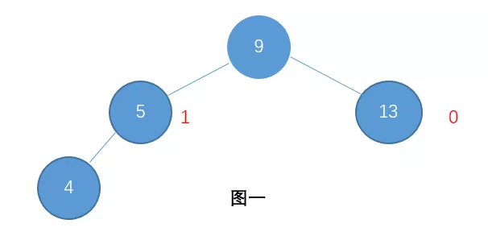
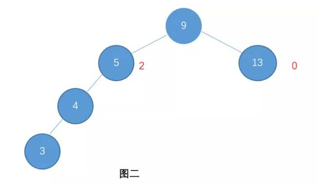
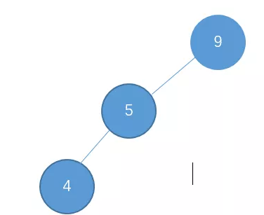
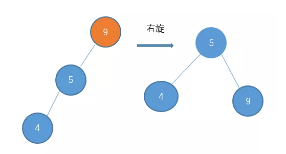

# AVL树的由来

我们来介绍最为经典的一种平衡二叉搜索树(BBST),也就是AVL树

从二叉搜索树(BST)的静态操作和动态操作的角度讲,BST有很高的效率,但是毕竟它并不能保证这一点,其原因在于它的高度,无论是从平均情况 还是最坏情况都不能保证做到足够的低(可能会形成一条链),具体来说 也就是做到logn以下.

当然在BST中的确存在这么一种特殊的类型,也就是所谓的完全二叉树(Complete Binary Tree),它的高度可以控制到最小,也就是logn,然而相对于整体的BST,这类BST的数量极少,而且我们如果需要将任何一棵树,转化为一棵完全二叉树,所需要的成本也太高,也正因为此,我们的建议是,或许应该适当地放松所谓平衡的标准,也就是说 我们只需考察某一类在渐近意义下不超过O(logn)高度的树即可,而这样一类树,也就是我们所说的平衡二叉搜索树(Balanced Binary Search Tree)

比如我们这一节将要介绍的AVL树就是在这种意义下的一种BBST,以AVL树为代表的这些BBST,首先并没有放弃渐近意义logn的复杂度底线,同时正因为它已经适度地放松了平衡的标准,对于任何一棵这样意义下的BBST,在其生命期内即便在某次操作之后,它不再满足BBST的条件,也就是说游离到BBST这个范畴之外,我们也可以通过上节所介绍的等价变换,迅速地将其重新转化为,一棵等价的BBST,也就是说 可以通过极小的代价,就使之重新归入BBST的范畴,而这种极小的代价是多少呢？不出你的意料 依然是不超过logn

    令刚刚失衡的搜索树重新恢复为一棵BBST的过程,也称作重平衡rebalance.而对于包括AVL树在内的各种BBST而言其核心的技巧无非两条: 第一 如何来界定一种适度的平衡标准,其次则是一整套重平衡的技巧和算法

# AVL树

什么是AVL树，Adelson-Velsky & E. Landis 取名字的缩写,

    avl树的特点:

- 具有二叉查找树的全部特性
- 每个节点的左子树和右子树的高度差最多为1(避免了变成一条链)

# 在AVL的意义下,什么叫作适度的平衡?凭借什么来判断一棵树,是否是在AVL意义下的适度平衡?

我们需要用到这样一个指标,叫平衡因子.所谓节点的平衡因子balanced factor：也就是任何一个节点的左子树高度与右子树高度之差就是这个节点的平衡因子：平衡因子 = 左子树的高度 - 右子树的高度

    那么根据AVL树发明者的定义：所谓AVL树就是其中所有节点的平衡因子都不超过1,也不小于-1.
    说白了就是"每个节点的左子树和右子树的高度差最多为1"

    AVL树本身只考虑每个节点左右子树的高度差

>AVL树未必是完全二叉树,也就是说它未必是理想平衡,那么反过来 如此定义的AVL树是否的确是适度平衡的呢？答案是肯定的。

    适度平衡也就是说 一棵节点数为n的AVL树其高度h在渐近意义下是不超过logn的.
    
    也就是avl树的查找/insert/delete的时间复杂度都是logn.

# avl树示例

    图一就是一颗AVL树了，而图二则不是(节点右边标的是这个节点的高度)。

    对于图二，因为节点9的左孩子高度为2，而右孩子高度为0。他们之间的差值超过1了。所以就不是avl树
    

    avl树就可以保证不会出现大量节点形成一条链

### 听起来这种树还不错，可以对于图1，如果我们要插入一个节点3，按照查找二叉树的特性，我们只能把3作为节点4的左子树插进去，可是插进去之后，又会破坏了AVL树的特性，那我们那该怎么弄？

    要通过左旋和右旋来恢复平衡.

---
    举一个右旋的例子:

    例如:我们在进行节点插入的时候，可能会出现节点都倾向于左边的情况，例如

    我们把这种倾向于左边的情况称之为 左-左型。这个时候，我们就可以对节点9进行右旋操作，使它恢复平衡。

    即：顺时针旋转两个节点，使得父节点被自己的左孩子取代，而自己成为自己的右孩子

---

# 在插入/删除的过程中，会出现破坏AVL树的特性，需要通过左旋和右旋维持avl树的平衡

>具体的过程可以看这个:[完整示例](https://mp.weixin.qq.com/s/dYP5-fM22BgM3viWg4V44A)