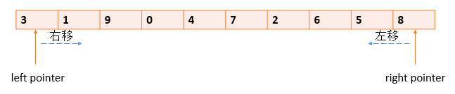
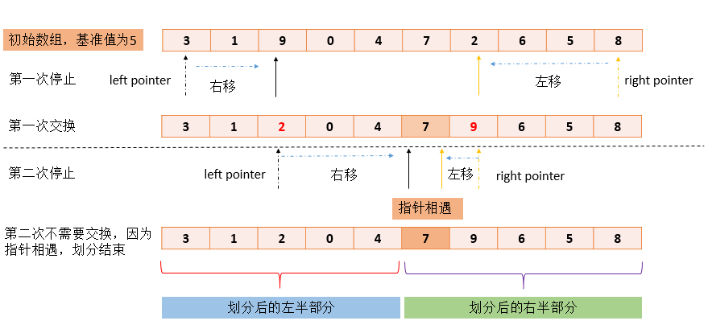
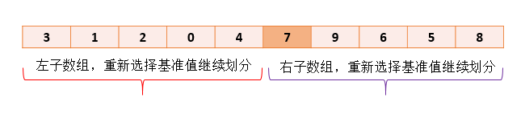

## 快速排序

    毫无疑问，快速排序(quick sort)是最流行的排序算法，因为有充足的理由，`在大多数情况下，快速排序都是最快的，执行时间为O(n*logn) 级.`

### 快速排序和归并排序对比

    归并排序(merge sort)也是对数组进行进行拆分，然后进行排序，快速排序和归并排序都是分治法的典型应用。 
    不过不同的是，二者的划分标准不同:

* 归并排序中，是将数组不断的划分成两个大小相同的子数组，实际上就是取数组下标的中间值为标准进行划分,例如{3,1,9,0,4,7,2,6,5,8}划分后的结果为{3,1,9,0,4 }和{7,2,6,5,8}.
* 快速排序中，数组的划分是基于某一个基准值(pivot)的，拆分时，将所有大于基准值的元素放在一组，将所有小于基准值的元素放在另一组。 比如基准值为5，那么{3,1,9,0,4,7,2,6,5,8}划分后的结果为{3, 1, 2, 0, 4}和{7, 9, 6, 5, 8}

>需要注意的是，归并排序由于是根据数组下标中间值划分的，因此切分后的两个子数组的长度最多相差1，但是对于快速排序，由于是根据基准值来进行划分，如果基准值选择的不好，例如基准值等于1，那么{3,1,9,0,4,7,2,6,5,8}划分后的结果为{1}和{3,9,0,4,7,2,6,5,8 }，因此在快速排序中，我们需要对划分操作有特别的关注。

### 划分(partition)

    划分是快速排序的根本机制，依赖于基准值。划分数据就是把数据分成两组，所有大于基准值的数据在一组，所有小于基准值的在一组。
    比如基准值为5，那么{3,1,9,0,4,7,2,6,5,8}划分后的结果为{3, 1, 2, 0, 4 }和{7, 9, 6, 5, 8}。

>理论上，可以使用任何值作为基准值，这个值可以包含在要排序的数组中，也可以是其他任意数字，基准值选择的有一定的技巧，如果选择的基准值比数组中任意一个元素都要大或者小的话，那么就相当于没有进行划分，最简单的基准值的选择方法，就是从数组中随机选择一个元素，当做基准值。

划分算法由两个指针来完成，这两个指针分别指向数组的开始和结尾，左指针left pointer向右移动而右指针right pointer向左移动.如图:

#### 停止和交换

1. 当left pointer 遇到比基准值小的值时它继续右移，因为这个数据项的位置已经在数组的小于基准值得一边了。当遇到基准值大的数时，它就停下来。
2. 类似的，当right pointer 遇到比特定值大的数时就继续左移，当遇到比基准值小的数时就停下来。
3. 当都停下来的时候left pointer 和right pointer 都指向了在数组错误一方位置上的数据项，所以交换这两个数据项。
4. 交换之后，继续移动两个指针，然后再在合适的位置停止、交换数据，不断重复此过程。当right pointer和left pointer相遇时，划分完成。



* 在第一次划分时，left pointer需要在一个比自己大的位置上停下来，9是第一个数字，所以此时left pointer指向9，right pointer需要在第一个比自己小的位置上停下来，所以right pointer指向2，此时交换两个指针位置指向的数字，即9和2的位置。
* 第二次划分时，left pointer继续右移，遇到7，比自己大，停下来；此时right pointer右移，也到了7的位置，两个指针相遇，划分完成。 此时在相遇数组下标左边的元素，都比基准值5小，而相遇下标右边的元素都大于等于基准值5，划分因此完成。

### 快速排序的核心思想

>基本的快速排序很简单，就是通过把一个数组划分(partition)为两个子数组，然后递归地调用自身，将子数组划分为更细的子数组，为每一个子数组进行快速排序来实现的，`当划分(partition)操作完成时，即当划分后的子数组只剩一个元素时，划分结束`。排序也就完成了，听起来不可思议，但是事实就是这样。

每一次划分(partition)操作，在快速排序中称之为一趟，我们可以通过将上面划分后的两个子数组，再分别进行一趟快速排序。



每个子数组在继续进行划分的时候，需要重新选择基准值，也就是每一趟都需要重新选择一个基准值，为了方便，我们通常选择划分后的子数组的第一个元素作为基准值，因此左半部分的基准值是3，右半部分的基准值是7.`当划分后的子数组只剩一个元素时，划分结束。`

### 三数据项取中(median-of-three)

#### 为什么基准值的选择很重要

在上例中，我们对基准值的选择，总是选择划分后数组的第一个元素arr[start]，这种方式可能遇到的问题是，划分后的数组不够均匀，这个我们在前面讲解划分(partition)的概念的时候已经提到过。`划分不均匀，会导致排序的效率降低，因为对于较大数组必须进行更多次的划分`

理想状态下，应该选择数据项中的`中值`作为枢纽，也就是说，`应该有一半的数据项大于枢纽，一半的数据项小于枢纽`，这会使数组被划分成两个大小相等子数组。`可是如果没有选择好枢纽，那么快排的结果，就是划分为一大一小两个子数组进行排序，这样会降低算法的效率，因为较大的子数组要被划分更多次。`

#### 快排最坏情况

N个数据项数组的最坏情况是一个子数组只有一个数据项，而另一个子数组有N-1个数据项。如果在每一趟划分中都出现这种1个数据项和N-1个数据项的分割，那么每一个数据项都需要一个单独的划分步骤。在逆序排列的数据项中实际上发生的就是这种情况，在所有的子数组中，枢纽都是最小的数据项，此时算法的效率降低到了。

#### 如何选取基准值

人们已经设计出很多更好的基准值选择方法，方法都是为了避免枢纽选择最大或者最小的值。理想情况下，基准值应该是一个中间值，但是选择出一个中间值，可能效率并不太高，因此采取了一个折中的方法，找到数组中第一个、最后一个以及中间位置的数据，选择中间位置的数据作为基准值，这种方法称之为"三数据项取中"(media-of-three)。三数据取中很好实现，只需要将getPivot方法改为如下即可：

```java
public class Partition {
    private static int getPivot(int[] arr,int start,int end) {
        int median = arr[start];
        // 保证有3个数据项,如果不够3项，直接返回子数组的第一个元素
        if(end - start >= 2){
            int left = arr[start];
            int right = arr[end];
            int middle = arr[(start+end)/2];
            // middle大小居中，所以作为基准值
            if (left < middle && middle < right) {
                median = middle;
            // right大小居中，所以right作为基准值
            } else if (left < right && right < middle) {
                median = right;
            // left大小居中，所以left作为基准值
            } else {
                median = left;
            }
        }
        return median;
    }
}
```