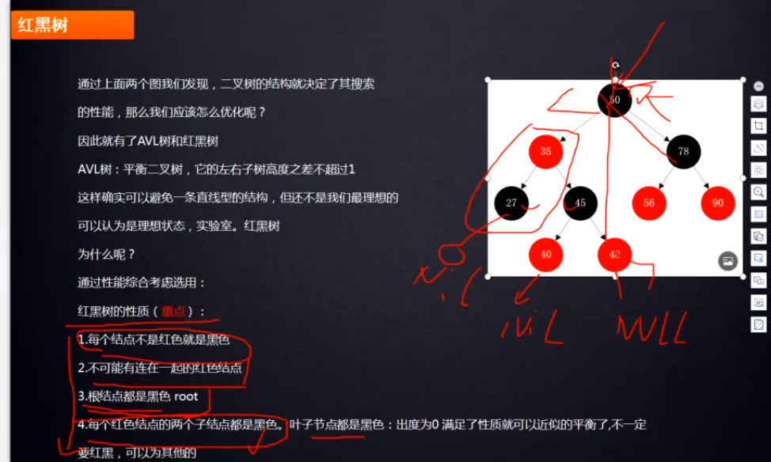

# 红黑树的性质

    红黑树是一颗自平衡的二叉查找树,满足二叉树的所有特点,而且有自己独特的性质.
    红黑树的5个规则：
    
    1. 每个节点不是红色就是黑点
    2. 根节点都是黑点
    3. 不可能有连在一起的红色节点
    4. 叶子节点都是黑色的空节点（NIL），也就是说，叶子节点不存数据
    5. 每个节点，从该节点出发到达叶子节点的所有路径上，都包含相同数目的黑色节点
    6. 所有插入的节点是红色.
    
    只要满足这些性质,就可以达到一颗相对平衡的二叉查找树.这个是前人的总结出来的.而且经过验证的.我们直接用即可.

# 所有插入的节点都是红色.为什么呢?
    
    假设一颗只有一个节点的树,这个节点就是根节点,是黑色,如果插入的节点是黑色的话,
    这棵树永远满足红黑树的性质,就不会出现变换了.