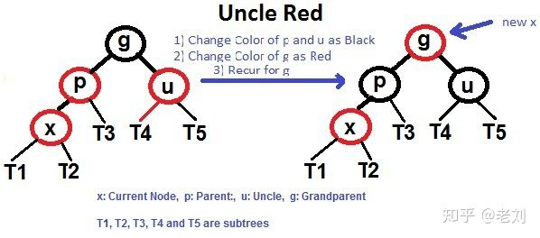
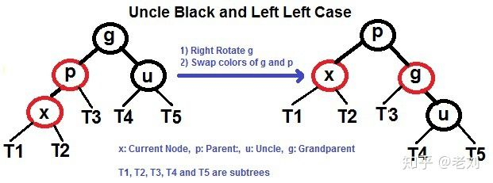
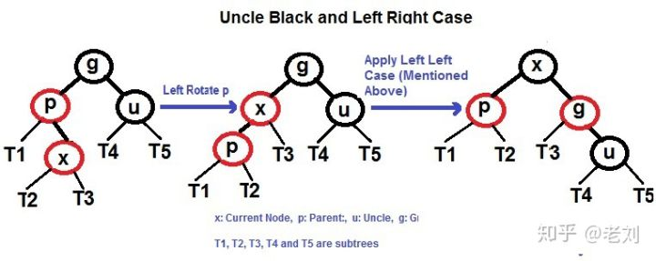
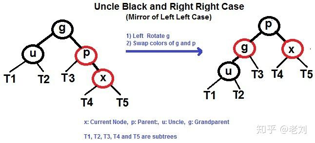
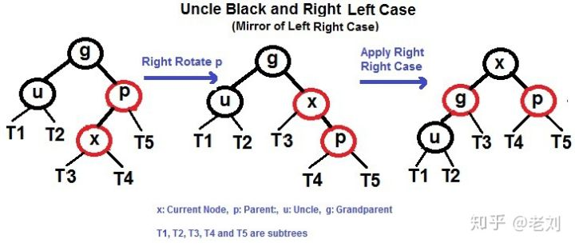

# 以插入节点为例

    我们插入的新节点为x
    
    1. 将新插入的节点标记为红色
    
    2. 如果x是根节点,则直接标记为黑色.
    
    3. 如果x不是根节点,并且x的父亲p为红色,x的叔叔u也是红色
    
    那么将x的父亲p和叔叔u都变为黑色,将x的爷爷g变为红色.
    此时我们操作的节点由x变为了x的爷爷g.
    然后从步骤2,3再重新开始.发现g是根节点,直接变为黑色,然后结束.
    

    4. 如果x不是根节点,并且x的父亲p为红色,x的叔叔u也是黑色
    
    这种情况下分4种情况处理:
    当出现 uncle叔叔 是黑色的时候我们第一步要考虑的是 旋转
    
    第一种情况: 左左 (p 是 g 的左孩子，并且 x 是 p 的左孩子)

        
    
    这种情况很简单，想象这是一根绳子，手提起 P 节点，然后变色即可
    
    第2种情况: 左右 (p 是 g 的左孩子，并且 x 是 p 的右孩子)
    

    先绕p左旋,然后就变成了左左的情况.    
    
    第3种情况: 右右 (p 是 g 的右孩子，并且 x 是 p 的右孩子)
    
    
    
    与左左情况一样，想象成一根绳子
    
    第4种情况: 右左 (p 是 g 的右孩子，并且 x 是 p 的左孩子)
    
    
    
    先绕p右旋,然后变成了右右的情况.

# 案例

    插入 10，20，30，15 13到一个空树中    
    
    走一遍流程图.

# 参考

- [非常好的文章](https://zhuanlan.zhihu.com/p/79980618)    