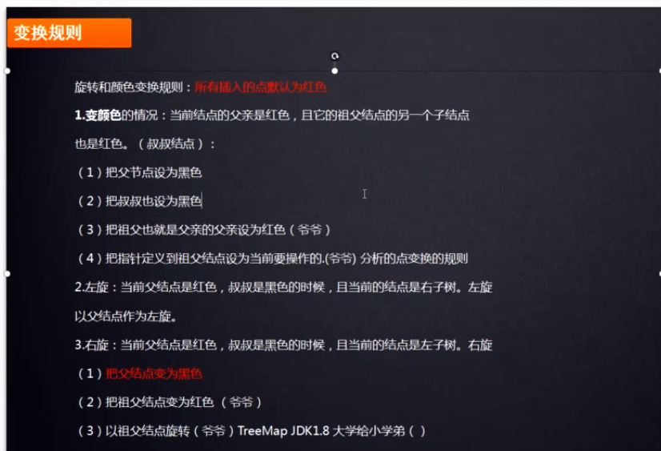
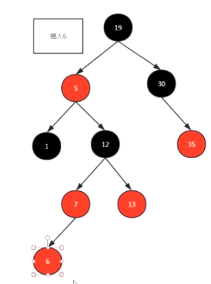
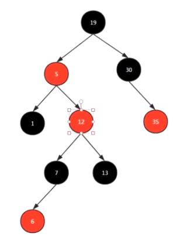
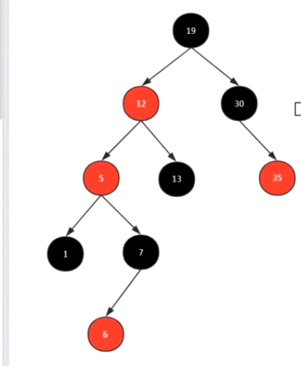
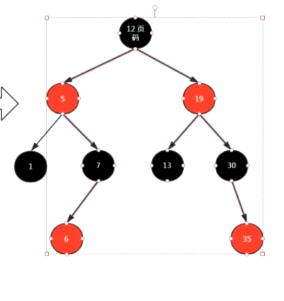

# 什么时候左旋?什么时候右旋?什么时候进行染色呢?

    破坏了规则的情况下,要进行旋转和染色.这个是重点,如果不懂就白学了.

    上面的这个变换规则不全.直接看06_变换规则详解即可.
    这篇主要是辅助理解

# 变换演示

    第一步: 先找到6的位置,也就是在7的左边.(满足二叉查找树的 左小右大 的规则)

    6和7都是红色,不满足红黑树的规定.
    
    此时6的叔叔节点13也是红色的情况下,要变颜色
    
    第二步: 先把6的父节点7和叔叔节点13都变为黑色,把6的爷爷变为红色.
    此时我们把要操作的点变为爷爷节点12了,因为6已经满足红黑树的性质了.

    此时12为红色,12的叔叔节点30位黑色,且当前的节点12为右子树的情况下,
    此时满足左旋的情况,就要左旋.
    

    此时要操作的节点变为了5,节点5是红色,叔叔节点是黑色,但是节点5是左子树,此时满足右旋的条件,就要进行右旋.

    右旋比左旋复杂一步,有一个变颜色的过程.
    把当前节点5的父节点12变为黑色,爷爷节点19变为红色.
    

    
# 参考

- [视频](https://www.bilibili.com/video/av70884620?p=3)