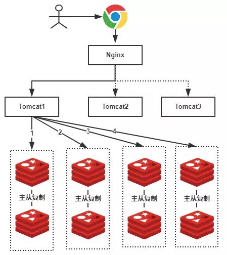
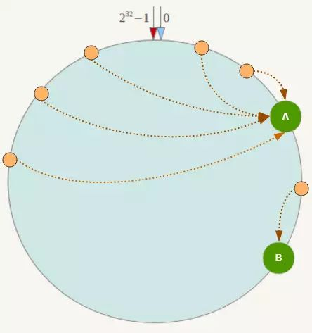

# 一致性hash算法详解

    案例: 从redis集群中获取图片的路径

    第一步: 我们使用redis存储图片路径,key是图片名称,value为图片所在文件服务器的路径.
    我们需要根据key图片的文件名查找该文件所在文件服务器上的路径,数据量大概有2000W左右

    
    第二步: 有4台master,每台master有一台slave.一共8个redis服务器,每台服务器大概含有500W条数据.

    第三步: 一张图片要存储到哪个redis服务器中呢?可以使用hash的方式,比如a.png,对图片的名字进行hash运算,
    然后对4取模.公式为: hash(a.png) % 4

    第4步: 第三步有哪些问题呢? 服务器数量变动的时候
    比如我们增加了一台缓存服务器，那么缓存服务器的数量就由4台变成了5台, hash(a.png) % 4 肯定不等于
    hash(a.png) % 5,所有图片的位置全都要发生了变化.这个时候缓存就会失效,发生缓存雪崩.
    同样的，假设4台缓存中突然有一台缓存服务器出现了故障，无法进行缓存,也会出现这样的问题.
    
    第5步: 为了解决这些问题,一致性Hash算法就出现了.一致性Hash算法也是使用取模的方法，
    只是，刚才描述的取模法是对服务器的数量进行取模，而一致性Hash算法是对2^32取模.

    第6步: 一个虚拟的hash圆环,圆环的正上方的点代表0，0点右侧的第一个点代表1，
    以此类推，2、3、4、5、6……直到2^32-1,我们把这个由2^32个点组成的圆环称为Hash环.
    

    
    第7步: 将所有redis服务器存放到环上,可以选择服务器的IP或主机名作为key进行哈希,这样每台机器
    就能确定其在哈希环上的位置,比如使用ip,公式为: hash(server.ip) % 2^32 ,
    

    第8步: 接下来使用如下算法定位数据访问到相应服务器, hash(数据key) % 2^32,得到此数据key在环上的位置,
    从此位置沿环顺时针“行走”，第一台遇到的服务器就是其应该定位到的服务器！
    我们有4个数据,Object A、Object B、Object C、Object D,在环空间上的位置如下：
    数据A会被定为到Node A上，B被定为到Node B上，C被定为到Node C上，D被定为到Node D上
    

    第9步: 一致性Hash算法的容错性和可扩展性怎么样?
    Node C不幸宕机，可以看到此时对象A、B、D不会受到影响，只有C对象被重定位到Node D,
    如果一台服务器不可用，则受影响的数据仅仅是此服务器到其环空间中前一台服务器之间数据.
    

    第10步: 如果在系统中增加一台服务器Node X,此时对象Object A、B、D不受影响，只有对象C需要重定位到新的Node X ！
    增加一台服务器，则受影响的数据仅仅是新服务器到其环空间中前一台服务器之间数据.
    
    综上所述，一致性Hash算法对于服务器的增减都只需重定位环空间中的一小部分数据，具有较好的容错性和可扩展性。

    第11步: Hash环的数据倾斜问题如何解决?
    一致性Hash算法在服务节点太少时，容易因为节点分部不均匀而造成数据倾斜
    （被缓存的对象大部分集中缓存在某一台服务器上）问题

    此时必然造成大量数据集中到Node A上，而只有极少量会定位到Node B上,一致性Hash算法引入了虚拟节点机制,
    具体做法可以在服务器IP或主机名的后面增加编号来实现。
    为每台服务器计算三个虚拟节点，于是可以分别计算 “Node A#1”、“Node A#2”、“Node A#3”、“Node B#1”、
    “Node B#2”、“Node B#3”,形成六个虚拟节点：
    定位到“Node A#1”、“Node A#2”、“Node A#3”三个虚拟节点的数据均定位到Node A上.这样就解决了服务
    节点少时数据倾斜的问题。在实际应用中，通常将虚拟节点数设置为32甚至更大，
    因此即使很少的服务节点也能做到相对均匀的数据分布

# 问题1: 传统的哈希分布的问题有哪些?

    当节点数量变化时,所有的数据都需要重新分布.

# 问题2: 顺序分布以及优缺点?

    根据 User 表的 ID 范围划为,顺序分布相比于哈希分布的主要优点: 能保持数据原有的顺序

- [一致性hash](https://zhuanlan.zhihu.com/p/34985026)