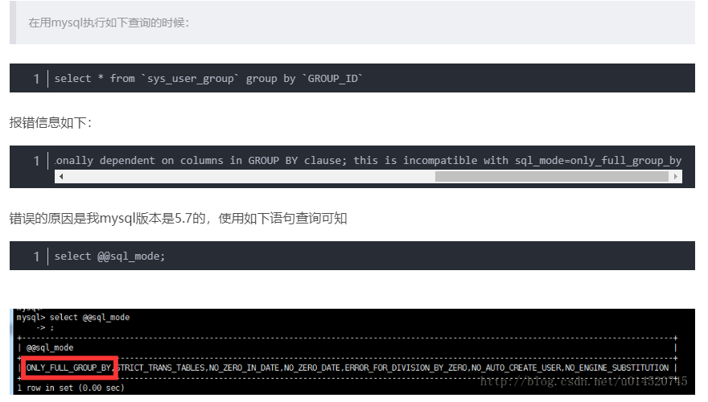
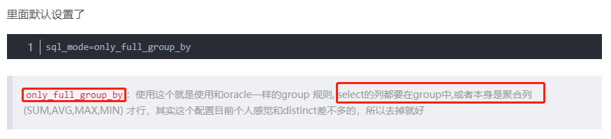
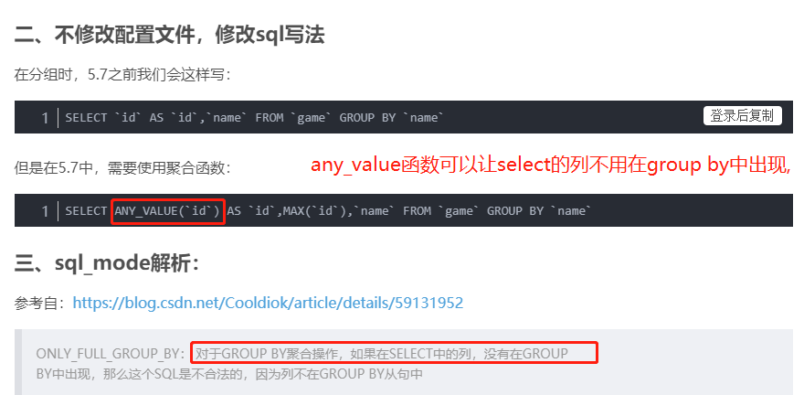

# MySql接口和MySql引擎

和其他关系数据库有所不同的是，MySQL本身实际上只是一个SQL接口，它的内部还包含多种数据引擎,常用的包括：

* InnoDB：支持事务,效率没有MyISAM高.
* MyISAM：MySQL早期集成的默认数据库引擎，不支持事务,由于不支持事务,所以效率高.

现在最常用的存储引擎是 InnoDB，它从 MySQL 5.5.5 版本开始就被当做默认存储引擎了.

如果你不知道应该采用哪种引擎，记住总是选择InnoDB就好了.(支持事务)

注意:最新的mysql8.0已经把MyISAM引擎去掉了,而且官网说,8.0是5.7速度的2倍,也就是说8.0的InnoDB虽然支持事务,但是效率也提高了,速度更快了.而且8.0的mysql是支持原生分布式数据库解决方案的.(5.5,5.6就不要使用了,5.7效率也还可以,不过还是尽快切换到8.0)

5.7直接跨到8.0,没有中间6开头和7开头的版本,所以语义上跨度大,一般表示的是底层架构发生了重大变化.

# only_full_group_by

MySQL 5.7.5后only_full_group_by成为sql_mode的默认选项之一，这可能导致之前的sql语句报错.

- [only_full_group_by研读](https://blog.csdn.net/allen_tsang/article/details/54892046)
