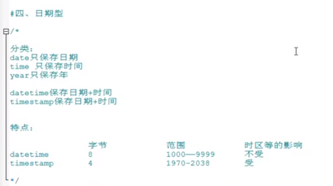
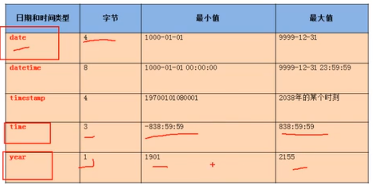
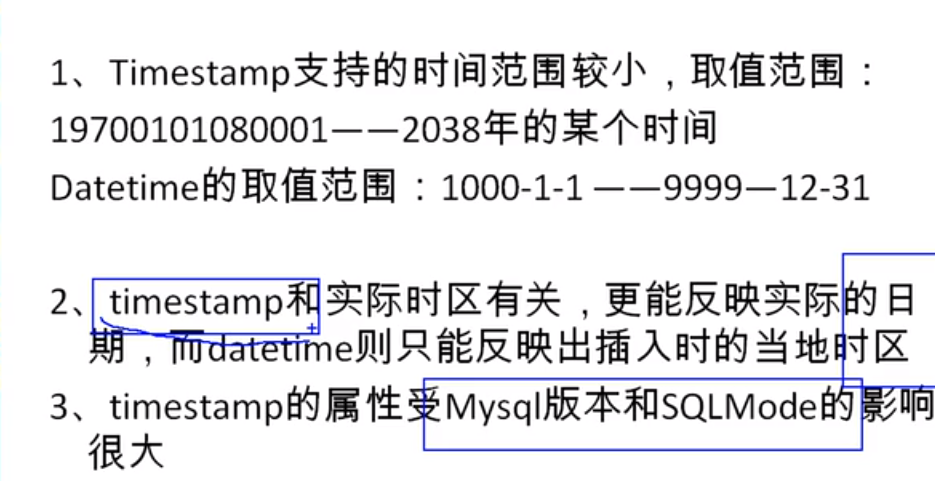
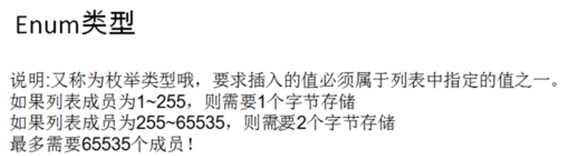
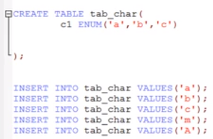
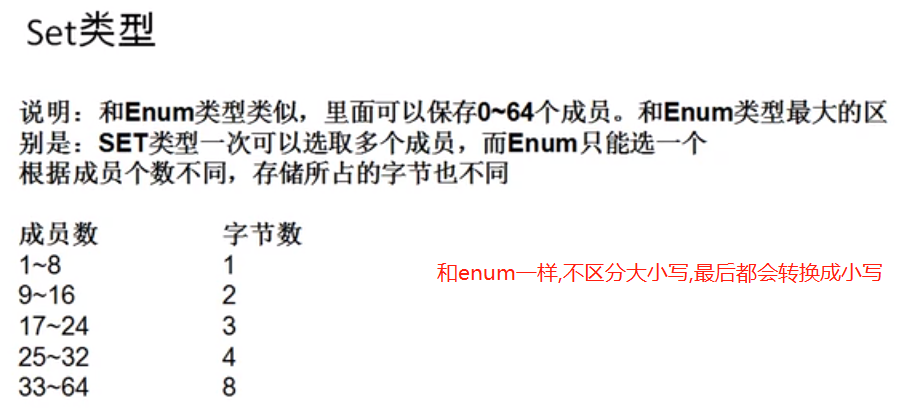
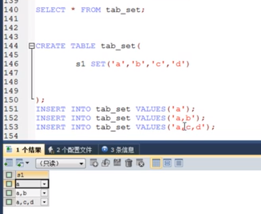

# 日期时间类型

  
  

    
---    
    datetime    按照 YYYY-MM-DD HH:MM:SS 格式组合显示的日期与时间
    date        YYYY-MM-DD 格式 (和时区无关)
    timestamp   和 UNIX 时间戳相同,只能表示从 1970 年到 2038 年.
    time        时间  按照 HH:MM:SS 格式存储的时间
    YEAR(M)     年份  用2位或4位格式存储的时间。如果把长度定为2，比如说YEAR(2)，那么可以表示从1970年到2069年的这些年份（70-69）。如果把长度定为4，YEAR(4)，则可以表示从1901年到2155年。默认长度为4.
---



    MySQL提供了 FROM_UNIXTIME() 函数把 UNIX 时间戳转换为日期，
    并提供了 UNIX_TIMESTAMP() 函数把日期转换为 UNIX 时间戳。
    
    默认情况下，如果插入时没有指定 TIMESTAMP 列的值，会将这个值设置为当前时间。
    
    应该尽量使用 TIMESTAMP，因为它比 DATETIME 空间效率更高。

```sql
CREATE TABLE dt_table(
	t1 DATETIME,
	t2 TIMESTAMP
);

INSERT INTO dt_table VALUES(NOW(), NOW());
SELECT * FROM dt_table;

SHOW VARIABLES LIKE 'time_zone';
SET time_zone='+9:00';
SELECT * FROM dt_table;
```

# 其他类型







# 最常用的数据类型(上面归纳的数据类型的一个子集)

    名称          类型                  说明
    INT           整型             4字节整数类型，范围约+/-21亿
    BIGINT        长整型           8字节整数类型，范围约+/-922亿亿
    REAL          浮点型           4字节浮点数，范围约+/-10^38
    DOUBLE        浮点型           8字节浮点数，范围约+/-10^308
    DECIMAL(M,N)  高精度小数       由用户指定精度的小数，例如，DECIMAL(20,10)表示一共20位，其中小数10位，通常用于财务计算
    CHAR(N)      定长字符串        存储指定长度的字符串，例如，CHAR(100)总是存储100个字符的字符串
    VARCHAR(N)   变长字符串      存储可变长度的字符串，例如，VARCHAR(100)可以存储0~100个字符的字符串
    BOOLEAN      布尔类型         存储True或者False
    DATE         日期类型         存储日期，例如，2018-06-22
    TIME         时间类型         存储时间，例如，12:20:59
    DATETIME     日期和时间类型    存储日期+时间，例如，2018-06-22 12:20:59

---

    上面的表中列举了最常用的数据类型。很多数据类型还有别名:

    REAL == FLOAT(24)

    数据库厂商还会支持特定的数据类型,例如：JSON

# 数据类型的选择

    选择数据类型的时候，要根据业务规则选择合适的类型,通常来说(以下两种类型是使用最广泛的):

    1. BIGINT能满足整数存储的需求
    2. VARCHAR(N)能满足字符串存储的需求
