# 数据库分库分表引入

一张表一般存储500万条数据,数据如果太多的话,数据库的查询效率会下降.

# mycat

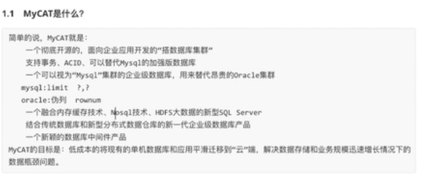

    mycat之于mysql,就类似于nginx之于tomcat.
    
    mycat可以做分库分表,也可以做读写分离(主从). 
    
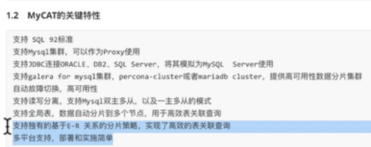


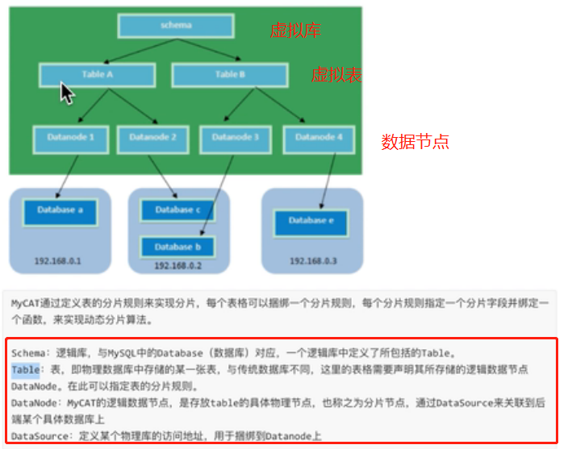


# mycat安装

[下载mycat](https://github.com/MyCATApache/Mycat-Server/releases)

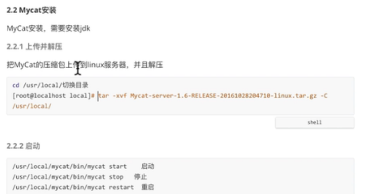

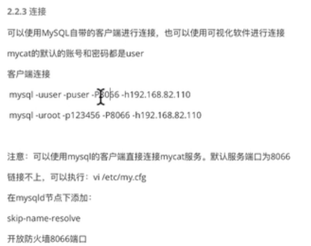

```shell script
mysql -uroot -p123456 -P8066 -h192.168.32.128 -DTESTDB
```

    可能遇到的问题:

```shell script
# 问题1: 
# 插入数据出现: ERROR 3009 (HY000): java.lang.IllegalArgumentException: Invalid DataSource:0
# 命令执行1分钟(感觉上)

# 解决方法 :
# 1. schema.xml 中用户名、密码与数据库中保持大小写一致。
# 2. 所用到的数据库要在对应的dataNode上提前建立好,否则可能报上面这个错误.
# 3. mysql要允许使用ip地址连接,也就是mycat中配置的连接mysql的用户名要有对应的连接权限.
# 4. 有可能是schema.xml中连接mysql使用的是ip形式的,可能会有问题,改成localhost就没有问题.这个有待进一步解决.
# 4. 可以查看logs下的日志,看错误信息
```

# mycat配置文件

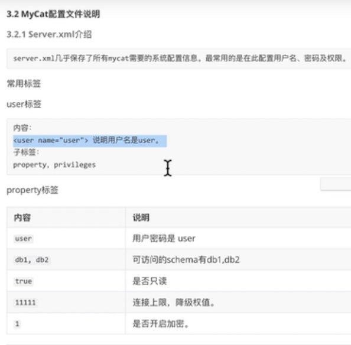


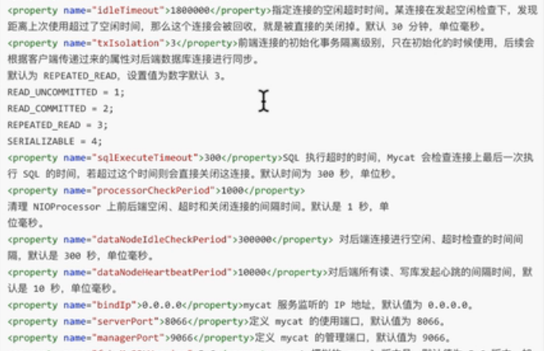
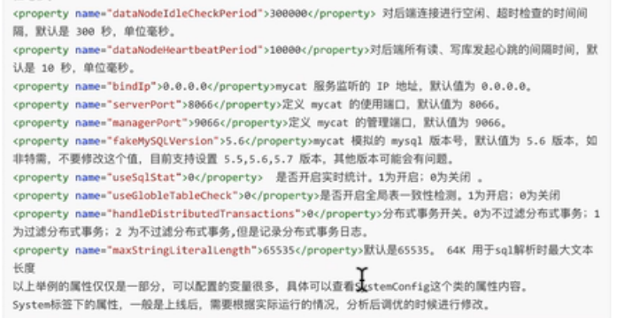


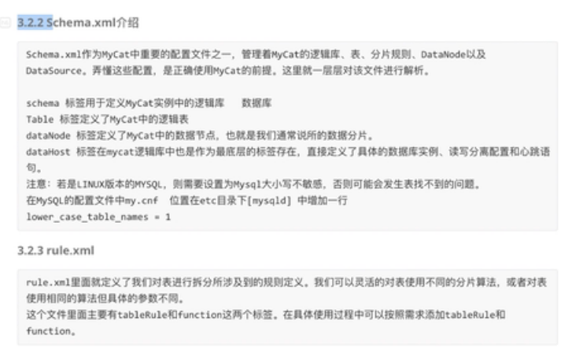

# mycat垂直分片示例

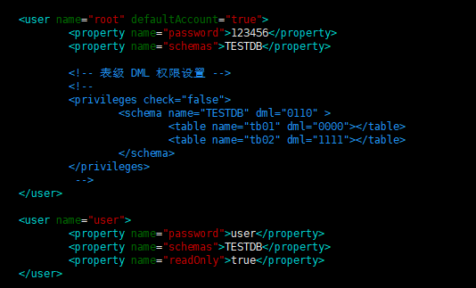

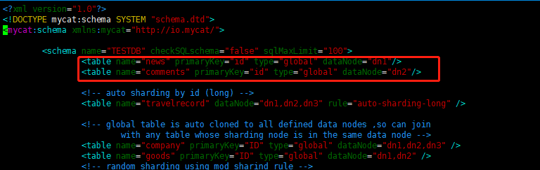

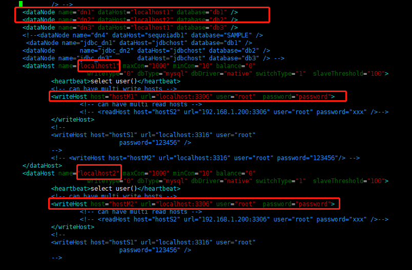

```sql
-- 在mycat上创建表news和comments
CREATE TABLE news(
	id INT(11) PRIMARY KEY AUTO_INCREMENT,
	title VARCHAR(200),
	author VARCHAR(50)
);

CREATE TABLE comments(
	id INT(11) PRIMARY KEY AUTO_INCREMENT,
	content VARCHAR(200),
	author VARCHAR(50)
);

insert into news (title,author) values('要努力,不要堕落', 'xzj01');
insert into news (title,author) values('振作起来', 'xzj02');

insert into comments (content, author) values('内容1', '作者1');
insert into comments (content, author) values('内容2', '作者2');

-- 然后到对应的库和表中已经发现数据被插入了
```

# mycat水平分片

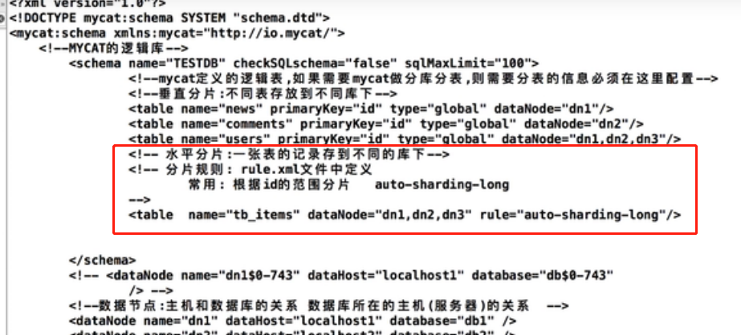

```xml
<!-- 改完配置文件后要重启mycat -->
<table name="tb_items" dataNode="dn1,dn2,dn3" rule="auto-sharding-long"/>
```

```sql
CREATE TABLE tb_items(
	id INT(11) PRIMARY KEY AUTO_INCREMENT,
	title VARCHAR(30),
	price DOUBLE(11,2)
);

-- 使用水平分片之后,sql插入语句要注意.
insert into tb_items (id,title,price) values(1, 'item1', 20);
insert into tb_items (id,title,price) values(2, 'item1', 40);
insert into tb_items (id,title,price) values(5000000, 'item1', 60);

insert into tb_items (id,title,price) values(5000001, 'item1', 80);
insert into tb_items (id,title,price) values(10000000, 'item1', 100);

insert into tb_items (id,title,price) values(10000001, 'item1', 120);
insert into tb_items (id,title,price) values(15000000, 'item1', 140);

-- 会提示错误: can't find any valid datanode :TB_ITEMS -> ID -> 15000001
-- 因为前三个db1和db2,db3按照默认的rule,每个node只可以存放500w条数据
insert into tb_items (id,title,price) values(15000001, 'item1', 160);
```

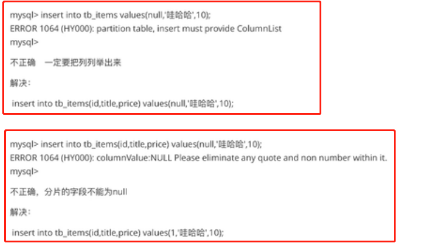

# 水平分片规则

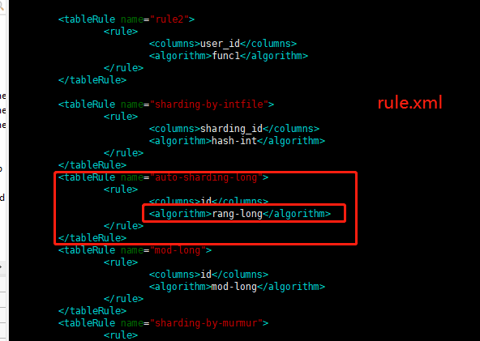
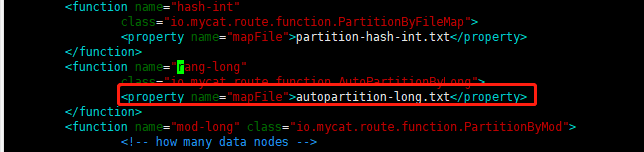
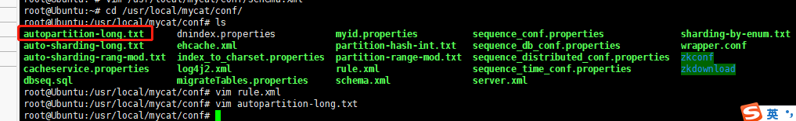

