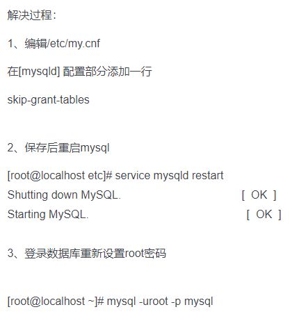
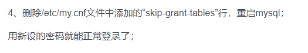
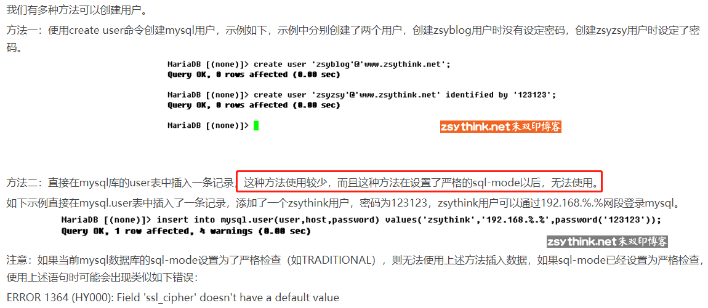
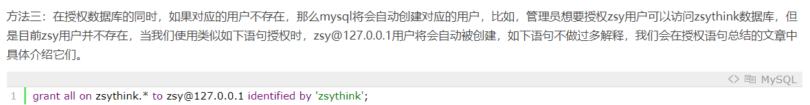
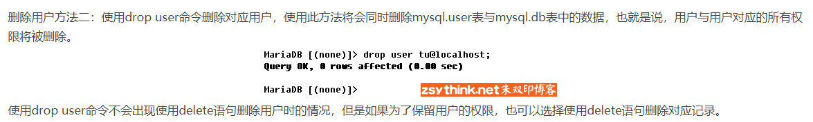

# mysql登录

```sql
# mysql登录:
mysql -h hostname -P port -u username -p
```

# 给MySql超级管理员root设置密码

```shell script
mysqladmin -u root password <你要设置的密码>
# 可能会出现connect to server at 'localhost' failed
# 这个时候service mysql stop,然后执行:
/usr/local/mysql/bin/mysqld_safe --skip-grant-tables &
# --skip-grant-tables：不启动grant-tables(授权表),跳过权限控制
# 保留开启mysqld_safe的终端，新建一个终端，输入命令：mysql,就可以直接登录MySQL
use mysql;
select host,user,authentication_string from user;
# 在mysql 5.7以前的版本，密码列的英文名是password，但是在5.7版本改成了authentication_string
# 我们只需要重置用户名为root的密码就可以
update user set authentication_string=PASSWORD('password') where user='root' and host='localhost';
# 5.5: update user set password=PASSWORD("newpass") where user="root";
# 新设置用户或更改密码后需用flush privileges刷新MySQL的系统权限相关表，否则会出现拒绝访问，
# 还有一种方法，就是重新启动mysql服务器，来使新设置生效
flush privileges;
```

# 忘记本地root的登录密码



```sql
update user set authentication_string=PASSWORD('password') where user='root' and host='localhost';
flush privileges;
```



# 密码过期解决方案

    出现以下错误表示密码过期了:
    ERROR 1820 (HY000): You must reset your password using ALTER USER statement before executing this statement.

[密码过期解决方法](https://www.58jb.com/html/153.html)

# 查看mysql的账户信息

```sql
-- mysql的账户信息保存在 mysql 这个数据库的user表中
use mysql;
-- 5.5 select user,host,password from user;
select user,host,authentication_string from user;
```

# 创建用户

- 创建mysql数据库用户：

    ```mysql
    create user tom identified by 'abc123';
    ```





# 删除用户



# 参考

- [用户管理](http://www.zsythink.net/archives/384)