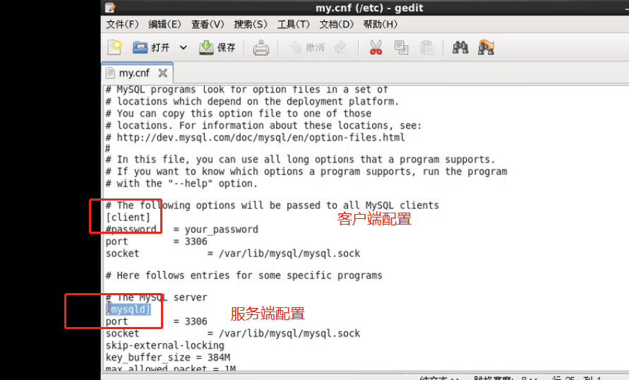

# 修改Mysql配置文件 




windows上所在路径: C:\ProgramData\MySQL\MySQL Server 5.7\my.ini

```properties
# 服务端配置
[mysqld]
port=3306

# mysql的安装目录
# basedir="C:/Program Files/MySQL/MySQL Server 5.7/"

# 存放数据的目录
datadir=C:/ProgramData/MySQL/MySQL Server 5.7\Data

# 字符集
character-set-server=utf8

# 默认存储引擎
default-storage-engine=INNODB

# 语法模式
sql-mode="STRICT_TRANS_TABLES,NO_AUTO_CREATE_USER,NO_ENGINE_SUBSTITUTION"

# 最大连接数,通过show variables like 'max_connections';
max_connections=151

# 就是可以把多少张表的文件句柄缓存起来,以后操作这些表的时候,速度会快
table_open_cache

# 索引的缓存大小: 能够缓存的索引的大小,把索引缓存后,下次用到相同的索引,就不用再去磁盘读取了.可以提高速度,这个参数对性能的影响很大.
key_buffer_size

# 
innodb_buffer_pool_size
```


