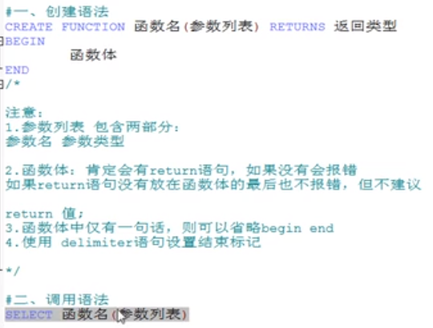

# 函数


# 函数的创建和调用



```sql
-- -------------------------案例演示--------------
-- 1. 无参有返回
-- 案例: 返回公司的员工个数

DELIMITER $
CREATE FUNCTION myf1() RETURNS INT
BEGIN
	DECLARE c INT DEFAULT 0;# 定义一个局部变量
	SELECT COUNT(*) INTO c # 赋值
	FROM employees;
	RETURN c;
END $

-- 如果有you *might* want to use the less safe log_bin_trust_function_creators variable错误的话,执行这个
-- SET GLOBAL log_bin_trust_function_creators = 1;

-- 调用函数
SELECT myf1()$

-- 2. 有参有返回
-- 案例2: 根据员工名,返回它的工资
DELIMITER $
CREATE FUNCTION myf2(empName VARCHAR(20)) RETURNS DOUBLE
BEGIN
	SET @sal=0;# 定义一个用户变量
	SELECT salary INTO @sal	# 赋值
	FROM employees
	WHERE last_name = empName;
	
	RETURN @sal;
END $

SELECT myf2('zj')$

-- 3. 根据部门名,返回该部门的平均工资

DELIMITER $
CREATE FUNCTION myf3(empName VARCHAR(20)) RETURNS DOUBLE
BEGIN
	DECLARE sal DOUBLE DEFAULT 0;#定义一个局部变量
	SELECT AVG(salary) INTO sal
	FROM employees e
	INNER JOIN departments d ON e.`department_id` = d.`department_id`
	WHERE d.`department_name` = empName;
	
	RETURN sal;
END $

SELECT myf3('it')$
```

# 查看函数和删除函数

```sql
SHOW CREATE FUNCTION myf3;

DROP FUNCTION myf3;
```

# 函数练习

```sql
-- 4. 函数练习
-- 创建函数,实现传入2个float,返回二者之和
DELIMITER $
CREATE FUNCTION test_fun1(num1 FLOAT,num2 FLOAT) RETURNS FLOAT
BEGIN
	DECLARE SUM FLOAT DEFAULT 0;
	SET SUM=num1+num2;
	RETURN SUM;
END $

SELECT test_fun1(2,4)$
```