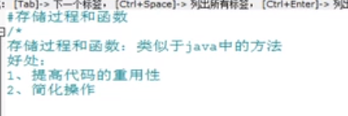
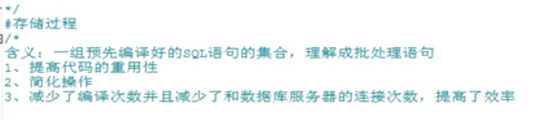
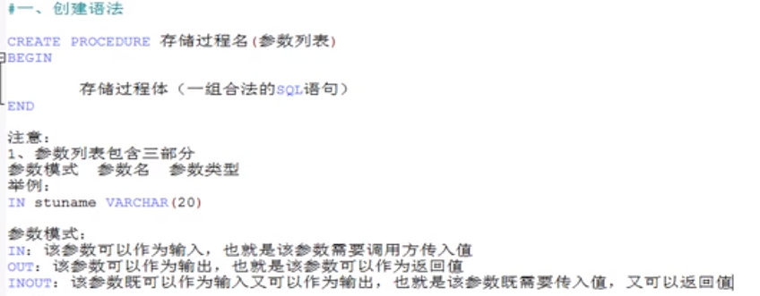
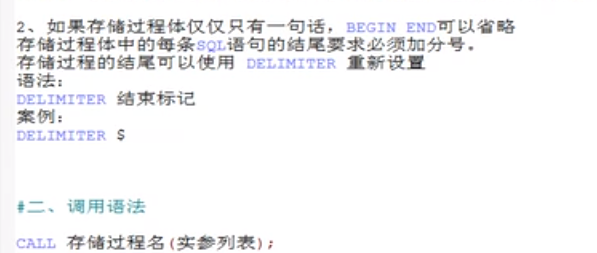
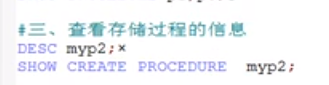
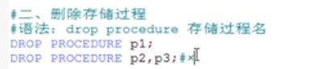
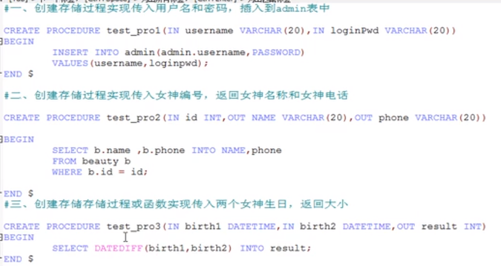
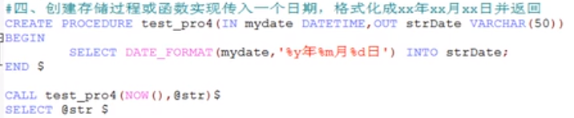
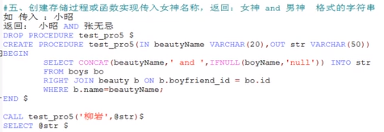
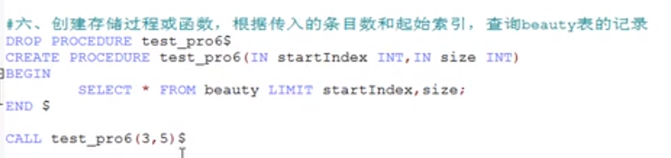

# 存储过程和函数



    没有返回值使用存储过程,有返回值使用存储函数

# 存储过程



- 由于是预先编译，因此具有很高的性能。





# 空参的存储过程示例

```sql
-- 准备数据
CREATE TABLE admin(
	id INT PRIMARY KEY NOT NULL AUTO_INCREMENT,
	username VARCHAR(20),
	PASSWORD VARCHAR(50)
);

-- 案例: 插入到admin表中五条记录
-- 实际过程中使用存储过程都是插入上万条记录,这样才可以体现出它的效率

-- 空参列表
DELIMITER $
CREATE PROCEDURE myp1()
BEGIN
	INSERT INTO admin(username,PASSWORD) 
	VALUES('john1','00000'),('luck','00000'),('kkkk','2222'),('tom','3333'),('king','5555');
END $

CALL myp1()$

SELECT * FROM admin;
```

# in模式参数的存储过程

```sql
-- 一个参数
-- 案例1: 创建存储过程实现,根据女神名,查询对应的男神信息
DELIMITER $
CREATE PROCEDURE myp2(IN beautyName VARCHAR(20))
BEGIN
	SELECT bo.*
	FROM boys bo 
	RIGHT JOIN beauty b ON b.boyfriend_id = bo.id
	WHERE b.`name` = beautyName;
END $

CALL myp2('刘岩');
```

```sql
-- 多个参数
-- 案例2: 创建存储过程,实现判断用户是否登录成功
DELIMITER $
CREATE PROCEDURE myp4(IN username VARCHAR(20),IN PASSWORD VARCHAR(50))
BEGIN
	DECLARE result INT DEFAULT 0; --声明并初始化

	SELECT COUNT(*) INTO result -- 赋值
	FROM admin
	WHERE admin.username = username
	AND admin.password = PASSWORD;

	SELECT IF(result>0,'登录成功','登录失败'); -- 使用
END $

CALL myp4('luck','00000')$
```

# 创建带out模式的存储过程

```sql
-- 一个out参数的示例
-- 案例1: 根据女神名返回对应的男神名
DELIMITER $
CREATE PROCEDURE myp5(IN beautyName VARCHAR(20),OUT boyName VARCHAR(20))
BEGIN
	SELECT bo.boyName INTO boyName
	FROM boys bo
	INNER JOIN
	beauty b ON b.`boyfriend_id` = bo.id
	WHERE b.name = beautyName;
END $

SET @boyName = NULL$
CALL myp5('小昭',@boyName)$
SELECT @boyName$
```

```sql
-- 多个out参数的示例
-- 案例1: 根据女神名,返回对应的男神名和男神魅力值
DELIMITER $
CREATE PROCEDURE myp6(IN beautyName VARCHAR(20),OUT boyName VARCHAR(20),OUT userCP INT)
BEGIN
	SELECT bo.boyName,bo.`userCP` INTO boyName,userCP
	FROM boys bo
	INNER JOIN
	beauty b ON b.`boyfriend_id` = bo.id
	WHERE b.name = beautyName;
END $

CALL myp6('小昭',@boyName,@userCP)$
SELECT @boyName,@userCP$
```

# 创建带inout模式参数的存储过程

```sql
-- 案例1: 传入a和b两个值,最终a和b都翻倍并返回
DELIMITER $
CREATE PROCEDURE myp8(INOUT a INT,INOUT b INT)
BEGIN
	SET a=a*2;# 局部变量前面不用加@
	SET b=b*2;
END $

SET @m=10$ # 用户变量前面要加@
SET @n=20$
CALL myp8(@m,@n)$
SELECT @m,@n$
```

# 查看存储过程



# 删除存储过程



# 存储过程练习




