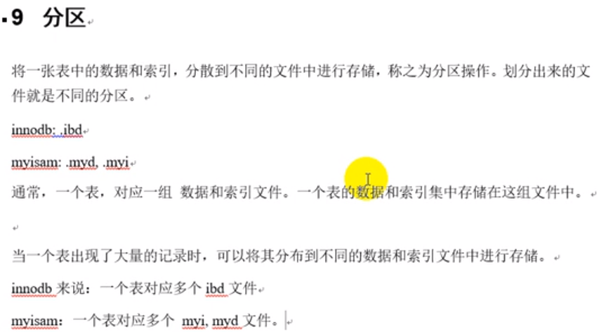
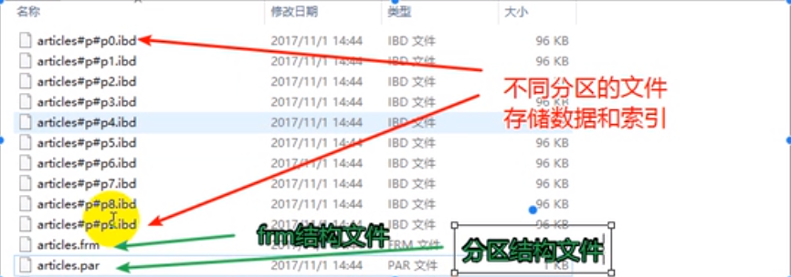
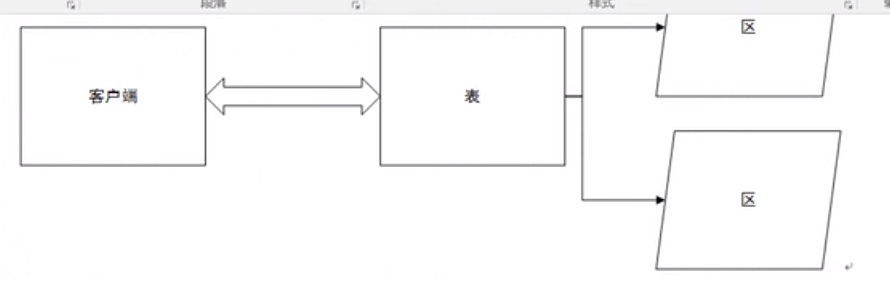
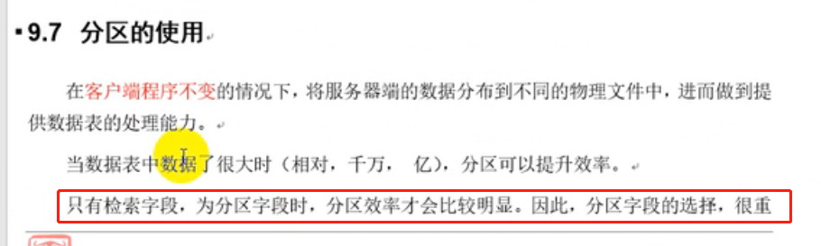
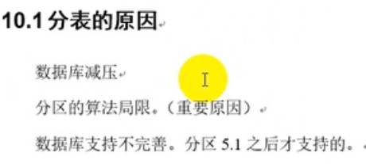
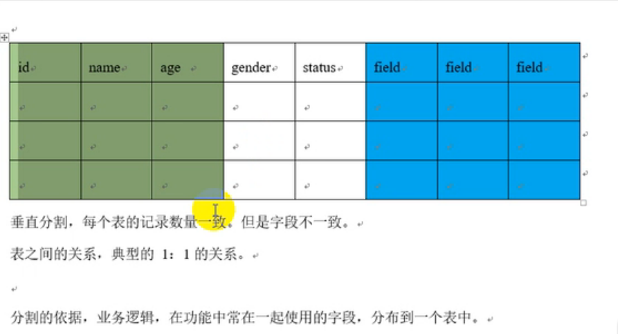

# 分区

    一个表,多个分区.








# 分区算法

    hash算法,key算法,range算法,list算法

# hash算法

    hash分区算法: 在业务逻辑层面,表示均匀分配.


    何时使用hash算法: 当数据表中的数据量很大,并且没有明显的逻辑分区时使用,比如我们存储的用户信息,
    就可以使用该算法,但是如果数据是用户每个月的账单信息就不要用了.因为如果你使用hash算法的话,
    用户某一个月的账单信息会分布到不同的分区中,但是用户查询的时候,是以月为单位来查询的.


```sql
CREATE TABLE articles_hash(
	id INT UNSIGNED AUTO_INCREMENT PRIMARY KEY,
	SUBJECT VARCHAR(255),
	content TEXT
)ENGINE INNODB CHARSET utf8
-- 利用id字段,使用hash算法,把数据分布到10个分区中
PARTITION BY HASH(id) PARTITIONS 10;

insert into articles_hash values(23, "mysql优化,分区的使用", "hash分区算法,就是一个求余算法,23id应该被存储到余数为3对应的分区中");

-- -- 增加4个分区,hash和key的分区管理,不影响数据,在管理时,需要将数据重写分配到新的分区中,效率比较低,花时间比较多
-- 尽量在设计阶段考虑总数,满足设计
ALTER TABLE articles_hash ADD PARTITION PARTITIONS 4;

-- 减少分区数量
-- 减少6个分区数量,原来分区总数为14,那么合并后,剩下8个分区
-- hash和key的分区管理,不影响数据,在管理时,需要将数据重写分配到新的分区中,效率比较低,花时间比较多
ALTER TABLE articles_hash COALESCE PARTITION 6;
```

# key算法


```sql
CREATE TABLE articles_key(
	id INT UNSIGNED AUTO_INCREMENT,
	SUBJECT VARCHAR(255),
	content TEXT,
	PRIMARY KEY (id,SUBJECT)	-- 你要分区字段(这里就是subject) 必须为主键的一部分,要不然分区创建不成功
)ENGINE INNODB CHARSET utf8
-- 利用id字段,使用hash算法,把数据分布到10个分区中
PARTITION BY KEY(SUBJECT) PARTITIONS 10;

-- 下面插入的subject是一样的,所以计算出来的分区应该是一样的.
INSERT INTO articles_key VALUES(23, "mysql优化,分区的使用", "hash分区算法,就是一个求余算法,23id应该被存储到余数为3对应的分区中");
INSERT INTO articles_key VALUES(24, "mysql优化,分区的使用", "hash分区算法,就是一个求余算法,23id应该被存储到余数为3对应的分区中");
INSERT INTO articles_key VALUES(25, "mysql优化,分区的使用", "hash分区算法,就是一个求余算法,23id应该被存储到余数为3对应的分区中");

-- -- 增加4个分区,hash和key的分区管理,不影响数据,在管理时,需要将数据重写分配到新的分区中,效率比较低,花时间比较多
-- 尽量在设计阶段考虑总数,满足设计
ALTER TABLE articles_key ADD PARTITION PARTITIONS 4;

-- 减少分区数量
-- 减少6个分区数量,原来分区总数为14,那么合并后,剩下8个分区
-- hash和key的分区管理,不影响数据,在管理时,需要将数据重写分配到新的分区中,效率比较低,花时间比较多
ALTER TABLE articles_key COALESCE PARTITION 6;
```

    分区字段一定是经常被检索的字段,这样我们把这个字段分区才有意义,这样我们可以快速通过用户输入这个字段,迅速找到对应的分区,
    如果你用一个不经常检索的字段来分区的话,分区就没有啥意义.
    
    分区的意义就是快速定位到少量的数据区域中,然后检索出需要的数据.提高效率.

# range算法


```sql
-- 这里演示的是根据文章的发布时间来分区存储,还有其他场景: 每个月的账单也可以这么存储
CREATE TABLE articles_range(
	id INT UNSIGNED AUTO_INCREMENT,
	SUBJECT VARCHAR(255),
	content TEXT,
	pubtime INT,
	PRIMARY KEY (id, pubtime)  -- 分区字段必须作为主键的一部分.
)ENGINE INNODB CHARSET utf8
PARTITION BY RANGE(pubtime) (
	PARTITION p201207 VALUES LESS THAN (1343750399), -- <
	PARTITION p201208 VALUES LESS THAN (1346428799), -- <
	PARTITION p201209 VALUES LESS THAN (1349020799) -- <
);

INSERT INTO articles_range VALUES(NULL, "mysql优化,分区的使用", "hash分区算法,就是一个求余算法,23id应该被存储到余数为3对应的分区中", 1343663999);
INSERT INTO articles_range VALUES(NULL, "mysql优化,分区的使用", "hash分区算法,就是一个求余算法,23id应该被存储到余数为3对应的分区中", 1346342399);

-- 增加2个分区
ALTER TABLE articles_range ADD PARTITION(
	PARTITION p201210 VALUES LESS THAN (1351699200),
	PARTITION p201211 VALUES LESS THAN (1354291200)
);

-- 删除分区,分区删除之后,数据也会被删除
ALTER TABLE articles_range DROP PARTITION p201211;
```

# list算法


```sql
CREATE TABLE articles_list(
	id INT UNSIGNED AUTO_INCREMENT,
	SUBJECT VARCHAR(255),
	content TEXT,
	pubtime INT,
	STATUS TINYINT, -- status enum ('草稿','完成','发布'),
	PRIMARY KEY (id, STATUS)  -- 分区字段必须作为主键的一部分.
)ENGINE INNODB CHARSET utf8
PARTITION BY LIST(STATUS) (
	PARTITION pwriting VALUES IN (1,2),
	PARTITION ppublished VALUES IN (3)
);

INSERT INTO articles_list VALUES(NULL, "mysql优化,分区的使用", "hash分区算法,就是一个求余算法,23id应该被存储到余数为3对应的分区中", 1343663999, 2);

INSERT INTO articles_list VALUES(NULL, "mysql优化,分区的使用", "hash分区算法,就是一个求余算法,23id应该被存储到余数为3对应的分区中", 1346342399, 3);

FLUSH TABLE;

-- 增加2个分区
ALTER TABLE articles_list ADD PARTITION(
	PARTITION p1 VALUES IN (4),
	PARTITION p2 VALUES IN (5)
);

-- 删除分区,分区删除之后,数据也会被删除
ALTER TABLE articles_list DROP PARTITION p1;
ALTER TABLE articles_list DROP PARTITION p2;
```

# 什么时候要进行分区




# 为什么有了数据库的分区,还会出现分表?

    分区只能在同一台机器上执行,分表的话,可以分布到不同的服务器上.



    这里的分表分为: 水平分表和垂直分表

    水平分表就是把一张表的数据,分配在多张表名不同,但是表结构相同的表中.
    但是此时业务代码就比较复杂了,要在业务中操作同结构不同名的表
    
    垂直分割: 把同一张表的一些字段放到一张表,另一些字段放到另一张表.这也会时业务层代码复杂,一般不这么做.

    

    真正业务中使用的数据库中间件来分库分表,例如mycat等.