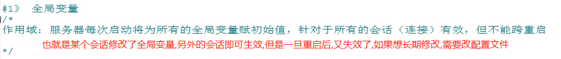
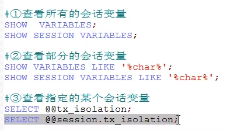
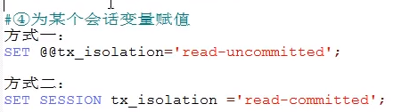
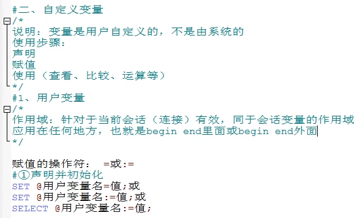
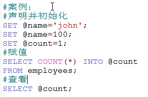
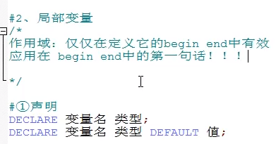
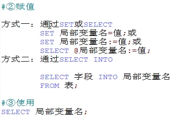
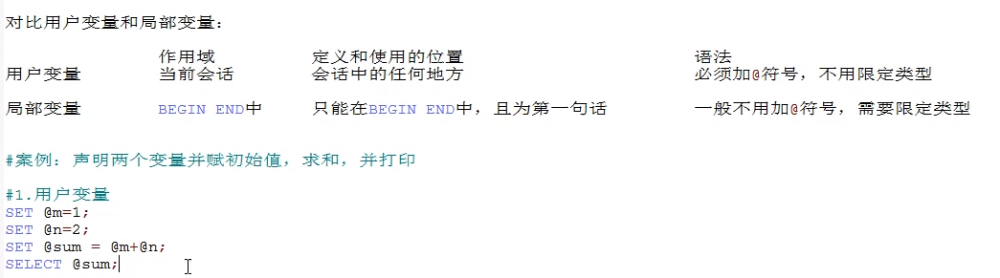
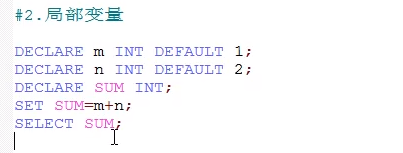

# 变量

- 系统变量
- 用户自定义变量

# 系统变量

该变量是由系统提供的,不是用户自己定义的.系统变量又可以细分为: 全局变量(针对整个服务器的)和会话变量(针对一个会话的,或者说是针对客户端的一次连接)

```sql
-- 1. 查看所有的系统变量
SHOW GLOBAL|[SESSION] VARIABLES; -- 如果global和session都不写,默认就是查看会话的
-- 2. 查看满足条件的系统变量
show GLOBAL|[SESSION] variables like '%char%';
-- 3. 查看指定的某个系统变量的值(直接使用select)
select @@global|[session].系统变量名; -- -- 如果global和session都不写,默认就是查看会话的
-- 4. 为某个系统变量赋值
set global|[session] 系统变量名 = 值; -- 方式1
set @@global|[session].系统变量名=值; -- 方式2
-- 注意: 如果是全局级别,需要加global,如果是会话级别,需要加session,如果什么都不写,默认就是seesion级别
```

## 全局变量

    全局变量修改完后,一旦重启了mysql,就会失效,如果要永久修改,必须修改配置文件.



```sql
-- 1. 查看所有全局变量
SHOW GLOBAL VARIABLES;
-- 2. 查看部门全局变量
SHOW GLOBAL VARIABLES LIKE '%char%';
-- 3. 查看指定全局变量的值
SELECT @@global.autocommit;
SELECT @@tx_isolation;
-- 4.为指定的全局变量赋值
SET @@global.autocommit=0;
SET GLOBAL autocommit=0;
```

## 会话变量

作用域: 仅仅对当前的会话(连接)有效.




```sql
-- 展示msyql当前的时区
SHOW VARIABLES LIKE '%time_zone%';
-- 修改时区为东九区
SET time_zone='+9:00';
```

# 用户自定义变量

按作用范围不同可以分为用户变量和局部变量

## 用户变量






## 局部变量





## 用户变量和局部变量的对比


