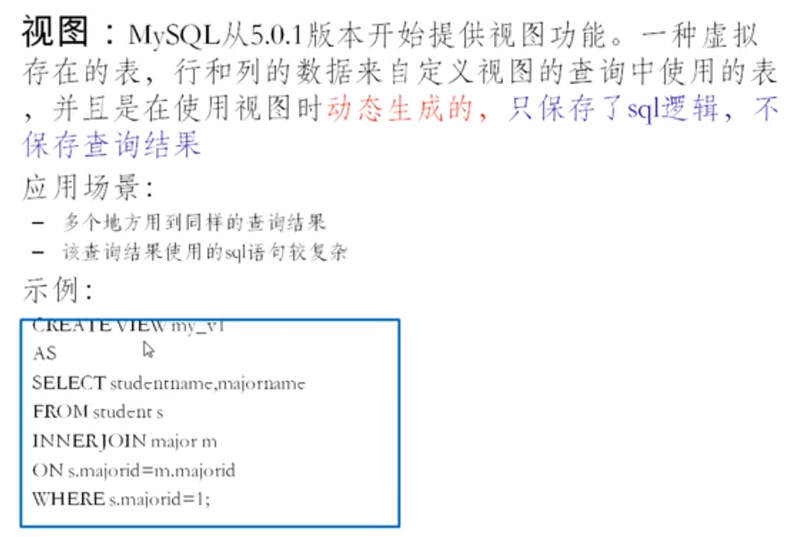

# 视图



# 视图的创建

```sql
-- 案例1: 查询姓名中包含a字符的员工名,部门名,工种名
-- 第一步创建视图
CREATE VIEW myv1 
AS
SELECT last_name,department_name,job_title
FROM  employees e
JOIN departments d ON e.department_id = d.department_id
JOIN jobs j ON e.job_id = j.job_id;
-- 第二步:使用视图
SELECT * FROM myv1 WHERE last_name LIKE '%a%';
```

```sql
-- 案例2: 查询各个部门的平均工资级别
-- 第一步: 创建视图,查看每个部门的平均工资
CREATE VIEW myv2
AS
SELECT AVG(salary) ag,department_id 
FROM employees
GROUP BY department_id;
-- 第二步:使用
SELECT myv2.ag, myv2.department_id, g.grade_level
FROM myv2
JOIN job_grades g
ON myv2.ag BETWEEN g.`lowest_sal` AND g.`highest_sal`;
```

```sql
-- 案例3: 查看平均工资最低的部门信息
SELECT * FROM myv2 ORDER BY myv2.ag LIMIT 1;
```

```sql
-- 案例4: 查看平均工资最低的部门名和平均工资
CREATE VIEW myv3
AS
SELECT * FROM myv2 ORDER BY myv2.ag LIMIT 1;

SELECT d.*,m.ag 
FROM myv3 m
JOIN departments d
ON m.department_id = d.department_id;
```

# 视图的修改

```sql
-- 方式1
CREATE OR REPLACE VIEW 视图名
AS
查询语句

SELECT * FROM myv3;

-- 修改
CREATE OR REPLACE VIEW myv3
AS 
SELECT AVG(salary),job_id
FROM employees
GROUP BY job_id;
```

```sql
-- 方式2:语法: alter view 视图名 as 查询语句
ALTER VIEW myv3 
AS
SELECT * FROM employees; 

SELECT * FROM myv3;
```

# 删除视图

```sql
-- 语法: drop view 视图名,视图名.....
DROP VIEW myv1,myv2,myv3;
```

# 查看视图

```sql
CREATE OR REPLACE VIEW myv3
AS 
SELECT AVG(salary),job_id
FROM employees
GROUP BY job_id;

DESC myv3;
SHOW CREATE VIEW myv3;
```

# 视图和表的区别

