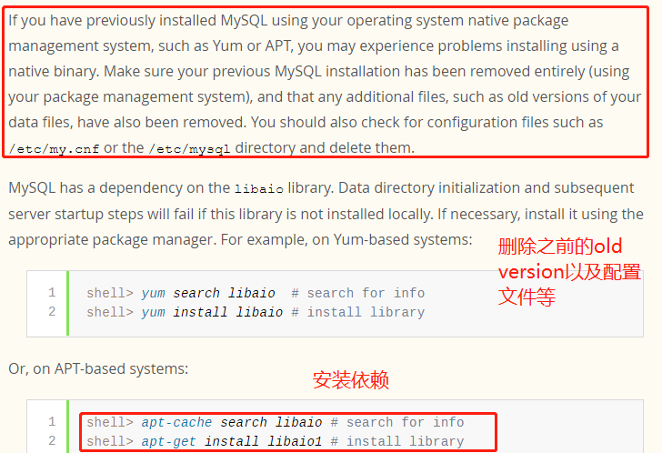

# mysql学习资料

- [MySQL 基础+高级篇](https://www.bilibili.com/video/av49181542?p=180)
- [mysql优化视频](https://www.bilibili.com/video/av32482297?p=10)

# mysql下载


# 安装linux通用的mysql

    小知识: ubuntu专用的是以deb结尾的安装包

从[官网](https://dev.mysql.com/downloads/mysql/5.7.html)下载tar.gz结尾的安装包,注意别下载错误了后缀必须是`x86_64.tar.gz`,然后进行[安装](https://dev.mysql.com/doc/refman/5.7/en/binary-installation.html)



```shell script
# 这里演示的是5.7的安装

# 安装依赖
apt-cache search libaio
apt-get install libaio1
apt-cache search libnuma
apt-get install libnuma1
apt-cache search libtinfo
apt-get install libtinfo5

# 通常安装在/usr/local/mysql
groupadd mysql
useradd -r -g mysql -s /bin/false mysql
cd /usr/local
tar zxvf /path/to/mysql-VERSION-OS.tar.gz
ln -s full-path-to-mysql-VERSION-OS mysql
cd mysql
mkdir mysql-files
chown mysql:mysql mysql-files
chmod 750 mysql-files
bin/mysqld --initialize --user=mysql 
bin/mysql_ssl_rsa_setup              
bin/mysqld_safe --user=mysql &
# Next command is optional
shell> cp support-files/mysql.server /etc/init.d/mysql.server

# 配置mysql环境变量,参照jdk配置

# 启动方式
# 使用 service 启动：service mysql start
# 使用 mysqld 脚本启动：/etc/init.d/mysql start

# 停止
# 使用 service 启动：service mysql stop
# 使用 mysqld 脚本启动：/etc/init.d/mysql stop

# 重启
# 使用 service 启动：service mysql restart 
# 使用 mysqld 脚本启动：/etc/init.d/mysql restart

# 卸载
rm -rf /etc/init.d/mysql.server
rm -rf /usr/local/mysql
rm -rf /var/lib/mysql
```

## 5.7配置文件的修改

MySQL从5.7.18版本开始不再自带my.cnf,如要指定配置,需要自己创建配置文件

```shell script
# 通过mysql --help  | grep my.cnf可以查看mysql加载配置文件的顺序优先级
# /etc/my.cnf /etc/mysql/my.cnf /usr/local/mysql/etc/my.cnf /usr/local/mysql/my.cnf ~/.my.cnf
cd /etc && touch my.cnf
# 然后就可以加入我们自己的配置了
```

# windows上mysql安装

---
    安装windows版mysql:
    如果之前计算机中安装过Mysql，要重新再安装  则需要：先卸载 再安装
    
    先卸载：
    1. 通过电脑自带卸载工具卸载Mysql
    2. 删除一个mysql缓存文件C:\ProgramData\MySQL
    3. 删除注册表中mysql相关配置，regedit中所有mysql相关配置
    4. 重启计算机
    
    安装MYSQL：安装时，如果出现未响应：  则重新打开D:\MySQL\MySQL Server 5.5\bin\MySQLInstanceConfig.exe
    
    图形化客户端： SQLyog, Navicat
---

```shell script
mysql -V
mysql --version

# 查看mysql进程
ps -ef | grep mysql
# 其中可以看到datadir为数据存放目录
# --pid-file为pid文件目录
# 启动脚本: /etc/init.d/mysql
```