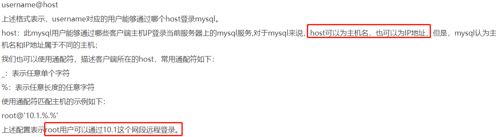

# 授予远程连接server的权限



```sql
use mysql;
select user,host,password from user;

-- 如果要远程连接数据库，则需要授权远程访问:
GRANT ALL PRIVILEGES ON *.* TO 'root'@'%' IDENTIFIED BY 'password' WITH GRANT OPTION; 
-- GRANT ALL PRIVILEGES ON *.* TO 'root'@'192.168.%.%' IDENTIFIED BY 'password' WITH GRANT OPTION;
-- GRANT ALL PRIVILEGES ON *.* TO 'root'@'192.168.32.%' IDENTIFIED BY 'password' WITH GRANT OPTION;
-- 解释：
-- GRANT ALL PRIVILEGES： 授权所有的权限
-- ON *.* ：第一个*表示的是任何数据库,可以指定具体的数据库,第二个*是哪张表
-- TO 'root'@'%': 授权给root这个用户名，%表示任意ip
-- IDENTIFIED BY 'password'： 密码是password

-- 给tom用户使用本地命令行方式，授予mydb这个库下的所有表的增删改查的权限。
grant select,insert,delete,update on mydb.* to tom@localhost identified by 'abc123'; 

-- 刷新权限
FLUSH PRIVILEGES;

-- 默认是没有开启远程访问的，远程连接的时候一定要授权.
-- 如果仍然报错：可能是防火墙没关闭 ：关闭防火墙  service iptables stop ，要不然A无法访问B
-- 自己踩过坑,忽略了windows的防火墙,花费了1天的时间弄这个,忘记把windows的防火墙关闭了.导致linux一直连接不上windows.
-- 实际生产只开放特定端口即可
```

# 删除权限 

>GRANT 和 REVOKE(撤销) 可在几个层次上控制访问权限：

    授予所有权限/撤销所有权限，使用 GRANT ALL/REVOKE ALL；
    某个数据库，使用 ON database.*；
    某个库特定的表，使用 ON database.table；

    REVOKE SELECT, INSERT ON mydatabase.* FROM myuser;