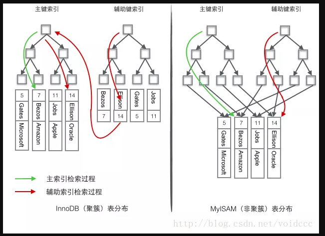
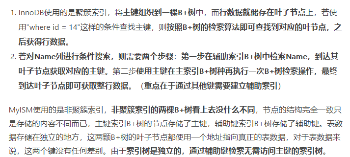
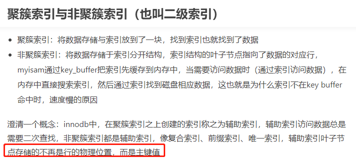
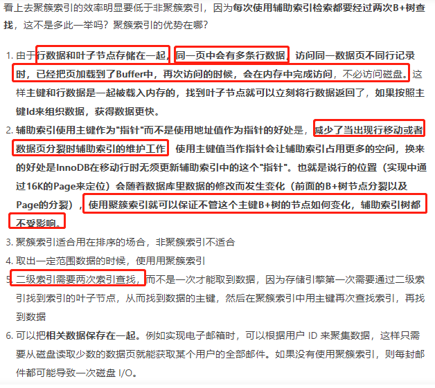
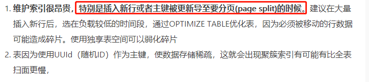
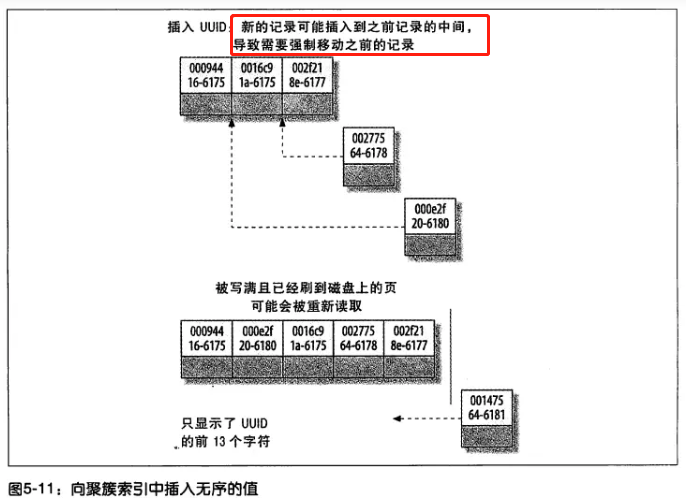
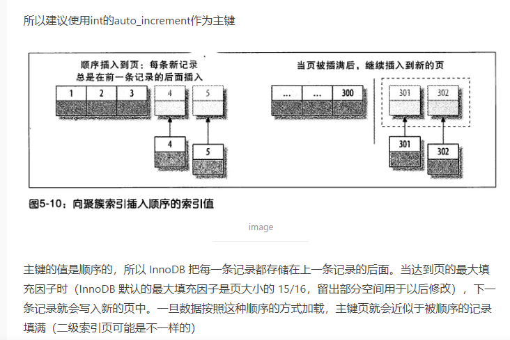
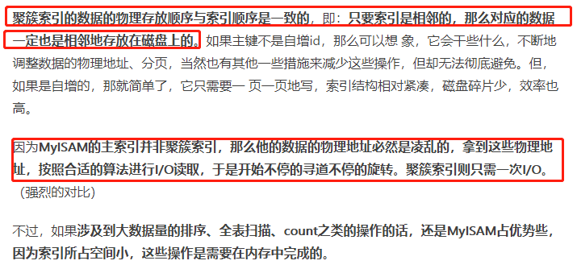

# 主索引和辅助索引(次索引)

InnoDB 的 B+Tree 索引分为主索引(索引和数据聚集在一起)和辅助索引。主索引的叶子节点 data 域记录着完整的数据记录，这种索引方式被称为聚簇索引。一个表只能有一个聚簇索引。聚簇索引具有唯一性.

辅助索引的叶子节点的 data 域记录着主键的值，因此在使用辅助索引进行查找时，需要先查找到主键值，然后再到主索引中进行查找。

    聚簇索引默认是主键,当然如果主键是无意义的字段的话,并且我们查询不常用,那么把主键设置为聚簇索引有些浪费,
    因为把聚簇索引对提升效率的帮助完全浪费了.此时我们可以修改其他我们常用的列为聚簇索引.
    步骤是: 先删除主键，然后添加我们想要的聚簇索引，最后恢复设置主键即可.
    
    聚簇索引性能最好,所以非常珍贵，必须慎重设置。
    一般要根据这个表最常用的SQL查询方式来进行选择，某个字段作为聚簇索引，或组合聚簇索引，这个要看实际情况



    myisam的主索引和次索引都指向物理行.





    频繁修改索引列,那么就不应该使用聚簇索引而是应该使用非聚簇索引,减少页的分裂.

    innodb的次索引(除了主键索引以外的索引)指向对主键的引用,
    通过次索引找数据的时候,是先通过次索引找到主键,要通过主键来找到对应数据.

# 聚簇索引的优势和劣势



    聚簇索引的好处: 根据主键查询,效率很快,因为找到主键了,就同时找到data了.

    innodb在树的叶子节点直接挂载数据.主键在哪里,data就直接放在主键的叶子节点旁边,
    
    次索引指向主键

---
    节点会分裂,对于聚簇索引,这个问题比较严重.
    
    对于myisam,节点存储的是物理行的地址,内容较小,同时又缓存在内存中,即使分裂,分裂的速度也是非常快,
    
    对于innodb而言,叶子节点还存储了数据,内容相对比较大,因此分裂的时候,还要移动行数据.速度比较慢.
    所以对于innodb而言,尽量用整型,而且是递增的整型.
    
    如果主键是无规律的,将会产生数据页的分裂,影响速度.所以要避免选择无规律的主键作为聚簇索引.
---








# 查看分裂的页数

```sql
SHOW STATUS;

-- 写了多少页.就是分裂了多少页.
innodb_pages_written
```

    myisam: 找到索引,然后到磁盘取数据叫做"回行",找到对应的索引值这个速度是很快的,但是回行是慢的,因为要进行磁盘io.

    你查询的内容如果索引中就有,这种速度是很快的,不用回行,也就是不用磁盘io了.
