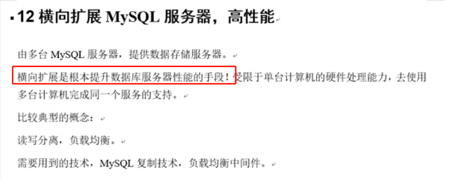
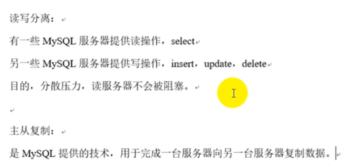
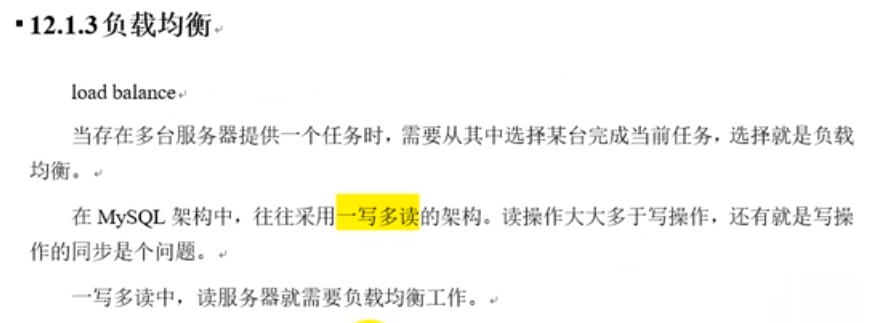

# 高性能



    读写分离能提高性能的原因: 主从服务器负责各自的读和写，极大程度缓解了锁的争抢.
    
    主服务器处理写操作以及实时性要求比较高的读操作，而从服务器处理读操作。
    读写分离常用代理方式来实现，代理服务器接收应用层传来的读写请求，然后决定转发到哪个服务器

# 读写分离

    网站都有一个读写比,读肯定比写多的多.
    写: insert/update/delete
    读: select
    
    读写分离可以借助中间件,也可以使用应用层的框架来实现.
    
    读写分离或者负载均衡: 代表的是要实现高性能
    


    读写分离需要sql主从复制技术的支持.
    




# 负载均衡

    可以使用框架来实现负载均衡或者使用中间件来实现负载均衡.
    
    读写分离或者负载均衡: 代表的是要实现高性能




# 主从复制 （集群在数据库的一种实现）

    集群的特点：负载均衡以及失败转移

    我们在windows上搭建主，在linux上搭建从

# 远程连接数据库需要授予权限

```sql
-- 如果要远程连接数据库，则需要授权远程访问:
-- 在mysql中输入
GRANT ALL PRIVILEGES ON *.* TO 'root'@'%' IDENTIFIED BY 'password' WITH GRANT OPTION; 
-- 解释：
-- GRANT ALL PRIVILEGES： 授权所有的权限
-- ON *.* ：任何数据库的任何表
-- TO 'root'@'%': 授权给root这个用户名，%表示任意ip
-- IDENTIFIED BY 'password'： 密码是password

-- 刷新权限
FLUSH PRIVILEGES;

-- 默认是没有开启远程访问的，远程连接的时候一定要授权。
-- 如果仍然报错：可能是防火墙没关闭 ：关闭防火墙  service iptables stop ，要不然A无法访问B
-- 实际生产只开放特定端口即可
```

# 主从复制过程


1. master将改变的数据记录在本地的 二进制日志中（binary log -> binlog) ；该过程 称之为：二进制日志件事, 也就是对数据库进行的所有增删改操作都会在日志文件里面记录下来。
2. slave将master的binary log拷贝到自己的 relay log（中继日志文件）中
3. 将relay log中的数据读取到自己的数据库之中 (中继日志事件)

>从图中可以看到，slave要进行复制，要有2个线程，一个是io线程，一个是sql线程。io线程负责从master的bin log中读取数据到relay log中，sql线程负责执行relay log的操作。MYSQL主从复制 是异步的，串行化的， 有延迟

# 主从复制实战

---
    准备:
	master:slave = 1:n

	配置文件：windows上叫my.ini，linux是my.cnf

	配置前，为了无误，先将权限(远程访问)、防火墙等关闭：
	关闭windows/linux防火墙：windows：右键“网络”, linux: service iptables stop
	
	允许远程访问： 
	GRANT ALL PRIVILEGES ON *.* TO 'root'@'%' IDENTIFIED BY 'password' WITH GRANT OPTION;
	FLUSH PRIVILEGES;
	验证是否可以远程登录(从服务器上是否可以连接主服务器)：
	mysql -u root -h 192.168.32.1 -P 3306 -p
	mysql -u root -h 192.168.32.128 -P 3306 -p
	注意要关闭windows防火墙，否则无法连接同步
---	

    master配置（以下代码和操作全部在主机windows中操作）：

```sql
-- C:\ProgramData\MySQL\MySQL Server 5.7\my.ini
[mysqld]
-- 起一个标识,一般设置成IP地址的最后一位
server-id=1
-- 二进制日志文件（注意是/  不是\）
log-bin="D:/programs/MySQL/data/mysql-bin"
-- 错误记录文件
log-error="D:/programs/MySQL/data/mysql-error"
--主从同步时 忽略的数据库，假如master上有a，b，c3个数据库，slave同步的时候可以忽略同步的数据库
binlog-ignore-db=mysql
binlog-ignore-db=information_schema
binlog-ignore-db=performance_schema
-- (可选)需要进行复制的数据库，可以指定数据库,指定主从同步时，同步哪些数据库
binlog-do-db=test	
```

```sql
-- 这些操作在master上执行:
-- master中的数据库 授权哪台计算机中的数据库 是自己的从数据库：	
-- TO 'root'@'192.168.2.%'： 授权ip是192.168.2网段的任意计算机，用户名是root
-- IDENTIFIED BY 'password'： 密码是password
-- REPLICATION slave: 从服务器复制的权限
GRANT REPLICATION slave,reload,super ON *.* TO 'root'@'192.168.32.%' IDENTIFIED BY 'password';
flush privileges ; 

-- 改为上面的配置后，master的mysql需要重启
-- 查看主数据库的状态（每次在主从同步前，需要观察 主机状态的最新值）
show master status;
-- File: 就是binary log二进制文件。
-- mysql-bin.000001，二进制日志文件名字
-- Position：表示mysql-bin.000001中已经记录到的位置
-- Binlog_Do_DB：需要复制的数据库,如果没有写的话,意思就是以后新建的数据库都要复制
-- Binlog_Ignore_DB : 忽略的数据库,不用复制
+------------------+----------+--------------+---------------------------------------------+-------------------+
| File             | Position | Binlog_Do_DB | Binlog_Ignore_DB                            | Executed_Gtid_Set |
+------------------+----------+--------------+---------------------------------------------+-------------------+
| mysql-bin.000001 |      154 | test         | mysql,information_schema,performance_schema |                   |
+------------------+----------+--------------+---------------------------------------------+-------------------+
```

    slave（以下代码和操作 全部在从机linux中操作）：

```properties
# 修改slave配置文件
# my.cnf
[mysqld]
# 可以修改为当前网段的最后一位,要提前分配好
server-id=128
# 这个是配置相对路径
log-bin=mysql-bin
# 只同步test数据库
replicate-do-db=test
```

```sql
-- 登录slave的mysql,执行:
-- linux中的数据 授权哪台计算机中的数据 是自己的主计算机
-- 旧版本的方式是通过修改my.cnf来配置，在新的版本中，修改my.cnf的配置方式已经废弃。
-- 而是使用CHANGE MASTER TO 语句,该语句完全替代了my.cnf 中相应的设置,
-- 并且允许以后指向别的主库时无须重启slave
-- 只需要配置一次即可，之后重启的时候，slave会自动连接到master同步数据，不需要每次都执行这些命令。
CHANGE MASTER TO 
-- 设置master的ip
MASTER_HOST = '192.168.32.1', 
-- 主机mysql的登录名
MASTER_USER = 'root',
-- 主机mysql的登录密码 
MASTER_PASSWORD = 'password', 
MASTER_PORT = 3306,
-- 要同步的bin-log
master_log_file='mysql-bin.000002',
-- 从上面这个文件的的哪个位置开始同步
master_log_pos=154;
-- mysql的slave将从master的mysql-bin.000002这个二进制日志文件的154这个位置开始复制.

-- 需要注意的是，此时复制并没有真正的开始
-- 需要开启主从同步：在从机linux中执行
start slave;

-- 检验是否配置成功
show slave status \G
-- 主要观察： Slave_IO_Running和 Slave_SQL_Running，确保二者都是yes；如果不都是yes，则看下方的 Last_IO_Error。
-- 而且Slave_IO_State: Waiting for master to send event #等待主库发送bin-log同步事件

-- 再查看master
show processlist \G

-- 测试,在windows上插入数据，观察从数据库中该表的数据
```

# 主从复制常见错误以及解决方法

```shell script
# 如果报错：This operation cannot be performed with a running slave; run STOP SLAVE first
# 解决：STOP SLAVE ;再次执行上条授权语句
```

```shell script
# 本次 通过 Last_IO_Error发现错误的原因是 主从使用了相同的server-id， 
# 检查:在主从中分别查看serverid:  show variables like 'server_id' ;
# 可以发现，在Linux中的my.cnf中设置了server-id=2，但实际执行时 确实server-id=1，
# 原因：可能是 linux版Mysql的一个bug，也可能是 windows和Linux版本不一致造成的兼容性问题。
# 解决改bug： set global server_id =2 ;

stop slave ;
set global server_id =2 ;
start slave ;
show slave status \G
```

```shell script
# 如果出现： Got fatal error 1236 from master when reading data from binary log: 'Slave can not handle replication events with the checksum that master is configured to log; the first event 'mysql-bin.000001' at 5115510, the last event read from './mysql-bin.000001' at 5115510, the last byte read from './mysql-bin.000001' at 120.'
# 这个问题是由于slave和master数据库版本不匹配导致，
# 这个错误一般出现在master5.6,slave在低版本的情况下。这是由于5.7或者更高版本中使用了crc32做binlog的checksum校验,但是低版本的slave不兼容校验导致.
# 当一个event被写入binary log(二进制日志)的时候，checksum也同时写入binary log，
# 然后在event通过网络传输到从服务器(slave)之后，再在从服务器中对其进行验证并写入从服务器的relay log.
# 在master(高版本的mysql,比如5.7)中设置binlog_checksum=none；即可解决
```


```shell script
# 有这么一种情况,一开始mysql是单机的,而且并没有在配置文件中设置log-bin等参数,也就是这台
# 单机的mysql一开始数据是没有写入log-bin对应的目录中的,那么这种情况下,搭建slave的时候,
# 一旦你在master上执行写操作,slave就会报错,因为slave没有master之前的已经存在的数据.

# 解决方法:
# 第一种: 要么就是把master之前已经存在的数据,这些数据没有在log-bin中,要把这些数据手动复制到slave中,
# 而且这个过程中,master不能进行写操作,然后复制完成后,再master和slave数据一致的基础上再进行同步

# 第二种: 从头开始同步数据,而不是半路上同步.
```

# binlog-format日志格式


# 通过mysqlbinlog工具解析Binlog日志


```shell script
# 查看binlog 日志内容：
mysqlbinlog  --no-defaults --database=test -vv --base64-output=decode-rows Ubuntu-relay-bin.000002 | more

mysqlbinlog --no-defaults --database=test -vv --base64-output=decode-rows --start-datetime='2019-04-11 00:00:00' --stop-datetime='2019-04-11 15:00:00'  mysql-bin.000007 | more

# -vv参数为查看具体SQL语句及备注。
# --base64-output=decode-rows参数为解析Binlog日志文件。
```
