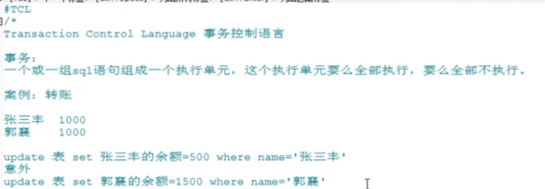
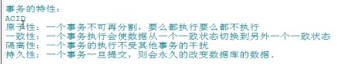
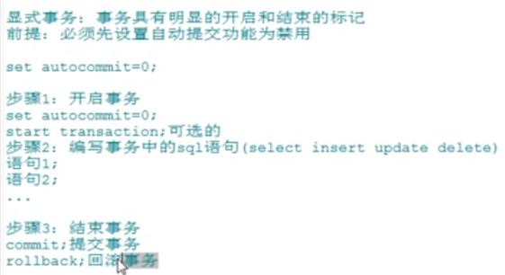
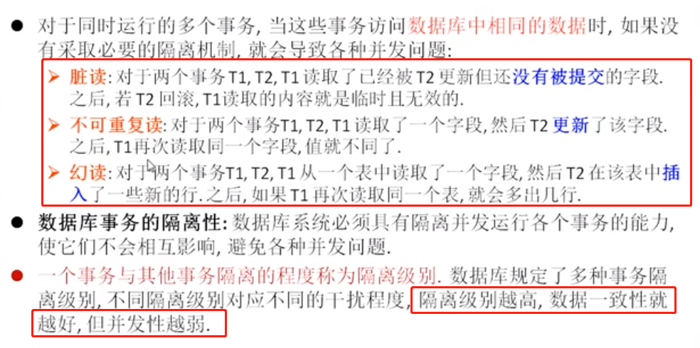
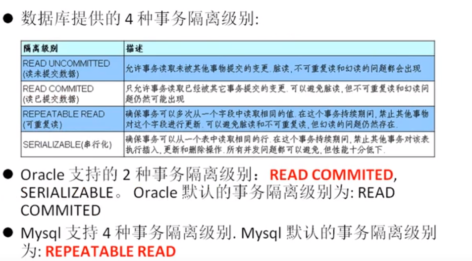
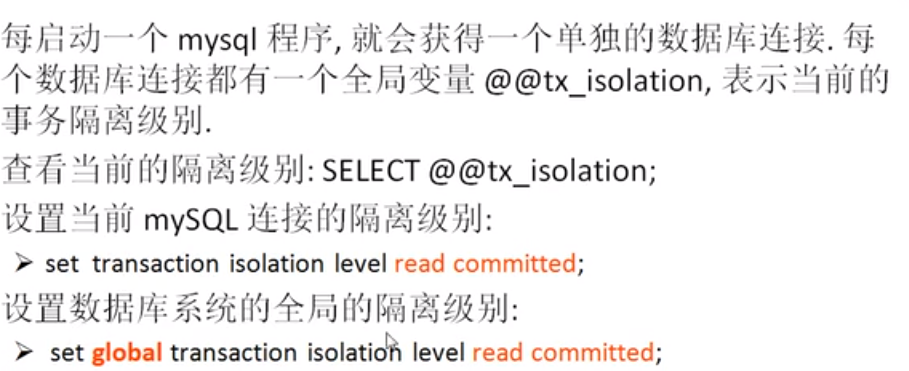
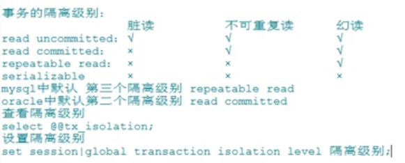
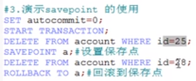

# tcl(transaction control language)




>隔离性需要我们去控制事务的隔离级别才可以达到.公司的业务一般情况下4种特性不会全部满足,尤其是在有高并发场景的业务下,隔离性不会严格满足.




# 事务的演示

- 隐式事务: 事务没有明显的开启和结束的标记,比如insert,update,delete,这些单独的语句相当于开启了事务.(简言之这些单独的语句就是原子性的)
- 显示事务: 事务有明显的开启和结束的标记(前提是先设置自动提交功能为关闭,因为默认是开启的)



```sql
-- 默认自动提交的功能是开启的,这意味着单独的insert,update,delete语句就是一个事务,就会自动提交.
show variables like 'autocommit';
```

```sql
-- 关闭自动提交(只针对当前的会话有效)
set autocommit = 0;
```

```sql
-- 准备数据
DROP TABLE IF EXISTS ACCOUNT;

CREATE TABLE ACCOUNT(
	id INT PRIMARY KEY AUTO_INCREMENT,
	username VARCHAR(20),
	balance DOUBLE
);

INSERT INTO ACCOUNT (username, balance) VALUES('张无忌', 1000),('赵敏', 1000);

-- 开启事务
SET autocommit = 0;
START TRANSACTION;
-- 编写一组事务语句
UPDATE ACCOUNT SET balance = 500 WHERE username = '张无忌';
UPDATE ACCOUNT SET balance = 1500 WHERE username = '赵敏';
-- 结束事务
-- rollback;
COMMIT;
SELECT * FROM ACCOUNT;
```

# 演示事务的隔离级别

    隔离性: 并发执行的事务彼此无法看到对方的中间状态.
    
    脏读: 如果b事务是在a事务结束之前开启,那么b事务就不应该读取到a事务还没有提交的数据.如果读取到了,就是脏读.
    不可重复读: 在同一事务中,多次读取同一数据返回的结果不一致,就是不可重复读.也就是同一事务中,后续读取可以读到另一事务已经提交的数据.
    






## 脏读

```sql
-- 脏读演示
-- 查看隔离级别
SELECT @@tx_isolation;

delete from account;

-- 会话1
-- 设置隔离级别为读未提交-read uncommitted(隔离级别最低的)
-- 在read uncommitted下,脏读,不可重复读,幻读都会出现
set session transaction isolation level read uncommitted;
set autocommit=0;
insert into account values(1, 'xzj1', 1888.00);

-- 会话2:
set session transaction isolation level read uncommitted;
-- 发现数据已经变了,但是人家会话1还没有提交事务
select * from account;

-- 会话1回滚
rollback;

-- 会话2:
-- 发现刚刚读到的数据没了
select * from account;
-- 最后避免影响后续演示,所以要提交下
commit;
```

```sql
-- 解决脏读
-- read committed可以避免脏读(不可重复读和幻读依然存在)

-- 会话1
-- 设置事务隔离级别为 "读已提交-read committed"
set session transaction isolation level read committed;
set autocommit=0;
update account set username='aaaa' where id = 1;

-- 会话2
set session transaction isolation level read committed;
set autocommit=0;
-- 发现已经没有脏读了
select * from account;

-- 最后避免影响后续演示,所以2个会话都提交下
commit;
```

## 不可重复读

```sql
-- 不可重复读演示
-- 会话1
set session transaction isolation level read committed;
set autocommit=0;
select * from account;

-- 会话2
set session transaction isolation level read committed;
set autocommit=0;
delete from account;
insert into account values(1, 'xzj1', 1888.00);
commit;

-- 会话1
-- 因为会话1事务还没有完成,但是发现和第一次读到的数据不一致,这就是不可重复读
select * from account;

-- 最后避免影响后续演示,所以2个会话都提交下
commit;
```

```sql
-- 解决不可重复读
-- repeatable read可以避免脏读和不可重复读,但是不可以避免幻读

-- 会话1
-- 设置事务的隔离级别为 repeatable read
set session transaction isolation level repeatable read;
set autocommit=0;
select * from account;

-- 会话2
set session transaction isolation level repeatable read;
set autocommit=0;
delete from account;
insert into account values(1, 'xzj1', 1888.00);
select * from account;
commit;

-- 会话1
-- 发现还是之前读到的数据,这个就解决了不可重复读,也就是当前事务在没有提交之前,每次读到的数据都要一致
select * from account;

-- 最后避免影响后续演示,所以2个会话都提交下
commit;
```

## 幻读

在Repeatable Read隔离级别下，一个事务可能会遇到幻读（Phantom Read）的问题,

幻读是指，在一个事务中，第一次查询某条记录，发现没有，但是，当试图更新这条不存在的记录时，竟然能成功，并且，再次读取同一条记录，它就神奇地出现了。

```sql
-- 幻读演示
-- 事务A
SET TRANSACTION ISOLATION LEVEL REPEATABLE READ;
BEGIN;

-- 事务B
SET TRANSACTION ISOLATION LEVEL REPEATABLE READ;
BEGIN;
SELECT * FROM account WHERE id = 1;

-- 事务A
INSERT INTO account (id, username, balance) VALUES(1, 'xxx', 3000);
COMMIT;

-- 事务B
-- 发现没有数据
SELECT * FROM account WHERE id = 1;

UPDATE account SET username = 'Alice' WHERE id = 1;
SELECT * FROM account WHERE id = 1;
COMMIT;
```

事务B第一次读取id=1的记录时，读到的记录为空，说明不存在id=1的记录。随后，事务A插入了一条id=1的记录并提交。事务B再次读取id=1的记录时，读到的记录仍然为空，但是，事务B在试图更新这条不存在的记录时，竟然成功了，并且，事务B再次读取id=1的记录时，记录出现了。

>可见，幻读就是没有读到的记录，以为不存在，但其实是可以更新成功的，并且，更新成功后，再次读取，就出现了.解决幻读只需要设置隔离级别为SERIALIZABLE,但是实际不会这么做,因为效率太低了,一般解决方法是: 如果是单机的应用,就是用jvm的锁机制,如果是分布式应用,就是用分布式锁来解决.

# savepoint(回滚点)



```sql
-- savepoint只搭配rollback使用
set autocommit=0;
start transaction;
delete from account where id = 3;
savepoint bb;--设置保存点
delete from account where id = 1;
rollback to bb;--回滚到保存点
```

# delete和truncate在事务使用时的区别

```sql
-- 演示delete(支持回滚)
SET autocommit=0;
START TRANSACTION;
DELETE FROM ACCOUNT;
ROLLBACK;

SELECT * FROM ACCOUNT;
```

```sql
-- 演示truncate(不支持回滚)
SET autocommit=0;
START TRANSACTION;
TRUNCATE TABLE ACCOUNT;
ROLLBACK;

SELECT * FROM ACCOUNT;
```

# Oracle和Mysql对事物的支持

- Oracle 支持的 2 种事务隔离级别：**READ COMMITED**, SERIALIZABLE。 Oracle 默认的事务隔离级别为: **READ COMMITED** 。


- Mysql 支持 4 种事务隔离级别。Mysql 默认的事务隔离级别为: **REPEATABLE READ。**