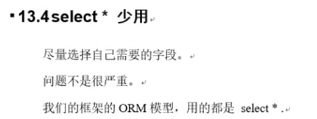
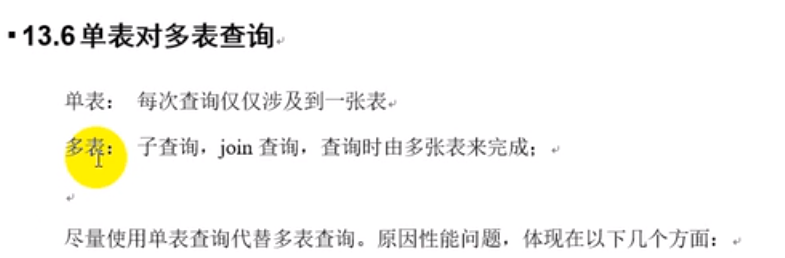

# 单表优化



```sql
create table book(
    bid int(4) primary key,
    name varchar(20) not null,
    authorid int(4) not null,
    publicid int(4) not null,
    typeid int(4) not null
);

insert into book values(1, 'tjava', 1, 1, 2);
insert into book values(2, 'tc', 2, 1, 2);
insert into book values(3, 'wx', 3, 2, 1);
insert into book values(4, 'math', 4, 2, 3);
commit;
```

```sql
-- 查询authorid=1 且 typeid为2或3的 bid
explain select bid from book where typeid in (2,3) and authorid = 1 order by typeid desc;
-- 结果比较糟糕,type为ALL,Extra为Using where,以及Using filesort
+----+-------------+-------+------+---------------+------+---------+------+------+-----------------------------+
| id | select_type | table | type | possible_keys | key  | key_len | ref  | rows | Extra                       |
+----+-------------+-------+------+---------------+------+---------+------+------+-----------------------------+
|  1 | SIMPLE      | book  | ALL  | NULL          | NULL | NULL    | NULL |    4 | Using where; Using filesort |
+----+-------------+-------+------+---------------+------+---------+------+------+-----------------------------+

-- 优化: 加索引
alter table book add index idx_bta(bid, typeid, authorid);
-- 内部实际的解析过程(顺序): from ..on..  join... where... group by ...having...  select distinct .. order by limit...
-- 虽然type变为了index,但是根据sql解析顺序,是先解析where, 然后才是select,所以需要调整索引的顺序
+----+-------------+-------+-------+---------------+---------+---------+------+------+------------------------------------------+
| id | select_type | table | type  | possible_keys | key     | key_len | ref  | rows | Extra                                    |
+----+-------------+-------+-------+---------------+---------+---------+------+------+------------------------------------------+
|  1 | SIMPLE      | book  | index | NULL          | idx_bta | 12      | NULL |    4 | Using where; Using index; Using filesort |
+----+-------------+-------+-------+---------------+---------+---------+------+------+------------------------------------------+

-- 索引一旦进行升级优化,需要将之前废弃的索引删掉,防止干扰
drop index idx_bta on book;

-- 根据sql实际解析的顺序,调整索引的顺序
alter table book add index idx_bta (typeid, authorid, bid);
explain select bid from book where typeid in (2,3) and authorid = 1 order by typeid desc;
-- 如果不给bid建立索引,虽然可以回表查bid,但是将bid放到索引中,直接在索引中就找到bid了,不用回表查询bid了,可以提升extra到using index
+----+-------------+-------+-------+---------------+---------+---------+------+------+--------------------------+
| id | select_type | table | type  | possible_keys | key     | key_len | ref  | rows | Extra                    |
+----+-------------+-------+-------+---------------+---------+---------+------+------+--------------------------+
|  1 | SIMPLE      | book  | index | idx_bta       | idx_bta | 12      | NULL |    4 | Using where; Using index |
+----+-------------+-------+-------+---------------+---------+---------+------+------+--------------------------+

-- 再次优化,之前之前type是index,我们一般要优化到ref或者range
-- 思路: 范围查询in有时会失效,如果失效的时候,后面的authorid这个索引可能会受到干扰,因此要交换索引的顺序,将typeid放到后面

drop index idx_bta on book;

alter table book add index idx_atb(authorid,typeid,bid); 
explain select bid from book where authorid = 1 and typeid in (2,3) order by typeid desc;
-- type从index提高到了ref
-- typeid这个索引一旦失效了,就会出现using where,需要回原表查询typeid.可以根据key_len印证
-- 本例中同时出现using where(需要回原表),using index(不需要回原表),
-- in大于一半记录,就会扫描原表
+----+-------------+-------+------+---------------+---------+---------+-------+------+--------------------------+
| id | select_type | table | type | possible_keys | key     | key_len | ref   | rows | Extra                    |
+----+-------------+-------+------+---------------+---------+---------+-------+------+--------------------------+
|  1 | SIMPLE      | book  | ref  | idx_atb       | idx_atb | 4       | const |    2 | Using where; Using index |
+----+-------------+-------+------+---------------+---------+---------+-------+------+--------------------------+

-- 小结: 索引不能跨列使用(最佳左前缀),保持索引的顺序和使用的顺序.
-- 索引需要逐步优化
-- 将含in范围查询的放到where条件的最后,防止失效.避免干扰前面的索引
```


