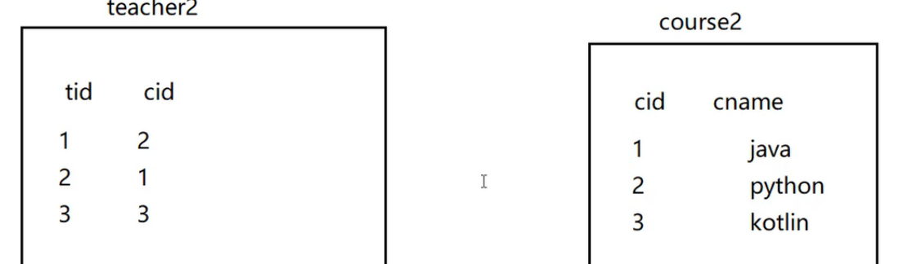
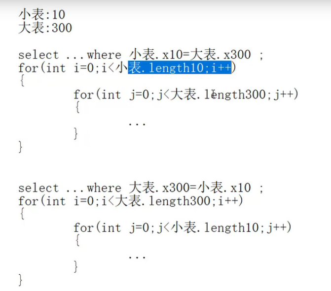
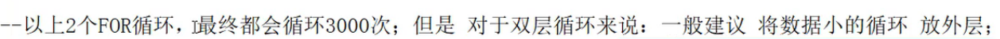
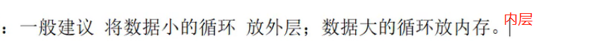

# 两表优化



```sql
create table teacher2(
    tid int(4) primary key,
    cid int(4) not null
);

insert into teacher2 values(1,2);
insert into teacher2 values(2,1);
insert into teacher2 values(3,3);

create table course2(
    cid int(4),
    cname varchar(20)
);

insert into course2 values(1,'java');
insert into course2 values(2,'python');
insert into course2 values(3,'kotlin');
commit;
```

```sql
-- 左连接(以左表为基础,左表为基础的意思就是左表中的全部数据都要匹配)
explain select * from teacher2 t left outer join course2 c on t.cid=c.cid where c.cname='java';
+----+-------------+-------+------+---------------+------+---------+------+------+--------------------------------+
| id | select_type | table | type | possible_keys | key  | key_len | ref  | rows | Extra                          |
+----+-------------+-------+------+---------------+------+---------+------+------+--------------------------------+
|  1 | SIMPLE      | t     | ALL  | NULL          | NULL | NULL    | NULL |    3 |                                |
|  1 | SIMPLE      | c     | ALL  | NULL          | NULL | NULL    | NULL |    3 | Using where; Using join buffer |
+----+-------------+-------+------+---------------+------+---------+------+------+--------------------------------+

-- 优化,要加索引,往哪里加?    --小表驱动大表
-- 将数据小的表放到左边,也就是当编写on t.cid=c.cid时,将数据量小的表放左边(这里是假设t表小)
where 小表.x = 大表.y;
```





>外层循环越小,内层循环越大,对于程序的性能是越高的.这个是编程的一个原则.

```sql
-- 索引要建立在经常使用的字段上
where 小表.x = 大表.y;
-- 假设小表是10条,大表是300表,左边的10条数据中的每一条数据,都要比较300次,因此左边表的数据使用量比较大
-- 左边的x字段使用的频率比较高,因此就需要给x字段加索引
-- 左连接,是以左表为基础,左表为基础的意思就是左表中的全部数据都要匹配,也就是左表
-- 的使用频率必然很频繁,所以要给左表加索引
-- 右连接,以右表为基础,给右表加索引
```

```sql
-- 给左表加索引
alter table teacher2 add index index_teacher2_cid(cid);

explain select * from teacher2 t left outer join course2 c on t.cid=c.cid where c.cname='java';
-- teacher2的type已经为index,而且增加了索引覆盖,extra变为using index了
+----+-------------+-------+-------+--------------------+--------------------+---------+------+------+--------------------------------+
| id | select_type | table | type  | possible_keys      | key                | key_len | ref  | rows | Extra                          |
+----+-------------+-------+-------+--------------------+--------------------+---------+------+------+--------------------------------+
|  1 | SIMPLE      | t     | index | index_teacher2_cid | index_teacher2_cid | 4       | NULL |    3 | Using index                    |
|  1 | SIMPLE      | c     | ALL   | NULL               | NULL               | NULL    | NULL |    3 | Using where; Using join buffer |
+----+-------------+-------+-------+--------------------+--------------------+---------+------+------+--------------------------------+

-- 还有一个字段是必须加索引的,那就是cname,因为要根据cname查询东西,如果不给cname加索引,效率太低了.
alter table course2 add index index_course2_cname(cname);

explain select * from teacher2 t left outer join course2 c on t.cid=c.cid where c.cname='java';
-- 很明显,给cname加完索引后,course的type变为ref了,
+----+-------------+-------+------+---------------------+---------------------+---------+------------+------+-------------+
| id | select_type | table | type | possible_keys       | key                 | key_len | ref        | rows | Extra       |
+----+-------------+-------+------+---------------------+---------------------+---------+------------+------+-------------+
|  1 | SIMPLE      | c     | ref  | index_course2_cname | index_course2_cname | 63      | const      |    1 | Using where |
|  1 | SIMPLE      | t     | ref  | index_teacher2_cid  | index_teacher2_cid  | 4       | myBD.c.cid |    1 | Using index |
+----+-------------+-------+------+---------------------+---------------------+---------+------------+------+-------------+
```


其实就是你这个sql写的太差了,mysql看不下去了,它给你加了连接缓存.后面我们改进了之后,mysql觉得你写的差不多,就给你加了.
