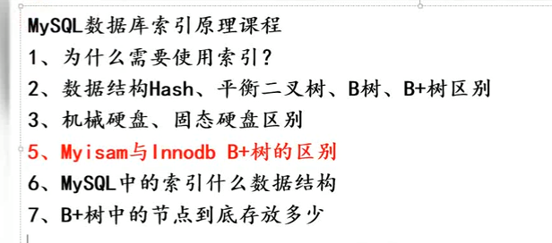

# MySql索引

    索引是排好序的数据结构，它可以提高查询速度

# 索引的优点

    SELECT 语句却会执行得更快
    

    全表扫描的代价是非常大的.会将整个表的数据全部扫描一遍.

# 索引的缺点

    INSERT 与 UPDATE 语句在拥有索引的表中执行会花费更多的时间。
    
    这是因为，在进行插入或更新时，数据库也需要插入或更新索引值.

# 索引问题概括

