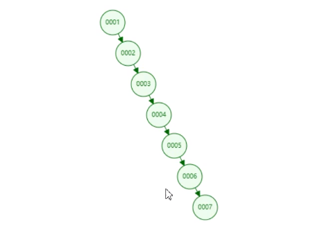
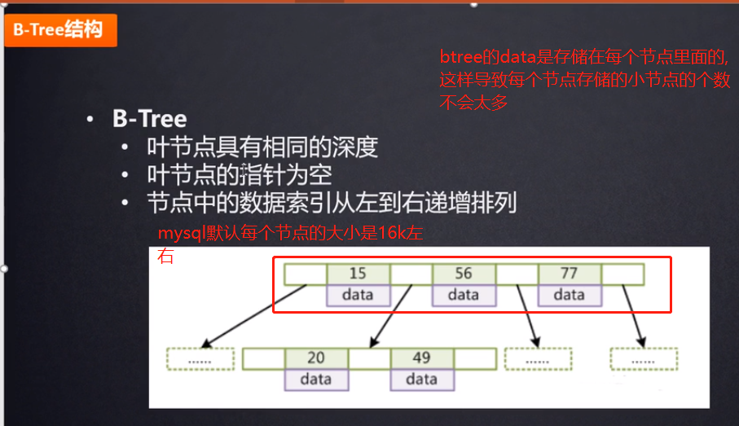
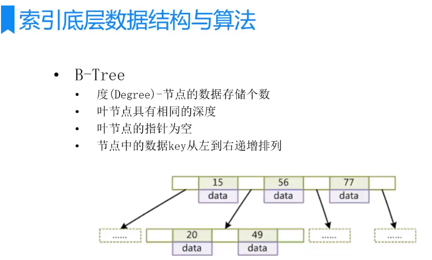
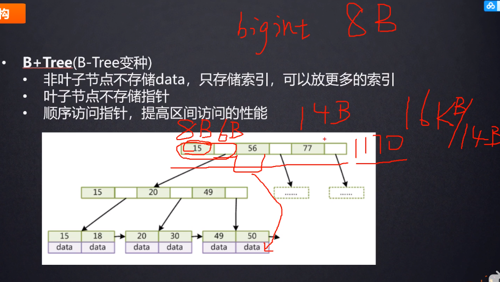
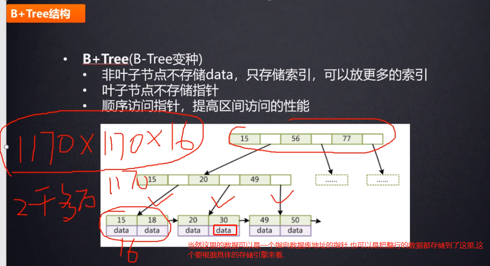
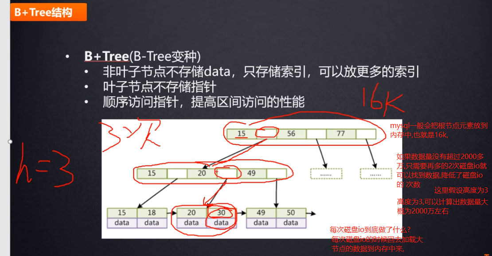
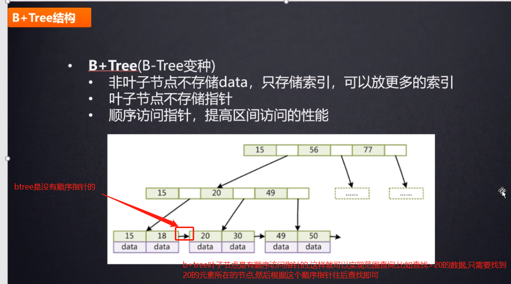
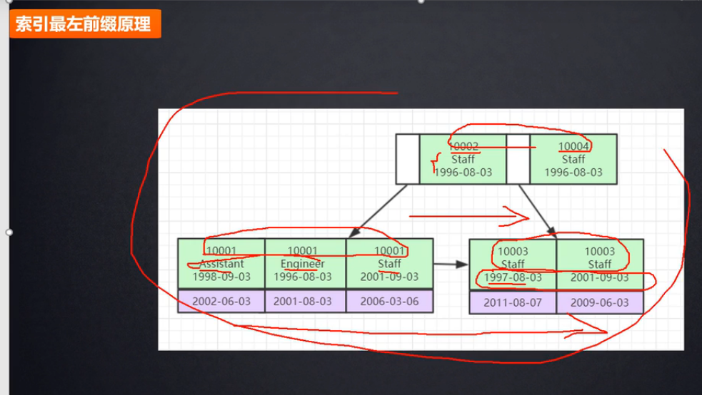

# MySql索引

索引是排好序的数据结构,索引可以通过一个或多个列来创建，它可以提高随机查询的速度,在创建索引时，需要考虑哪些列会用于 SQL 查询，然后为这些列创建一个或多个索引,工作中建的最多的就是联合索引.

INSERT 与 UPDATE 语句在拥有索引的表中执行会花费更多的时间，而 SELECT 语句却会执行得更快。这是因为，在进行插入或更新时，数据库也需要插入或更新索引值.

# mysql索引使用的数据结构

mysql索引使用的数据结构不是使用二叉树,而是使用B+tree这种数据结构.

# 二叉树作为存储索引的数据结构有什么弊端呢?

    使用二叉树的话,col1就会退化成一条链,这样的话,并不能减少查询的次数.
    也就是当这列的数据是递增的情况下,二叉树这种结构不会减少搜索次数

# 思考一下为什么不使用hash建立索引?

使用hash表的方式建立索引使用的比较少,工作中99%是使用b+tree建立索引.而不是使用hash建立索引.

如果我们使用hash表来建立索引,比如查找col1=6的这一行的数据,只需要对6做哈希运算就可以得到这行数据在内存中的地址,磁盘io只需要一次(磁盘io是比较消耗性能的,所以只需要1次磁盘io性能已经很好了)

但是使用hash表建立索引有一个致命的缺点,那就是不能用于范围查询.你hash表性能再高,但是如果查找col1>6的行的话,hash表就没辙了.

# 思考下为什么不使用红黑树来构建索引?

红黑树等平衡树也可以用来实现索引，但是文件系统及数据库系统普遍采用 B+ Tree 作为索引结构，主要原因：

    更少的查找次数

    平衡树查找操作的时间复杂度和树高 h 相关.

    红黑树的出度为 2，而 B+ Tree 的出度一般都非常大，所以相同节点数量,
    红黑树的树高 h 很明显比 B+ Tree 大非常多，查找的次数也就更多

# 理解B-树(多路分叉)

    B-tree解决了树的高度不会太高的问题(树太高的话,磁盘io的次数会很多,效率就比较低),
    也就是存储同样个数的节点,B-tree的高度要比二叉树的高度要低很多.
    
    B树中,非叶子节点除了存储索引,也是存储具体数据的.
    (B+树对这个特点进行了改造,使得非叶子节点可以存储更多的索引数据,这样树的高度就可以更低了)

# B+tree(b-树的变体)

    叶子节点之间有顺序访问指针,通过顺序访问指针来进行区间查询.

>一个大节点上,存储了很多小节点,mysql官方给每个节点设置了大小限制默认大概为16K,可以通过`show global status like 'Innodb_page_size';`查看.

    按照上图推算,我们一般使用主键索引假如使用bitint.占用8个字节.
    然后指针占用大概6个字节,所以小节点总共6+8=14个字节.
    所以一个大的非叶节点大概可存放16Kb/14b=1170个

    B+树中,data存放在叶子节点.非叶子节点不存储data.非叶子节点只存储部分索引(冗余存储部分索引)

    叶子节点存放的了data,这个data可能存放的是索引所在行的地址指针
    ,也有可能是索引所在行的数据.这个要看是什么引擎.
    
    所以一个叶子节点对应的索引大概总大小是1KB(包含了data的大小),
    
    所以一个大节点可以存放16Kb/1Kb=16个索引元素.
    
    整个树可以存放大概: 1170*1170*16=2千多万

    一般b+tree的高度要控制在2-4之间,这样磁盘io的次数就可以控制.
    如果树的高度再高,也就是数据量再大的话,就要分库分表.

>操作

进行查找操作时，首先在根节点进行二分查找，找到要查询的key的范围，然后递归地在这个更小的范围内进行二分查找。直到查找到叶子节点，然后在叶子节点上进行二分查找，找出 key 所对应的 data

    插入删除操作会破坏平衡树的平衡性，因此在插入删除操作之后，
    需要对树进行一个分裂、合并、旋转等操作来维护平衡性。

# myisam存储引擎

    存储引擎是针对于表级别,而不是数据库级别的.

    myd: myisam data存放数据
    myi: myisam index存放索引
    
    myisam的索引就是非聚集索引: 索引和表数据是分开存储的,不在一个文件中.

    先把myi索引文件加载到数据,然后根据索引找到数据对应的地址指针,
    然后从myd这个文件中,用上面的地址指针找到对应的数据.

# innodb存储引擎

    大多数公司都是使用innodb.因为有事务.
    

    frm: 存储表结构信息
    ibd: innodb data用于存储索引和data
    innodb就是把索引和data存储在一起.

    聚集索引: 索引和表数据放在一起.
    
    innodb的索引就是聚集索引.索引和表数据是在同一个文件中存储的.
    也就是 innodb的叶节点包含了: 索引+data

# 为什么InnoDB表必须有主键,并且推荐使用整型的自增主键?

如果你没有给InnoDB的表建立主键,mysql底层会自动挑选一个能够唯一标识数据的字段作为主键索引,如果找不到,她会给你生成一个隐藏列,这个隐藏列可以唯一标识每行数据.然后innodb根据这个隐藏列来建立主键索引.从而使用b+tree来组织数据.

    因为innodb就是使用b+tree来组织索引和数据的,如果表没有建立主键,就没法通过b+树来组织数据

    这也就要求使用InnoDB的话,必须要创建主键.

工作中的主键不要使用uuid,而是要使用整型,因为整型的比较效率更高(通过索引查找的时候会涉及比较),而且占用的空间也比较小.这就是为什么要使用整型.

如果主键使用uuid的话,因为每个uuid都不是递增的,是随机的,当新增数据的时候,uuid是随机的,那么这条数据插入的位置也就是随机的,会造成b+tree的大量的树的平衡和分裂.(花费时间和性能)

    分裂就是树的分叉.
    
    如果是递增的整型的话,每次新添加的元素都是有序的在叶子节点往后添加,不会造成大量的树的平衡和分裂.这就是为什么要使用 "自增的"整型.

# 联合索引

工作中用到最多的就是联合索引,没有人在表里面大规模的建立单值索引.联合索引比单值索引性能会高很多.

联合索引就是把多个字段放到一起组成索引来存储.比较大小就是从第一个字段往后比较,如果第一个字段相等就比较第二个,依次类推.

联合索引也是按照从小到大去存储的.依然满足从左到右依次递增的排序,

# 参考

- [视频](https://www.bilibili.com/video/av70678432?p=5)
