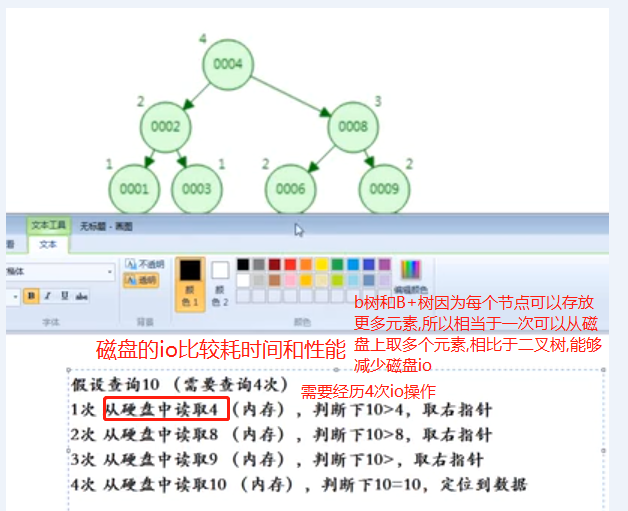
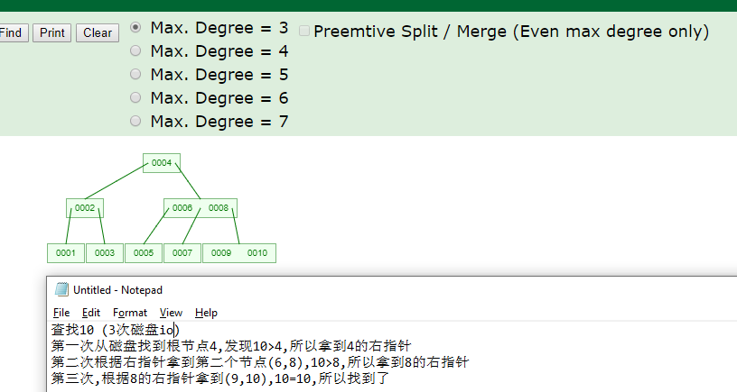
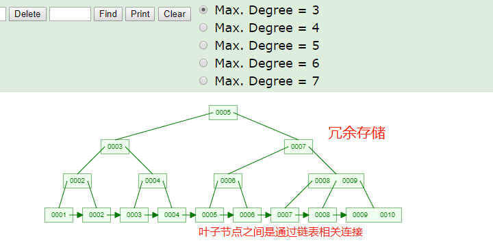

# mysql索引的数据结构

    结论: mysql索引使用的数据结构不是使用二叉树,而是使用B+tree这种数据结构.

# 思考一下为什么不使用二叉树建立索引?

    二叉树作为存储索引的数据结构有什么弊端呢?

    使用二叉树的话,col1可能会退化成一条链,这种极端的情况,并不能减少查询的次数.

# 思考一下为什么不使用hash建立索引?

使用hash表的方式建立索引使用的比较少,工作中99%是使用b+tree建立索引.而不是使用hash建立索引.

如果我们使用hash表来建立索引,比如查找col1=6的这一行的数据,只需要对6做哈希运算就可以得到这行数据在内存中的地址,磁盘io只需要一次(磁盘io是比较消耗性能的,所以只需要1次磁盘io性能已经很好了)

    缺点: 使用hash表建立索引有一个致命的缺点,那就是不能用于范围查询.你hash表性能再高,但是如果查找col1>6的行的话,hash表就没辙了.

# 思考下为什么不使用红黑树来构建索引?

红黑树等平衡树也可以用来实现索引，但是文件系统及数据库系统普遍采用 B+ Tree 作为索引结构，主要原因：

    更少的查找次数

    平衡树查找操作的时间复杂度和树高 h 相关.

    红黑树的出度为 2，而 B+ Tree 的出度一般都非常大，所以相同节点数量,
    红黑树的树高 h 很明显比 B+ Tree 大非常多，查找的次数也就更多

# 理解B树(多路分叉)

    0. B树是在平衡二叉树的基础之上改进过来的(满足左小右大).
    1. B树的每个节点能存放的元素比二叉树多.就是为了降低树的高度.控制io操作的次数.
        相比于平衡二叉树,B树解决了树的高度不会太高的问题
    2. 也就是存储同样个数的节点,B树的高度比平衡二叉树的低很多.

    
    B树的特点:

    B树的非叶子节点除了存储索引,也存储数据
    
    B+树对这个特点进行了改造,使得非叶子节点可以存储更多的索引元素,这样树的高度就可以更低了
    
    B树的范围查询查询效率太低了(或者说不支持范围查找),因为节点不是冗余存储的

    应用: B树在大块数据的读上有明显的优势,所以普遍运用于数据库和文件系统.

# B+tree(B树的变体)

    为了解决B树范围查询效率太低的问题,出现了B+树.
    
    B+树继承了B树的优点:
        - 每个节点中能存放的元素比较多,所以能够减少磁盘io的次数
    
    B+树的范围查询效率非常高,因为叶子节点之间是通过链表相连,是顺序排列的.

    B+树的一个节点存储了很多元素,mysql官方给每个节点设置了大小限制默认大概为16K,
    可以通过这个命令查看: show global status like 'Innodb_page_size'; 

    按照上图推算:
        1. 我们一般使用主键索引假如使用bitint.占用8个字节.
        2. 然后指向下一层的指针占用大概6个字节
        3. 所以一个元素占用: 6+8=14个字节.
        4. 所以一个非叶子节点大概可存放16Kb/14b=1170个

        B+树中,data存放在叶子节点.非叶子节点不存储data.
        非叶子节点只存储部分索引(冗余存储)

    叶子节点存放的了data,这个data可能存放的是索引所在行的地址指针
    ,也有可能是索引所在行的数据.这个要看是什么引擎.
    
    所以一个叶子节点对应的索引大概总大小是1KB(包含了data的大小),
    
    所以一个节点可以存放16Kb/1Kb=16个索引元素.
    
    整个树可以存放大概: 1170*1170*16=2千多万

    一般b+tree的高度要控制在2-4之间,这样磁盘io的次数就可以控制.
    如果树的高度再高,也就是数据量再大的话,就要分库分表.

    插入删除操作会破坏平衡树的平衡性，因此在插入删除操作之后，
    需要对树进行一个分裂、合并、旋转等操作来维护平衡性

# Myisam和innodb B+树的区别?

    Myisam和innodb虽然都是使用B+树,但是细节方法还是有很多区别的.

# 参考

- [视频](https://www.bilibili.com/video/av70678432?p=5)
