# SQL需要优化的原因

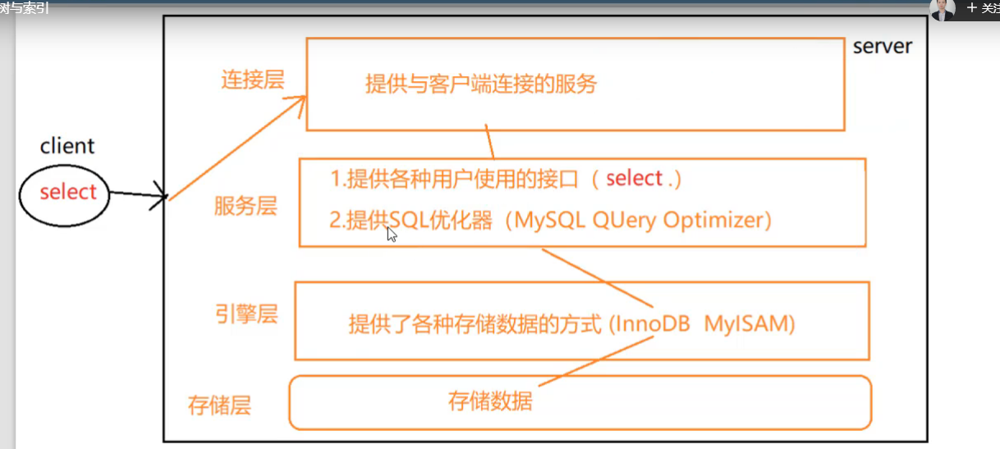
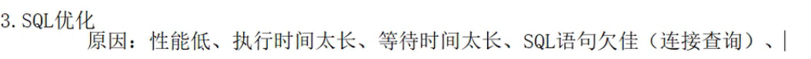
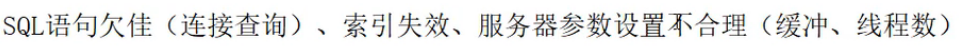

# sql优化,主要就是优化索引

索引简单来讲就是书的目录,比如你要在字典里面查找"王",如果没有目录,你就要从头一个个查找,比对,直到找到这个王,建立索引之后,可以在目录里面查找王的是在第1000页,我们就可以直接在1000页的地方查找了,索引就相当于目录,可以加速我们查询的效果.

索引在数据库中是用index表示,索引是帮助mysql高效查询数据的一种数据结构.所以可以看到索引是一种数据结构.索引是一种树结构(B树).

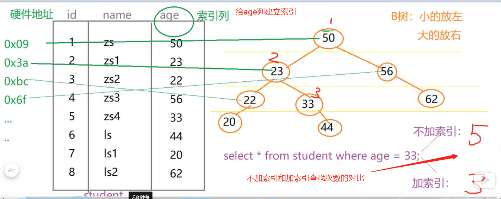

age列为索引列,相当于是书的目录,也就是age等于50的指向第一行,age为22的指向第三行.整个树就是一个索引.

索引的弊端: 

- 索引本身也是数据,自己本身也需要占用内存空间,可以存放在内存/硬盘中,通常存放在硬盘中,

索引不是所有情况均适用: 

- 少量数据
- 频繁更新的字段不适合做索引,因为这个导致节点在树上的位置要不断变化,会耗性能
- 很少使用的字段

索引确实会增加select的效率,但是会降低insert/delete/update的效率.比如上面的例子,如果把age=44要修改为age=55,这个age=44节点在树中的位置也要被修改.这个索引相对还是比较划算的,因为select的频率要比其他的insert/delete/update频率要高.

索引的优势:

- 提高查询的效率(降低IO的使用率-查询的次数少了)
- 降低cpu使用率(不用再排序了),例如上面的例子,如果需要对age进行降序排序,在没有建立索引的情况下,需要把所有的age全部拿出来,再进行排序,如果有了索引,age已经是排好序了.就不用再排序了,可以直接使用.只需要把树上的数据简单处理输出就可以了.也就是直接使用tree的遍历方式就可以了.

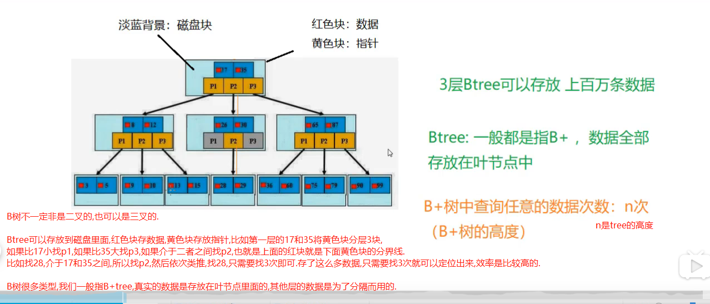

B树不一定非是二叉的,也可以是三叉的.

Btree可以存放到磁盘里面,红色块存数据,黄色块存放指针,比如第一层的17和35将黄色块分层3块,如果比17小找p1,如果比35大找p3,如果介于二者之间找p2,也就是上面的红块就是下面黄色块的分界线.比如找28,介于17和35之间,所以找p2,然后依次类推,找28,只需要找3次即可.存了这么多数据,只需要找3次就可以定位出来,效率是比较高的.

B树很多类型,我们一般指B+tree,真实的数据是存放在叶节点里面的,其他层的数据是为了分隔而用的.

# SQL性能问题

分析sql的执行过程, 使用的关键字是explain,可以模拟sql优化器执行sql语句. 从而可以让开发人员知道自己编写的sql的状况.

mysql优化器会干扰我们的优化.

[mysql 5.5](https://dev.mysql.com/doc/refman/5.5/en/optimization.html)

查询执行计划: `explain + sql语句.`

```sql
explain select * from tb;
```

```shell script
+----+-------------+-------+-------+---------------+-----------------+---------+------+------+-------------+
| id | select_type | table | type  | possible_keys | key             | key_len | ref  | rows | Extra       |
+----+-------------+-------+-------+---------------+-----------------+---------+------+------+-------------+
|编号| 查询类型     | 表名  | 类型  | 预测用到的索引 | 实际使用的索引   | 实际使用索引的长度| 表之间的引用|通过索引查到的数据量| 额外的信息 |
+----+-------------+-------+-------+---------------+-----------------+---------+------+------+-------------+
```

# 准备数据

```sql
create table course(
cid int(3),
cname varchar(20),
tid int(3)
);

create table teacher(
tid int(3),
tname varchar(20),
tcid int(3)
);

create table teacherCard(
tcid int(3),
tcdesc varchar(200)
);

insert into course values(1, 'java',1);
insert into course values(2, 'html',1);
insert into course values(3, 'sql',2);
insert into course values(4, 'web',3);

insert into teacher values(1, 'tz',3);
insert into teacher values(2, 'tw',2);
insert into teacher values(3, 'tl',3);

insert into teacherCard values(1, 'tzdesc');
insert into teacherCard values(2, 'twdesc');
insert into teacherCard values(3, 'tldesc');
commit;
```

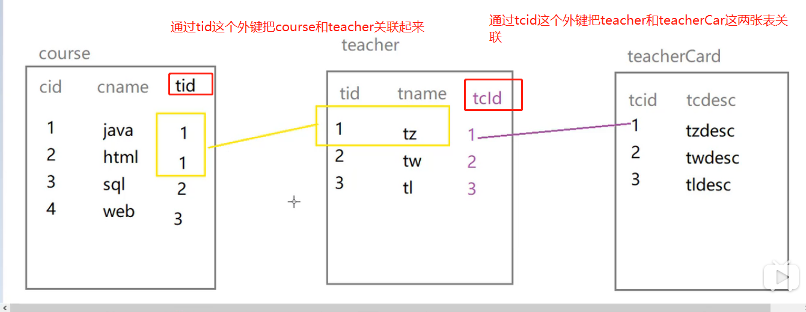
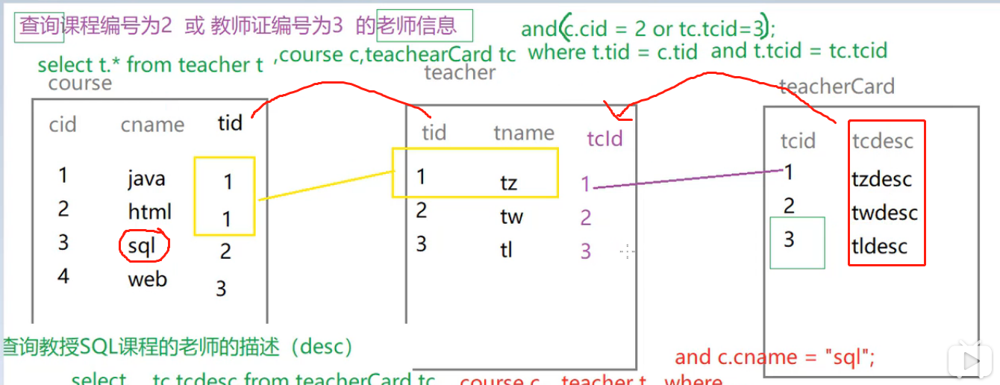
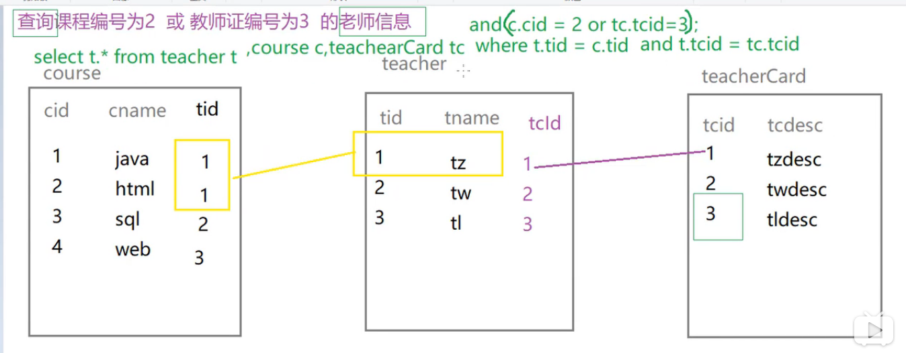

```sql
-- 查询课程编号(cid)为2 或 教师证编号(tcid)为3 的老师信息
select t.* from teacher t,course c,teacherCard tc where t.tid = c.tid and t.tcid = tc.tcid and (c.cid = 2 or tc.tcid = 3); 

-- 查看上面sql语句的执行计划
explain select t.* from teacher t,course c,teacherCard tc where t.tid = c.tid and t.tcid = tc.tcid and (c.cid = 2 or tc.tcid = 3);
+----+-------------+-------+------+---------------+------+---------+------+------+--------------------------------+
| id | select_type | table | type | possible_keys | key  | key_len | ref  | rows | Extra                          |
+----+-------------+-------+------+---------------+------+---------+------+------+--------------------------------+
|  1 | SIMPLE      | t     | ALL  | NULL          | NULL | NULL    | NULL |    3 |                                |
|  1 | SIMPLE      | tc    | ALL  | NULL          | NULL | NULL    | NULL |    3 | Using where; Using join buffer |
|  1 | SIMPLE      | c     | ALL  | NULL          | NULL | NULL    | NULL |    4 | Using where; Using join buffer |
+----+-------------+-------+------+---------------+------+---------+------+------+--------------------------------+

-- id值相同,从上往下顺序执行,从table列可以看出,顺序: t -> tc -> c ,t3 -> tc3 -> c4 (也就是teacher表3条数据,tc表3条数据,c表4条数据)

insert into teacher values(4, 'ta', 4);
insert into teacher values(5, 'tb', 5);
insert into teacher values(6, 'tc', 6);
commit;

explain select t.* from teacher t,course c,teacherCard tc where t.tid = c.tid and t.tcid = tc.tcid and (c.cid = 2 or tc.tcid = 3); 
+----+-------------+-------+------+---------------+------+---------+------+------+--------------------------------+
| id | select_type | table | type | possible_keys | key  | key_len | ref  | rows | Extra                          |
+----+-------------+-------+------+---------------+------+---------+------+------+--------------------------------+
|  1 | SIMPLE      | tc    | ALL  | NULL          | NULL | NULL    | NULL |    3 |                                |
|  1 | SIMPLE      | c     | ALL  | NULL          | NULL | NULL    | NULL |    4 | Using where; Using join buffer |
|  1 | SIMPLE      | t     | ALL  | NULL          | NULL | NULL    | NULL |    6 | Using where; Using join buffer |
+----+-------------+-------+------+---------------+------+---------+------+------+--------------------------------+

-- 顺序变成了 tc3 -> c4 -> t6, 执行表的顺序变了,造成差异的原因?
-- 表的执行顺序因为表的数据量的个数改变而改变了,数据小的表,优先查询.因为这样可以使占用的内存更小

-- id值不同,id值越大越优先别查询.

-- 查询教授sql课程的老师描述(desc)
-- 使用多表查询
select tc.tcdesc from teacherCard tc,course c,teacher t where c.tid = t.tid and t.tcid = tc.tcid and c.cname = 'sql';

explain select tc.tcdesc from teacherCard tc,course c,teacher t where c.tid = t.tid and t.tcid = tc.tcid and c.cname = 'sql';
+----+-------------+-------+------+---------------+------+---------+------+------+--------------------------------+
| id | select_type | table | type | possible_keys | key  | key_len | ref  | rows | Extra                          |
+----+-------------+-------+------+---------------+------+---------+------+------+--------------------------------+
|  1 | SIMPLE      | tc    | ALL  | NULL          | NULL | NULL    | NULL |    3 |                                |
|  1 | SIMPLE      | c     | ALL  | NULL          | NULL | NULL    | NULL |    4 | Using where; Using join buffer |
|  1 | SIMPLE      | t     | ALL  | NULL          | NULL | NULL    | NULL |    6 | Using where; Using join buffer |
+----+-------------+-------+------+---------------+------+---------+------+------+--------------------------------+

-- 查询教授sql课程的老师描述(desc)
-- 永远要记住,先查询主干,即: select tc.tcdesc from teacherCard, 这句话就是在查询老师的描述信息,但是查询出的老师的描述很多,
-- 需要通过tcid来约束查询出来的tcdesc,所以添加where语句
-- select tc.tcdesc from teacherCard tc where tc.tcid = (select t.tcid from teacher t), 同样这里的t.tcid也是有很多条,所以要使用tid约束tcid
-- 核心就是,我们要查找的是tc.tcdesc,但是要一步一步的靠到c.cname这个字段
-- 这里是: 使用子查询
select tc.tcdesc from teacherCard tc where tc.tcid = (select t.tcid from teacher t where t.tid = (select c.tid from course c where c.cname = 'sql'));

explain select tc.tcdesc from teacherCard tc where tc.tcid = (select t.tcid from teacher t where t.tid = (select c.tid from course c where c.cname = 'sql'));
+----+-------------+-------+------+---------------+------+---------+------+------+-------------+
| id | select_type | table | type | possible_keys | key  | key_len | ref  | rows | Extra       |
+----+-------------+-------+------+---------------+------+---------+------+------+-------------+
|  1 | PRIMARY     | tc    | ALL  | NULL          | NULL | NULL    | NULL |    3 | Using where |
|  2 | SUBQUERY    | t     | ALL  | NULL          | NULL | NULL    | NULL |    6 | Using where |
|  3 | SUBQUERY    | c     | ALL  | NULL          | NULL | NULL    | NULL |    4 | Using where |
+----+-------------+-------+------+---------------+------+---------+------+------+-------------+

-- id值不同,id值越大越优先别查询.c -> t -> tc
-- 先执行的是最内层的sql,因为要先根据c.cname找到tid,然后根据tid找到tcid,再根据tcid找到tcdesc
-- 本质: 在嵌套子查询时,先查询内层,再查询外层.

-- 子查询+多表查询
select t.tname, tc.tcdesc from teacher t, teacherCard tc where t.tcid = tc.tcid and t.tid = (select c.tid from course c where c.cname = 'sql');

explain select t.tname, tc.tcdesc from teacher t, teacherCard tc where t.tcid = tc.tcid and t.tid = (select c.tid from course c where c.cname = 'sql');
+----+-------------+-------+------+---------------+------+---------+------+------+--------------------------------+
| id | select_type | table | type | possible_keys | key  | key_len | ref  | rows | Extra                          |
+----+-------------+-------+------+---------------+------+---------+------+------+--------------------------------+
|  1 | PRIMARY     | tc    | ALL  | NULL          | NULL | NULL    | NULL |    3 |                                |
|  1 | PRIMARY     | t     | ALL  | NULL          | NULL | NULL    | NULL |    6 | Using where; Using join buffer |
|  2 | SUBQUERY    | c     | ALL  | NULL          | NULL | NULL    | NULL |    4 | Using where                    |
+----+-------------+-------+------+---------------+------+---------+------+------+--------------------------------+

-- id值有相同,有不同,先执行id最大的,id值相同的,从上往下顺序执行
```

# select_type(查询类型)

```sql
-- select_type(查询类型): 
-- PRIMARY: 包含子查询或者派生查询,一般最外层就是PRIMARY,也就是查询的主干
-- SUBQUERY: 包含非from子查询,一般非最外层,和PRIMARY对立
-- simple: 简单查询,不包含子查询,union的就是simple
-- union: 
-- union result: 
-- derived: 衍生查询(使用到了临时表),有2种情况会触发衍生查询
-- a. 一个是from子查询,即:在from里面,如果子查询只有一张表,那么该子查询就是derived(该子查询得到的表就是衍生表),这里from里面只有一张course表: 
-- select cr.cname from (select * from course where tid in (1,2)) cr;
-- 因为select * from course where tid in (1,2) 查询出来的是一张临时表,这个临时表就是一张衍生表,所以就是衍生查询.
-- b. 在from子查询中,如果有table1 union table2,则table1就是derived.table1就是衍生表,table2就是union表
-- select cr.cname from (select * from course where tid = 1 union select * from course where tid = 2) cr;
-- explain select cr.cname from (select * from course where tid = 1 union select * from course where tid = 2) cr;

-- simple: 简单查询,不包含子查询,union的就是simple
explain select * from teacher;
+----+-------------+---------+------+---------------+------+---------+------+------+-------+
| id | select_type | table   | type | possible_keys | key  | key_len | ref  | rows | Extra |
+----+-------------+---------+------+---------------+------+---------+------+------+-------+
|  1 | SIMPLE      | teacher | ALL  | NULL          | NULL | NULL    | NULL |    6 |       |
+----+-------------+---------+------+---------------+------+---------+------+------+-------+

-- a. 一个是from子查询,即:在from里面,如果子查询只有一张表,那么该子查询就是derived,这里是from里面只有一张course表: 
-- select cr.cname from (select * from course where tid in (1,2)) cr;
explain select cr.cname from (select * from course where tid in (1,2)) cr;
+----+-------------+------------+------+---------------+------+---------+------+------+-------------+
| id | select_type | table      | type | possible_keys | key  | key_len | ref  | rows | Extra       |
+----+-------------+------------+------+---------------+------+---------+------+------+-------------+
|  1 | PRIMARY     | <derived2> | ALL  | NULL          | NULL | NULL    | NULL |    3 |             |
|  2 | DERIVED     | course     | ALL  | NULL          | NULL | NULL    | NULL |    4 | Using where |
+----+-------------+------------+------+---------------+------+---------+------+------+-------------+
-- PRIMARY后面是<derived2>,意思就是主查询涉及到了衍生表(临时表).后面这个数字2就是代表你衍生的是哪张表,也就是临时表是从id为2这个course表衍生得来的.


-- b. 在from子查询中,如果有table1 union table2,则table1就是derived.则table1就是derived.table1就是衍生表,table2就是union表
-- select cr.cname from (select * from course where tid = 1 union select * from course where tid = 2) cr;
-- explain select cr.cname from (select * from course where tid = 1 union select * from course where tid = 2) cr;
explain select cr.cname from (select * from course where tid = 1 union select * from course where tid = 2) cr;
+----+--------------+------------+------+---------------+------+---------+------+------+-------------+
| id | select_type  | table      | type | possible_keys | key  | key_len | ref  | rows | Extra       |
+----+--------------+------------+------+---------------+------+---------+------+------+-------------+
|  1 | PRIMARY      | <derived2> | ALL  | NULL          | NULL | NULL    | NULL |    3 |             |
|  2 | DERIVED      | course     | ALL  | NULL          | NULL | NULL    | NULL |    4 | Using where |
|  3 | UNION        | course     | ALL  | NULL          | NULL | NULL    | NULL |    4 | Using where |
| NULL | UNION RESULT | <union2,3> | ALL  | NULL          | NULL | NULL    | NULL | NULL |             |
+----+--------------+------------+------+---------------+------+---------+------+------+-------------+
-- union result: <union2,3>意思就是id为2和3 union而来的.就是告知开发人员,哪些表之间存在union查询.
```

# table

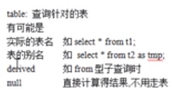

# type

type: 这里只举例几个企业最常用的:

system>const>eq_ref>ref>range>index>all

越往左边,性能越高,比如type为system比type为all性能高出很多很多.其中system,const,只是理想情况,基本达不到这种级别

实际优化中能达到的是ref>range,也就是说我们自己写sql,如果没有优化,type就是all,优化之后,我们尽量达到ref或者range级别.

要对type进行优化的前提,得要有索引,如果 索引都没有创建,你就不用优化了,你肯定是all.

- system/const: 结果只有一条数据
- eq_ref: 结果有多条数据,但是每条数据都是唯一的.
- ref: 结果是多条,但是每条数据是0或多条.

system(基本达不到,可以忽略): 只有一条数据的系统表 或者 衍生表只有一条数据的主查询(这个偶尔能达到),举例第二种情况:

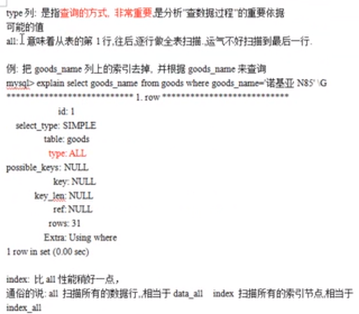

    All: 意味着整张表都被扫描了.
    index: 索引全部扫描一遍
    这两个都不太好.因为尽量走索引没错,但是不希望全部把索引扫描一遍.

    rows: 扫描了多少行.

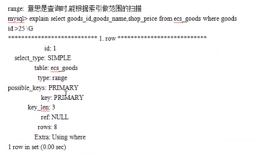

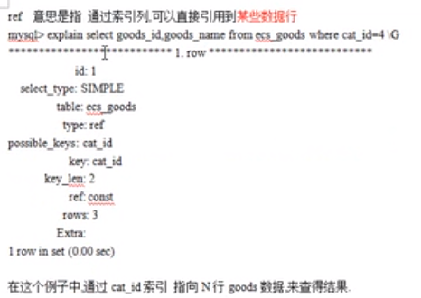

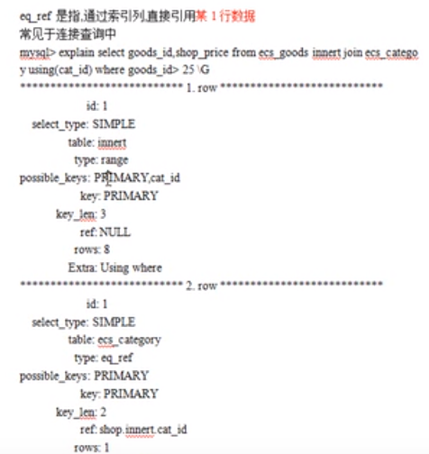

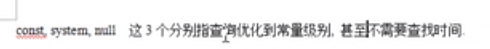

```sql
create table test01(
    tid int(3),
    tname varchar(20)
);
-- 只往里面insert一条数据
insert into test01 values(1, 'a');
commit;

-- 增加主键索引(注意,一个table,一旦有了主键,就相当于自动有了主键索引),所以增加主键索引的过程就是设置主键的过程
-- 将test01表中的tid设置为主键(间接增加了主键索引)
alter table test01 add constraint tid_pk primary key(tid);
-- from中的衍生表只有一条数据(即select * from test01),所以 select * from (select * from test01); 这就是衍生表只有一条数据的主查询.
-- 衍生表就是t,它的type就是system
explain select * from (select * from test01) t where tid = 1;
+----+-------------+------------+--------+---------------+------+---------+------+------+-------+
| id | select_type | table      | type   | possible_keys | key  | key_len | ref  | rows | Extra |
+----+-------------+------------+--------+---------------+------+---------+------+------+-------+
|  1 | PRIMARY     | <derived2> | system | NULL          | NULL | NULL    | NULL |    1 |       |
|  2 | DERIVED     | test01     | ALL    | NULL          | NULL | NULL    | NULL |    1 |       |
+----+-------------+------------+--------+---------------+------+---------+------+------+-------+
```

const(几乎达不到): 仅仅能查到一条数据的sql,用于primary key,或者unique索引,也就是如果有一条数据,并且是主键或者唯一键的时候,才可以达到const级别.再强调一下,这种情况只针对这两个索引有效(主键索引和唯一索引),也就是虽然有时候查到一条数据了,但是如果你的索引类型不是主键索引/唯一索引,那type也不是const.

```sql
-- 这里使用了主键索引,因为我现在根据where查询,where后面放索引,也就是根据tid找,tid本身就是一个primary key.
explain select * from test01 where tid = 1;
+----+-------------+--------+------+---------------+------+---------+------+------+-------------+
| id | select_type | table  | type | possible_keys | key  | key_len | ref  | rows | Extra       |
+----+-------------+--------+------+---------------+------+---------+------+------+-------------+
|  1 | SIMPLE      | test01 | ALL  | NULL          | NULL | NULL    | NULL |    1 | Using where |
+----+-------------+--------+------+---------------+------+---------+------+------+-------------+

-- 把主键删除了(间接删除了主键索引)
alter table test01 drop primary key;

 -- 增加一个单值索引
create index test01_index on test01(tid);
-- type不再是const,因为不再是主键索引/唯一索引了
explain select * from test01 where tid = 1;
+----+-------------+--------+------+---------------+--------------+---------+-------+------+-------+
| id | select_type | table  | type | possible_keys | key          | key_len | ref   | rows | Extra |
+----+-------------+--------+------+---------------+--------------+---------+-------+------+-------+
|  1 | SIMPLE      | test01 | ref  | test01_index  | test01_index | 4       | const |    1 |       |
+----+-------------+--------+------+---------------+--------------+---------+-------+------+-------+
```

eq_ref(比较难满足,基本也达不到): 唯一性索引,对于每个索引键的查询,返回匹配唯一行数据(有且只有1个,不能多,也不能少,也就是不能为0),也就是必须要达到查询的结果和数据的条数是一致的,所以也比较难满足.

比如你写了select .... from  ... where name = ...., 返回20条数据,每一行数据是唯一的,比如有张三,李四,等,你不能有2个张三,也不能有0个张三,也就是每条数据有且只有一个,能到到eq_ref(equal ref),当然前提是你要给name建立索引,如果name连索引都没有,那肯定达不到eq_ref.简单说就是name必须建立索引,并且name查到的值都是唯一的.张三一个,李四一个,王五一个,虽然有20个数据,但是每个数据能达到唯一的,就可以达到eq_ref级别.此种情况常见于唯一索引/主键索引.

```sql
-- 增加约束: 给teacherCard增加主键,叫tcid.
alter table teacherCard add constraint pk_tcid primary key(tcid);

-- 增加约束: teacher的tcid是唯一索引
alter table teacher add constraint uk_tcid unique index(tcid);

-- t.tcid是唯一索引,tc.tcid是主键索引
-- teacher表一共3条数据,而下面的连接查询结果也是3条,3条一一对应3条,就是唯一的.满足eq_ref,实际工作共很难满足这种情况,比较苛刻.
-- 必须要达到查询的结果和数据的条数是一致的
-- 这条sql用到的索引是t.tcid,即teacher表的tcid.
explain select t.tcid from teacher t,teacherCard tc where t.tcid = tc.tcid;
+----+-------------+-------+--------+---------------+---------+---------+-------------+------+-------------+
| id | select_type | table | type   | possible_keys | key     | key_len | ref         | rows | Extra       |
+----+-------------+-------+--------+---------------+---------+---------+-------------+------+-------------+
|  1 | SIMPLE      | t     | index  | uk_tcid       | uk_tcid | 5       | NULL        |    3 | Using index |
|  1 | SIMPLE      | tc    | eq_ref | PRIMARY       | PRIMARY | 4       | myBD.t.tcid |    1 | Using index |
+----+-------------+-------+--------+---------------+---------+---------+-------------+------+-------------+
```

ref: 非唯一性索引,对于每个索引键的查询,返回匹配的所有行即可(可以是0行,或多行).

```sql
insert into teacher values(4, 'tz', 4);
insert into teacherCard values(4, 'tzdesc');
-- 给teacher增加单值索引
alter table teacher add index index_name(tname);
explain select * from teacher where tname = 'tz';
+----+-------------+---------+------+---------------+------------+---------+-------+------+-------------+
| id | select_type | table   | type | possible_keys | key        | key_len | ref   | rows | Extra       |
+----+-------------+---------+------+---------------+------------+---------+-------+------+-------------+
|  1 | SIMPLE      | teacher | ref  | index_name    | index_name | 63      | const |    2 | Using where |
+----+-------------+---------+------+---------------+------------+---------+-------+------+-------------+
```

range; 检索指定范围的行,where后面是一个范围查询(between,>,<,>=等,in有时候可以,有时候不行,其他的是可以的,in和数据量有关系,in括号中的数据太大的话,type就变成了all,从而转为无索引all,也就是查询全部数据)

```sql
alter table teacher add constraint primary key(tid);
-- 查询之前要先确保,where后面的列是索引列,如果不是索引,谈不上优化
explain select * from teacher t where t.tid > 3;
+----+-------------+-------+-------+---------------+---------+---------+------+------+-------------+
| id | select_type | table | type  | possible_keys | key     | key_len | ref  | rows | Extra       |
+----+-------------+-------+-------+---------------+---------+---------+------+------+-------------+
|  1 | SIMPLE      | t     | range | PRIMARY       | PRIMARY | 4       | NULL |    1 | Using where |
+----+-------------+-------+-------+---------------+---------+---------+------+------+-------------+

explain select * from teacher t where t.tid between 1 and 2;
+----+-------------+-------+-------+---------------+---------+---------+------+------+-------------+
| id | select_type | table | type  | possible_keys | key     | key_len | ref  | rows | Extra       |
+----+-------------+-------+-------+---------------+---------+---------+------+------+-------------+
|  1 | SIMPLE      | t     | range | PRIMARY       | PRIMARY | 4       | NULL |    2 | Using where |
+----+-------------+-------+-------+---------------+---------+---------+------+------+-------------+
```

index: 查询全部索引中的数据,(也就是把where子句后面的列对应的索引全部查询了一遍)

```sql
-- tid是索引,你是个索引,我只查你,所以我查询的是全部的索引.
-- 只需要扫描索引表,不需要扫描全部数据
explain select tid from teacher;
+----+-------------+---------+-------+---------------+---------+---------+------+------+-------------+
| id | select_type | table   | type  | possible_keys | key     | key_len | ref  | rows | Extra       |
+----+-------------+---------+-------+---------------+---------+---------+------+------+-------------+
|  1 | SIMPLE      | teacher | index | NULL          | uk_tcid | 5       | NULL |    4 | Using index |
+----+-------------+---------+-------+---------------+---------+---------+------+------+-------------+
```

all: 查询全部表中的数据(把所有的列,不论是有没有建立索引,全部查询一遍.)

```sql
-- cid不是索引,就徐娅扫描全表的数据.
explain select cid from course;
+----+-------------+--------+------+---------------+------+---------+------+------+-------+
| id | select_type | table  | type | possible_keys | key  | key_len | ref  | rows | Extra |
+----+-------------+--------+------+---------------+------+---------+------+------+-------+
|  1 | SIMPLE      | course | ALL  | NULL          | NULL | NULL    | NULL |    4 |       |
+----+-------------+--------+------+---------------+------+---------+------+------+-------+
```

# possible_keys

可能用到的索引,是一种预测,不准.

```sql
alter table course add index cname_index(cname);
alter table teacher drop index uk_tcid;
alter table teacherCard drop primary key;
alter table teacher drop primary key;

explain select t.tname, tc.tcdesc from teacher t, teacherCard tc where t.tcid = tc.tcid and t.tid = (select c.tid from course c where c.cname = 'sql');
-- SUBQUERY: 子查询可能用到的索引是cname_index
-- PRIMARY: 主查询没有用到索引(如果possible_keys/key是NULL,说明没有索引)
+----+-------------+-------+------+---------------+-------------+---------+-------+------+--------------------------------+
| id | select_type | table | type | possible_keys | key         | key_len | ref   | rows | Extra                          |
+----+-------------+-------+------+---------------+-------------+---------+-------+------+--------------------------------+
|  1 | PRIMARY     | t     | ALL  | NULL          | NULL        | NULL    | NULL  |    4 | Using where                    |
|  1 | PRIMARY     | tc    | ALL  | NULL          | NULL        | NULL    | NULL  |    4 | Using where; Using join buffer |
|  2 | SUBQUERY    | c     | ref  | cname_index   | cname_index | 63      | const |    1 | Using where                    |
+----+-------------+-------+------+---------------+-------------+---------+-------+------+--------------------------------+

alter table teacher add index uk_tcid(tcid);
alter table teacher add index tid_index(tid);

explain select t.tname, tc.tcdesc from teacher t, teacherCard tc,course c where t.tcid = tc.tcid and t.tid = c.tid and c.cname = 'sql';
-- 第二行: possible_keys预测可能用到的索引是2个: uk_tcid,tid_index,但实际用到了一个,可以看到key这个列: tid_index 
-- 说明了possible_keys有时候准,有时候不准
+----+-------------+-------+------+-------------------+-------------+---------+------------+------+--------------------------------+
| id | select_type | table | type | possible_keys     | key         | key_len | ref        | rows | Extra                          |
+----+-------------+-------+------+-------------------+-------------+---------+------------+------+--------------------------------+
|  1 | SIMPLE      | c     | ref  | cname_index       | cname_index | 63      | const      |    1 | Using where                    |
|  1 | SIMPLE      | t     | ref  | uk_tcid,tid_index | tid_index   | 4       | myBD.c.tid |    1 |                                |
|  1 | SIMPLE      | tc    | ALL  | NULL              | NULL        | NULL    | NULL       |    4 | Using where; Using join buffer |
+----+-------------+-------+------+-------------------+-------------+---------+------------+------+--------------------------------+
```

# key

实际用到的索引

# key_len

实际用到的索引的长度,作用是经常用于判断复合索引是否被完全使用了.

假设复合所有有a,b,c3个字段,我们有时候只使用了a和b,c没有使用,到底怎么知道呢,就可以使用key_len判断.

```sql
create table test_k1(
    name char(20) not null default ''
);
alter table test_k1 add index index_name(name);

explain select * from test_k1 where name = '';
-- 在utf8中,一个字符占3个字节,20个字符,所以共60个字节.
-- key_len为60,表示查询用到的索引的长度为60个字节,
+----+-------------+---------+------+---------------+------------+---------+-------+------+--------------------------+
| id | select_type | table   | type | possible_keys | key        | key_len | ref   | rows | Extra                    |
+----+-------------+---------+------+---------------+------------+---------+-------+------+--------------------------+
|  1 | SIMPLE      | test_k1 | ref  | index_name    | index_name | 60      | const |    1 | Using where; Using index |
+----+-------------+---------+------+---------------+------------+---------+-------+------+--------------------------+

-- name1可以为null,这是和name列的区别
alter table test_k1 add column name1 char(20);
alter table test_k1 add index index_name1(name1);
explain select * from test_k1 where name1 = '';
-- 如果索引字段可以为null,则mysql会使用一个字节用于标识,mysql底层会用一个字节标识name1可以为null.
+----+-------------+---------+------+---------------+-------------+---------+-------+------+-------------+
| id | select_type | table   | type | possible_keys | key         | key_len | ref   | rows | Extra       |
+----+-------------+---------+------+---------------+-------------+---------+-------+------+-------------+
|  1 | SIMPLE      | test_k1 | ref  | index_name1   | index_name1 | 61      | const |    1 | Using where |
+----+-------------+---------+------+---------------+-------------+---------+-------+------+-------------+
```

```sql
drop index index_name on test_k1;
drop index index_name1 on test_k1;

-- 增加复合索引,由name和name1构成一个复合索引
-- 复合索引的意思是先根据一个索引列进行查询,如果能查到就完事,如果查不到就再使用其他的索引列查询.
-- 举例: 我先根据姓名查张三,如果全年级就一个张三,就不需要第二个字段了,如果全年级有2个张三,我再根据班级查询.
alter table test_k1 add index name_name1_index(name, name1);
-- key_len: 121
explain select * from test_k1 where name1 = '';
+----+-------------+---------+-------+---------------+------------------+---------+------+------+--------------------------+
| id | select_type | table   | type  | possible_keys | key              | key_len | ref  | rows | Extra                    |
+----+-------------+---------+-------+---------------+------------------+---------+------+------+--------------------------+
|  1 | SIMPLE      | test_k1 | index | NULL          | name_name1_index | 121     | NULL |    1 | Using where; Using index |
+----+-------------+---------+-------+---------------+------------------+---------+------+------+--------------------------+

-- key_len:60
explain select * from test_k1 where name1 = '';
+----+-------------+---------+------+------------------+------------------+---------+-------+------+--------------------------+
| id | select_type | table   | type | possible_keys    | key              | key_len | ref   | rows | Extra                    |
+----+-------------+---------+------+------------------+------------------+---------+-------+------+--------------------------+
|  1 | SIMPLE      | test_k1 | ref  | name_name1_index | name_name1_index | 60      | const |    1 | Using where; Using index |
+----+-------------+---------+------+------------------+------------------+---------+-------+------+--------------------------+

-- 增加一列name2
alter table test_k1 add column name2 varchar(20);
alter table test_k1 add index name2_index(name2);
explain select * from test_k1 where name2 = '';
-- key_len: 63
-- 20*3=60 + 1(用一个字节标识name2可以为null) + 2(用2个字节标识name2是可变长度) = 63
+----+-------------+---------+------+---------------+-------------+---------+-------+------+-------------+
| id | select_type | table   | type | possible_keys | key         | key_len | ref   | rows | Extra       |
+----+-------------+---------+------+---------------+-------------+---------+-------+------+-------------+
|  1 | SIMPLE      | test_k1 | ref  | name2_index   | name2_index | 63      | const |    1 | Using where |
+----+-------------+---------+------+---------------+-------------+---------+-------+------+-------------+
```

utf8是一个字符3个字节
gkb: 一个字符2个字节
latin:  一个字符1个字节

如果编码是gbk,乘的时候乘2即可.

# ref

注意,与type中的ref区分.

作用: 指明当前表所引用的字段.

select ... where  a.id = b.aid;(其中b.aidk可以是常量,这个时候a表的ref就是const),注意,where后面的列都要建立索引,研究这个ref才有意义.

```sql
alter table course add index tid_index(tid);

explain select * from course c, teacher t where c.tid = t.tid and t.tname = 'tw';
-- t.tname = 'tw',对应下面的t表引用了常量字段const
-- c.tid = t.tid, 对应下面的c表引用了myBD.t.tid
+----+-------------+-------+------+----------------------+------------+---------+------------+------+-------------+
| id | select_type | table | type | possible_keys        | key        | key_len | ref        | rows | Extra       |
+----+-------------+-------+------+----------------------+------------+---------+------------+------+-------------+
|  1 | SIMPLE      | t     | ref  | index_name,tid_index | index_name | 63      | const      |    1 | Using where |
|  1 | SIMPLE      | c     | ref  | tid_index            | tid_index  | 5       | myBD.t.tid |    1 | Using where |
+----+-------------+-------+------+----------------------+------------+---------+------------+------+-------------+
```

# rows

实际通过索引,查到的数据个数

```sql
explain select * from course c,teacher t where c.tid = t.tid and t.tname = 'tz';
+----+-------------+-------+------+----------------------+------------+---------+------------+------+-------------+
| id | select_type | table | type | possible_keys        | key        | key_len | ref        | rows | Extra       |
+----+-------------+-------+------+----------------------+------------+---------+------------+------+-------------+
|  1 | SIMPLE      | t     | ref  | index_name,tid_index | index_name | 63      | const      |    2 | Using where |
|  1 | SIMPLE      | c     | ref  | tid_index            | tid_index  | 5       | myBD.t.tid |    1 | Using where |
+----+-------------+-------+------+----------------------+------------+---------+------------+------+-------------+
```

# Extra

如果你在我们sql执行计划里面,看到using filesort 或者using temporary,他们的性能损耗比较大,都是需要优化的.尽量把他们都干掉.

## using filesort

如果出现以下单词,意味着什么?

- using filesort: 表示性能消耗比较大,需要 "额外的" 一次排序/查询, 排序的前提是先要把数据查询出来,using filesort经常出现在order by中.

```sql
-- 创建表的同时给字段添加索引
create table test02(
    a1 char(3),
    a2 char(3),
    a3 char(3),
    index idx_a1(a1),
    index idx_a2(a2),
    index idx_a3(a3)
);


explain select * from test02 where a1 = '' order by a1;
-- 排序a1的时候,已经查找过了,所以就不用再 "额外一次的" 查询
+----+-------------+--------+------+---------------+--------+---------+-------+------+-------------+
| id | select_type | table  | type | possible_keys | key    | key_len | ref   | rows | Extra       |
+----+-------------+--------+------+---------------+--------+---------+-------+------+-------------+
|  1 | SIMPLE      | test02 | ref  | idx_a1        | idx_a1 | 10      | const |    1 | Using where |
+----+-------------+--------+------+---------------+--------+---------+-------+------+-------------+


explain select * from test02 where a1 = '' order by a2;
-- 排序a2的时候,因为where后面是a1,也就是a2还没有查询过,所以就需要 "额外一次的" 查询,这个时候Extra显示了Using filesort
+----+-------------+--------+------+---------------+--------+---------+-------+------+-----------------------------+
| id | select_type | table  | type | possible_keys | key    | key_len | ref   | rows | Extra                       |
+----+-------------+--------+------+---------------+--------+---------+-------+------+-----------------------------+
|  1 | SIMPLE      | test02 | ref  | idx_a1        | idx_a1 | 10      | const |    1 | Using where; Using filesort |
+----+-------------+--------+------+---------------+--------+---------+-------+------+-----------------------------+
```

对于单索引,如果排序和查找的是同一个字段,则不会出现using filesort;这时性能消耗就比较大,所以where哪些字段,order by哪些字段.

对于复合索引,不能跨列(最佳左前缀),一旦违反了这个规则,就会出现using filesort,where和order by按照复合索引的顺序使用(a1_a2_a3),不要跨列或无序使用.也就是where使用的是a1,order by使用a2

看下面的例子:

```sql
drop index idx_a1 on test02;
drop index idx_a2 on test02;
drop index idx_a3 on test02;
alter table test02 add index idx_a1_a2_a3(a1,a2,a3);


explain select * from test02 where a1 = '' order by a2;
+----+-------------+--------+------+---------------+--------------+---------+-------+------+--------------------------+
| id | select_type | table  | type | possible_keys | key          | key_len | ref   | rows | Extra                    |
+----+-------------+--------+------+---------------+--------------+---------+-------+------+--------------------------+
|  1 | SIMPLE      | test02 | ref  | idx_a1_a2_a3  | idx_a1_a2_a3 | 10      | const |    1 | Using where; Using index |
+----+-------------+--------+------+---------------+--------------+---------+-------+------+--------------------------+


explain select * from test02 where a1 = '' order by a3;
+----+-------------+--------+------+---------------+--------------+---------+-------+------+------------------------------------------+
| id | select_type | table  | type | possible_keys | key          | key_len | ref   | rows | Extra                                    |
+----+-------------+--------+------+---------------+--------------+---------+-------+------+------------------------------------------+
|  1 | SIMPLE      | test02 | ref  | idx_a1_a2_a3  | idx_a1_a2_a3 | 10      | const |    1 | Using where; Using index; Using filesort |
+----+-------------+--------+------+---------------+--------------+---------+-------+------+------------------------------------------+

explain select * from test02 where a2 = '' order by a3;
-- 因为跨了a1(最佳左前缀),所以出现using filesort
+----+-------------+--------+-------+---------------+--------------+---------+------+------+------------------------------------------+
| id | select_type | table  | type  | possible_keys | key          | key_len | ref  | rows | Extra                                    |
+----+-------------+--------+-------+---------------+--------------+---------+------+------+------------------------------------------+
|  1 | SIMPLE      | test02 | index | NULL          | idx_a1_a2_a3 | 30      | NULL |    1 | Using where; Using index; Using filesort |
+----+-------------+--------+-------+---------------+--------------+---------+------+------+------------------------------------------+
```

## using temporary(额外再多使用一张临时表)

性能损耗比较大,用到了临时表.一般出现在group by语句中,出现的原因是已经查询出一张表了,但是不使用,必须要再查询另一张表.说白了就是已经有表了,你不用,非要再来查询一张临时表,这个时候`using temporary`就是警告你性能太低了.

```sql
explain select a1 from test02 where a1 in ('1','2','3') group by a2;
-- 查询出来了a1,但是是按照a2分组的,所以又不得不查询一下a2
-- 出现的原因是已经查询出一张表了,但是不使用,必须要再查询另一张表.
+----+-------------+--------+-------+---------------+--------------+---------+------+------+-----------------------------------------------------------+
| id | select_type | table  | type  | possible_keys | key          | key_len | ref  | rows | Extra                                                     |
+----+-------------+--------+-------+---------------+--------------+---------+------+------+-----------------------------------------------------------+
|  1 | SIMPLE      | test02 | index | idx_a1_a2_a3  | idx_a1_a2_a3 | 30      | NULL |    1 | Using where; Using index; Using temporary; Using filesort |
+----+-------------+--------+-------+---------------+--------------+---------+------+------+-----------------------------------------------------------+
```

如何避免?

查询哪些列,就要根据哪些列group by.

总结: 如果复合索引使用不要跨列,a1_a2_a3复合索引中的顺序要和使用顺序一致.

看两个例子

>解析过程(顺序): from ..on..  join... where... group by ...having...  select distinct .. order by limit...

```sql
create table test03(
    a1 char(3),
    a2 char(3),
    a3 char(3),
    a4 char(3),
    index idx_a1(a1),
    index idx_a2(a2),
    index idx_a3(a3),
    index idx_a4(a4)
);

explain select * from test03 where a2=2 and a4=4 group by a4; 
-- 根据上面的解析顺序,可以看到先解析的是where,这个时候查询出一张临时表,后面group by是a4,直接在这张表上操作即可
-- 所以不用再额外的查询另一张临时表
+----+-------------+--------+-------+---------------+--------+---------+------+------+-------------+
| id | select_type | table  | type  | possible_keys | key    | key_len | ref  | rows | Extra       |
+----+-------------+--------+-------+---------------+--------+---------+------+------+-------------+
|  1 | SIMPLE      | test03 | index | idx_a2,idx_a4 | idx_a4 | 10      | NULL |    1 | Using where |
+----+-------------+--------+-------+---------------+--------+---------+------+------+-------------+
```

group by 2个字段的情况需要分a2和a4是否为无索引列,单值索引列,唯一索引列讨论,a2和a4中有一个是唯一索引就不会用到临时表.

## using index

using index: 表示性能提升了,原因在于我此sql查询不读取原文件,只从索引文件中 获取数据,不需要回表查询

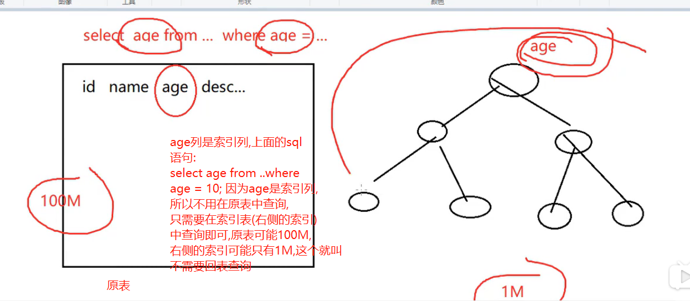

只要你要查询的列,全部都在索引中,就是索引覆盖(using index意味着用到了索引),也就是上图中,使用到age列,age列全部在索引中,就叫索引覆盖.

```sql
-- test02表中有一个复合索引(a1,a2,a3)
show index from test02;

explain select a1,a2 from test02 where a1='' and a2='';
-- 你要使用的a1和a2都在复合索引中,也就是复合索引(a1_a2_a3)覆盖了你要查找的东西,这个时候就不用使用原表了
-- 就会出现using index
+----+-------------+--------+------+---------------+--------------+---------+-------------+------+--------------------------+
| id | select_type | table  | type | possible_keys | key          | key_len | ref         | rows | Extra                    |
+----+-------------+--------+------+---------------+--------------+---------+-------------+------+--------------------------+
|  1 | SIMPLE      | test02 | ref  | idx_a1_a2_a3  | idx_a1_a2_a3 | 20      | const,const |    1 | Using where; Using index |
+----+-------------+--------+------+---------------+--------------+---------+-------------+------+--------------------------+

-- 删除了复合索引,举一个反例
drop index idx_a1_a2_a3 on test02;
-- 只给a1和a2增加index
alter table test02 add index idx_a1_a2(a1,a2);
explain select a1,a3 from test02 where a1='' and a3='';
-- 复合索引idx_a1_a2不可以覆盖你要用到的a3,所以就不会出现using index.
+----+-------------+--------+------+---------------+-----------+---------+-------+------+-------------+
| id | select_type | table  | type | possible_keys | key       | key_len | ref   | rows | Extra       |
+----+-------------+--------+------+---------------+-----------+---------+-------+------+-------------+
|  1 | SIMPLE      | test02 | ref  | idx_a1_a2     | idx_a1_a2 | 10      | const |    1 | Using where |
+----+-------------+--------+------+---------------+-----------+---------+-------+------+-------------+
```

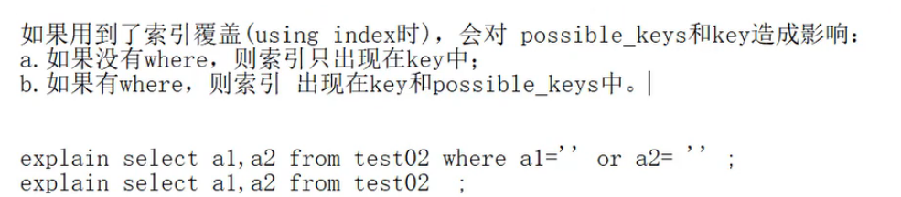

## using where

```sql
show index from test02;
+--------+------------+-----------+--------------+-------------+-----------+-------------+----------+--------+------+------------+---------+---------------+
| Table  | Non_unique | Key_name  | Seq_in_index | Column_name | Collation | Cardinality | Sub_part | Packed | Null | Index_type | Comment | Index_comment |
+--------+------------+-----------+--------------+-------------+-----------+-------------+----------+--------+------+------------+---------+---------------+
| test02 |          1 | idx_a1_a2 |            1 | a1          | A         |           0 |     NULL | NULL   | YES  | BTREE      |         |               |
| test02 |          1 | idx_a1_a2 |            2 | a2          | A         |           0 |     NULL | NULL   | YES  | BTREE      |         |               |
+--------+------------+-----------+--------------+-------------+-----------+-------------+----------+--------+------+------------+---------+---------------+


explain select a1 from test02;
+----+-------------+--------+-------+---------------+-----------+---------+------+------+-------------+
| id | select_type | table  | type  | possible_keys | key       | key_len | ref  | rows | Extra       |
+----+-------------+--------+-------+---------------+-----------+---------+------+------+-------------+
|  1 | SIMPLE      | test02 | index | NULL          | idx_a1_a2 | 20      | NULL |    1 | Using index |
+----+-------------+--------+-------+---------------+-----------+---------+------+------+-------------+

explain select a1 from test02 where a1='';
-- 使用where就会出现using where
+----+-------------+--------+------+---------------+-----------+---------+-------+------+--------------------------+
| id | select_type | table  | type | possible_keys | key       | key_len | ref   | rows | Extra                    |
+----+-------------+--------+------+---------------+-----------+---------+-------+------+--------------------------+
|  1 | SIMPLE      | test02 | ref  | idx_a1_a2     | idx_a1_a2 | 10      | const |    1 | Using where; Using index |
+----+-------------+--------+------+---------------+-----------+---------+-------+------+--------------------------+
```

## impossible where

```sql
explain select a1 from test02 where a1 = 'x' and a1 = 'y';
-- a1不可能同时等于x和y,所以就是Impossible WHERE
+----+-------------+-------+------+---------------+------+---------+------+------+------------------+
| id | select_type | table | type | possible_keys | key  | key_len | ref  | rows | Extra            |
+----+-------------+-------+------+---------------+------+---------+------+------+------------------+
|  1 | SIMPLE      | NULL  | NULL | NULL          | NULL | NULL    | NULL | NULL | Impossible WHERE |
```

