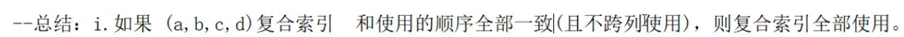
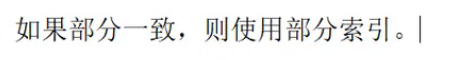

```sql
drop table test03;

create table test03(
    a1 int(4) not null,
    a2 int(4) not null,
    a3 int(4) not null,
    a4 int(4) not null
); 

alter table test03 add index idx_a1_a2_a3_a4(a1,a2,a3,a4);

explain select a1,a2,a3,a4 from test03 where a1=1 and a2=2 and a3=3 and a4=4;
-- 推荐写法,因为索引的使用顺序(where后面的顺序)和复合索引的的顺序一致
+----+-------------+--------+------+-----------------+-----------------+---------+-------------------------+------+-------------+
| id | select_type | table  | type | possible_keys   | key             | key_len | ref                     | rows | Extra       |
+----+-------------+--------+------+-----------------+-----------------+---------+-------------------------+------+-------------+
|  1 | SIMPLE      | test03 | ref  | idx_a1_a2_a3_a4 | idx_a1_a2_a3_a4 | 16      | const,const,const,const |    1 | Using index |
+----+-------------+--------+------+-----------------+-----------------+---------+-------------------------+------+-------------+

explain select a1,a2,a3,a4 from test03 where a1=1 and a3=2 and a2=3 and a4=4;
-- 虽然编写的顺序(where后面的顺序)和索引的顺序不一致,但是sql在真正前,经过了sql优化器的调整
-- 结果与上一条是一致的
-- ref的const有4个
+----+-------------+--------+------+-----------------+-----------------+---------+-------------------------+------+-------------+
| id | select_type | table  | type | possible_keys   | key             | key_len | ref                     | rows | Extra       |
+----+-------------+--------+------+-----------------+-----------------+---------+-------------------------+------+-------------+
|  1 | SIMPLE      | test03 | ref  | idx_a1_a2_a3_a4 | idx_a1_a2_a3_a4 | 16      | const,const,const,const |    1 | Using index |
+----+-------------+--------+------+-----------------+-----------------+---------+-------------------------+------+-------------+

-- 以上2个sql使用了全部的复合索引,因为可以从key_len看出
```

```sql
explain select a1,a2,a3,a4 from test03 where a1=1 and a2=2 and a4=3 order by a3;
-- a1和a2是符合符合索引顺序的,所以有using index
-- a4是跨列了,所以a4需要回表查询,也就是要在原表查询,也就是出现了using where
-- 还可以通过key_len印证,a1和a2加起来正好是8
-- ref的const有2个也印证了只有a1和a2是使用了索引来查询的
+----+-------------+--------+------+-----------------+-----------------+---------+-------------+------+--------------------------+
| id | select_type | table  | type | possible_keys   | key             | key_len | ref         | rows | Extra                    |
+----+-------------+--------+------+-----------------+-----------------+---------+-------------+------+--------------------------+
|  1 | SIMPLE      | test03 | ref  | idx_a1_a2_a3_a4 | idx_a1_a2_a3_a4 | 8       | const,const |    1 | Using where; Using index |
+----+-------------+--------+------+-----------------+-----------------+---------+-------------+------+--------------------------+
--以上sql用到了a1和a2 两个索引,该2个字段不需要回表查询,所以是using index
--而a4因为跨列使用,所以造成该索引失效,需要回表查询,因此是using where
-- 这里没有出现filesort的原因: 因为a4跨列了,where和order by连起来就是a1 a2 a3,这个和符合索引顺序一直
-- 所以就不会出现filesort(额外的多查询/排序)
```

```sql
explain select a1,a2,a3,a4 from test03 where a1=1 and a4=3 order by a3;
-- 出现filesort(多了一次额外的排序/查找),因为a4跨列了,所以a4需要回表查询
-- 然后where和order连起来就是a1 a3,这个也是跨列的,就导致需要在原表中再次查询a3,就多了一次额外的查询/排序
-- 所以就出现了filesort
+----+-------------+--------+------+-----------------+-----------------+---------+-------+------+------------------------------------------+
| id | select_type | table  | type | possible_keys   | key             | key_len | ref   | rows | Extra                                    |
+----+-------------+--------+------+-----------------+-----------------+---------+-------+------+------------------------------------------+
|  1 | SIMPLE      | test03 | ref  | idx_a1_a2_a3_a4 | idx_a1_a2_a3_a4 | 4       | const |    1 | Using where; Using index; Using filesort |
+----+-------------+--------+------+-----------------+-----------------+---------+-------+------+------------------------------------------+
-- 我们不要跨列使用(where和order by拼起来,也不要跨列使用) 

explain select a1,a2,a3,a4 from test03 where a1=1 and a4=3 order by a2,a3;
-- a4和a1不是连着的,是属于跨列了,所以要回表查询a4
-- where和order连起来就是a1 a2 a3,和复合索引的顺序一致,所以没有出现filesort
+----+-------------+--------+------+-----------------+-----------------+---------+-------+------+--------------------------+
| id | select_type | table  | type | possible_keys   | key             | key_len | ref   | rows | Extra                    |
+----+-------------+--------+------+-----------------+-----------------+---------+-------+------+--------------------------+
|  1 | SIMPLE      | test03 | ref  | idx_a1_a2_a3_a4 | idx_a1_a2_a3_a4 | 4       | const |    1 | Using where; Using index |
+----+-------------+--------+------+-----------------+-----------------+---------+-------+------+--------------------------+
```

总结:



