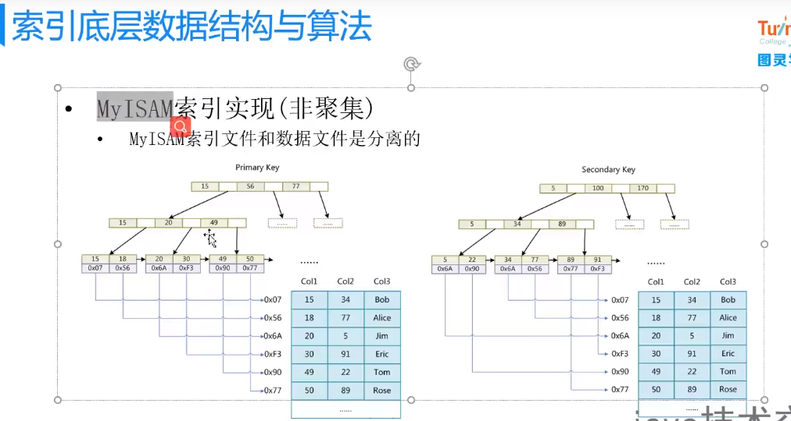
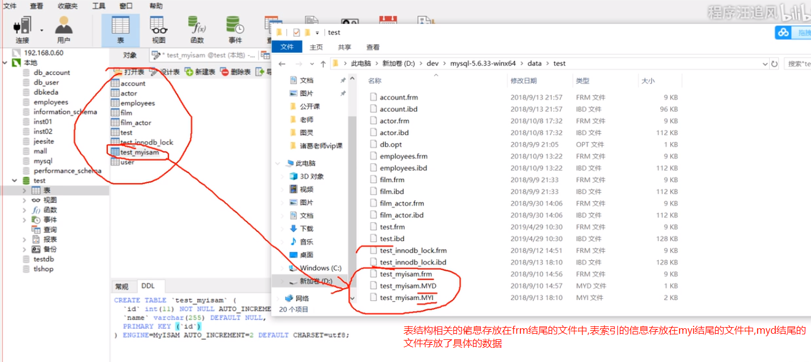
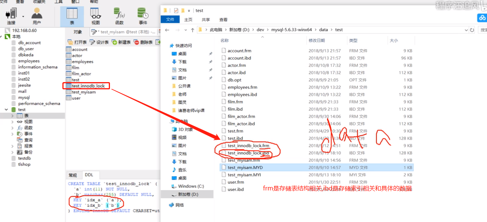
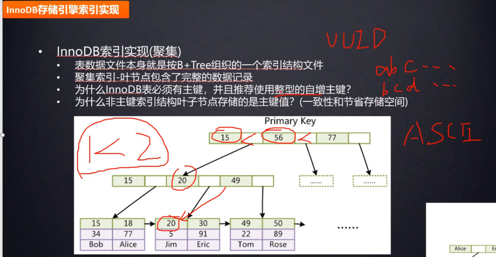
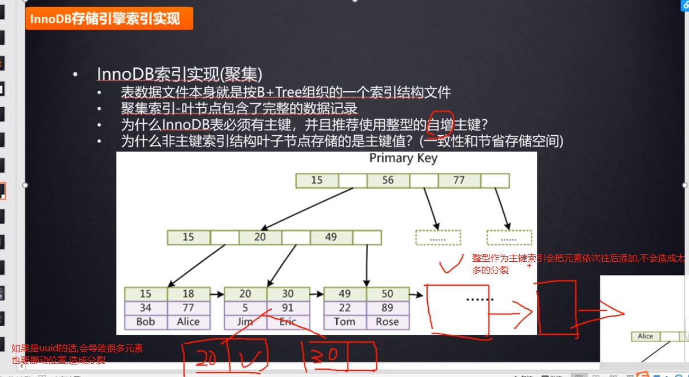
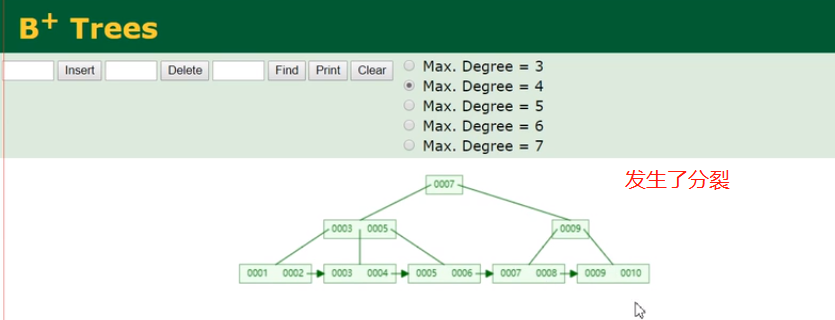
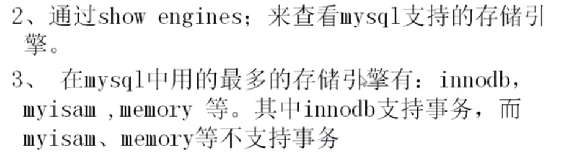
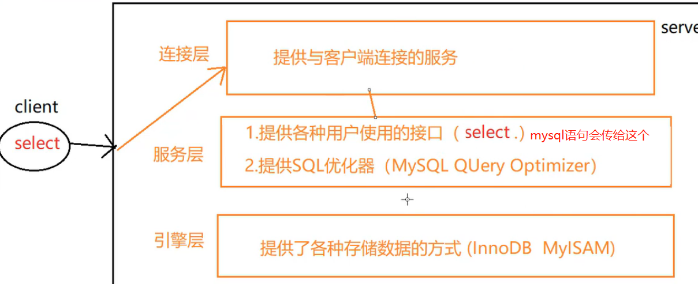
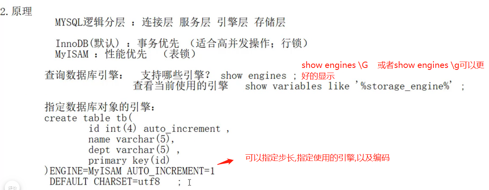

# myisam存储引擎



    存储引擎是针对于表级别,而不是数据库级别的.



    myd: myisam data存放数据
    myi: myisam index存放索引
    
    myisam的索引就是非聚集索引: 索引和表数据是分开存储的,不在一个文件中.


    先把myi索引文件加载到数据,然后根据索引找到数据对应的地址指针,
    然后从myd这个文件中,用上面的地址指针找到对应的数据.

# innodb存储引擎

    大多数公司都是使用innodb.因为有事务.
    


    frm: 存储表结构信息
    ibd: innodb data用于存储索引和data
    innodb就是把索引和data存储在一起.



    聚集索引: 索引和表数据放在一起.
    
    innodb的索引就是聚集索引.索引和表数据是在同一个文件中存储的.
    也就是 innodb的叶节点包含了: 索引+data

# 为什么InnoDB表必须有主键,并且推荐使用整型的自增主键?

如果你没有给InnoDB的表建立主键,mysql底层会自动挑选一个能够唯一标识数据的字段作为主键索引,如果找不到,她会给你生成一个隐藏列,这个隐藏列可以唯一标识每行数据.然后innodb根据这个隐藏列来建立主键索引.从而使用b+tree来组织数据.

    因为innodb就是使用b+tree来组织索引和数据的,如果表没有建立主键,就没法通过b+树来组织数据

    这也就要求使用InnoDB的话,必须要创建主键.

工作中的主键不要使用uuid,而是要使用整型,因为整型的比较效率更高(通过索引查找的时候会涉及比较),而且占用的空间也比较小.这就是为什么要使用整型.

如果主键使用uuid的话,因为每个uuid都不是递增的,是随机的,当新增数据的时候,uuid是随机的,那么这条数据插入的位置也就是随机的,会造成b+tree的大量的树的平衡和分裂.(花费时间和性能)

    分裂就是树的分叉.
    
    如果是递增的整型的话,每次新添加的元素都是有序的在叶子节点往后添加,不会造成大量的树的平衡和分裂.这就是为什么要使用 "自增的"整型.






# MySql引擎

* InnoDB：支持事务,事务优先(适合高并发操作,事务可以防止高并发造成的混乱),效率没有MyISAM高,使用的是行锁,一次锁一行数据,意味着每一行都要上锁,自然行锁的性能降低了,但是适合高并发.不容易出错.
* MyISAM：性能优先,MySQL早期集成的默认数据库引擎，不支持事务,由于不支持事务,所以效率高.使用的是表锁.一次锁一个表的数据.表锁一张表只用上一次锁,所以效率高

```sql
-- 显示存储引擎的状态信息
SHOW ENGINES;
```






>现在最常用的存储引擎是 InnoDB，它从 MySQL 5.5.5 版本开始就被当做默认存储引擎了.

如果你不知道应该采用哪种引擎，记住总是选择InnoDB就好了.(支持事务)

>注意:最新的mysql8.0已经把MyISAM引擎去掉了,而且官网说,8.0是5.7速度的2倍,也就是说8.0的InnoDB虽然支持事务,但是效率也提高了,速度更快了.而且8.0的mysql是支持原生分布式数据库解决方案的.(5.5,5.6就不要使用了,5.7效率也还可以,不过还是尽快切换到8.0)

    5.7直接跨到8.0,没有中间6开头和7开头的版本,所以语义上跨度大,一般表示的是底层架构发生了重大变化.

