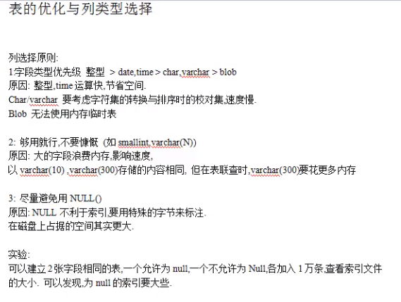
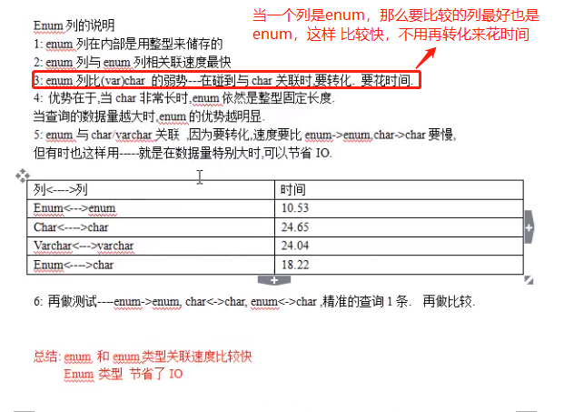

# 列类型的选取原则



在选取类型上，优先选取 `整形，然后是date，time，再然后是enum，再然后是char，varchar，最次是blob.`，即:

    整形 > date,time > enum > varchar,char > blob

# 为什么字段尽量避免null

```sql
-- 为什么字段尽量避免null,而是要用特殊字节代替,比如''
-- 因为使用索引查询的时候，key_len会多一个字节，占用更多内存。而且使用不方便
create table t3 (
name char(1) not null default '',
key(name)   -- 给name列建立索引
)engine=myisam charset=utf8;
insert into t3 values ('a'),('');
show index from t3;

-- 可以看大key_len为3
explain select * from t3 where name = 'a';
+----+-------------+-------+------+---------------+------+---------+-------+------+--------------------------+
| id | select_type | table | type | possible_keys | key  | key_len | ref   | rows | Extra                    |
+----+-------------+-------+------+---------------+------+---------+-------+------+--------------------------+
|  1 | SIMPLE      | t3    | ref  | name          | name | 3       | const |    1 | Using where; Using index |
+----+-------------+-------+------+---------------+------+---------+-------+------+--------------------------+

create table t4 (
name char(1),
key(name)
)engine=myisam charset=utf8;
insert into t4 values ('a'),(null);
show index from t4;

-- 可以看大key_len为4，因为要多使用1个字节来区别null和非null，所以字段尽量避免null
explain select * from t4 where name = 'a';
+----+-------------+-------+------+---------------+------+---------+-------+------+--------------------------+
| id | select_type | table | type | possible_keys | key  | key_len | ref   | rows | Extra                    |
+----+-------------+-------+------+---------------+------+---------+-------+------+--------------------------+
|  1 | SIMPLE      | t4    | ref  | name          | name | 4       | const |    1 | Using where; Using index |
+----+-------------+-------+------+---------------+------+---------+-------+------+--------------------------+

select * from t4 where name is null;
```

# 枚举类型



```sql
-- 当查询的数据量大的时候，enum的优势很明显，因为它帮你省了很多空间
-- 如果我们要存一些比如性别，学历这样的，建议使用enum，很省空间。

create table t5 (
gender enum('male','female') not null default 'male'
)engine myisam charset utf8;

insert into t5 values ('male'),('female');

select gender+0 from t5;
-- 说明enum内部是使用整形来存储的
+----------+
| gender+0 |
+----------+
|        1 |
|        2 |
+----------+
```
