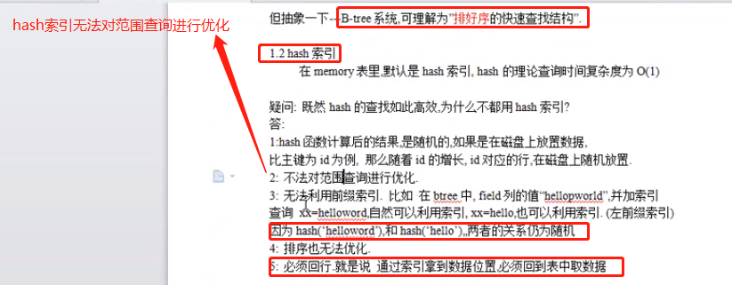
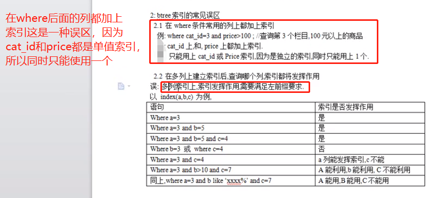
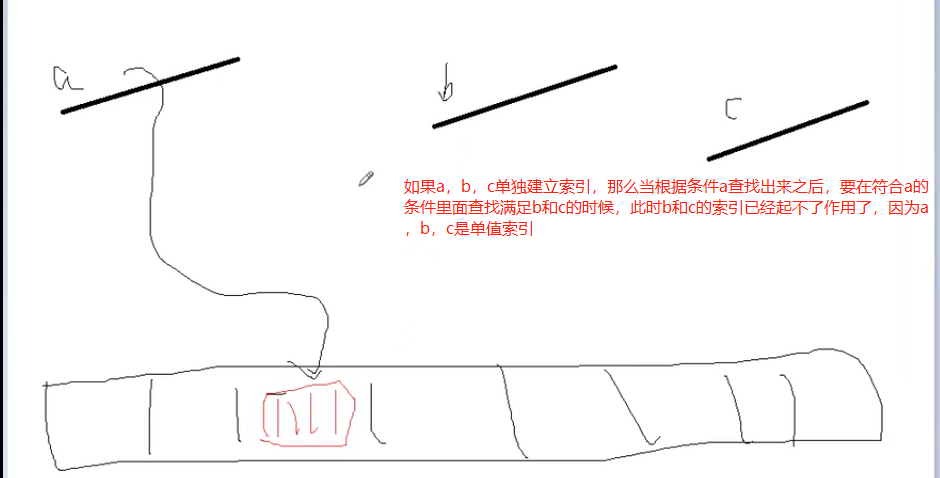
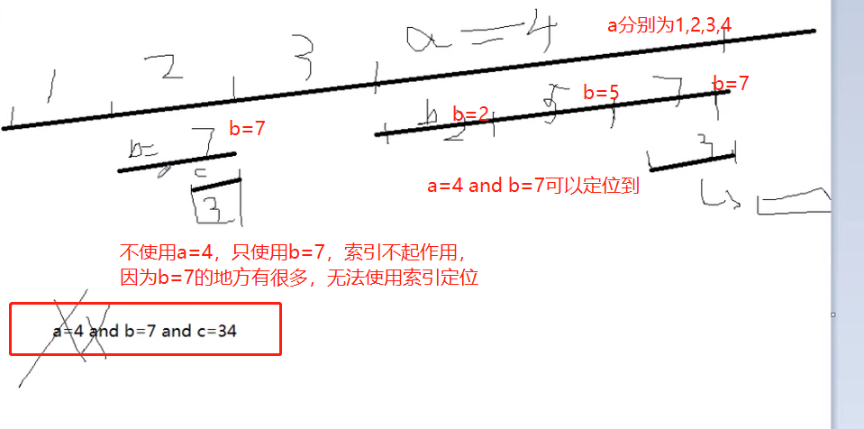
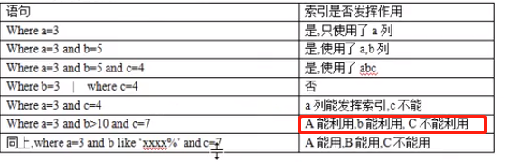
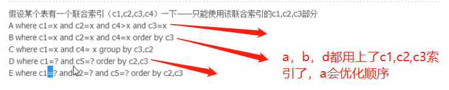
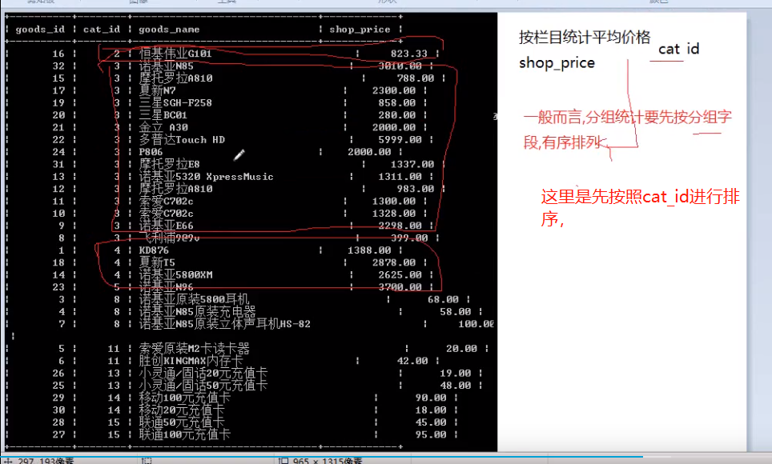

# 复合索引练习题

    真正的项目中,都是使用复合索引,而不是单列索引.
    单例索引的意义不是很大,因为业务中一般不会只根据单列来查询
    而是使用多列来查询



```sql
-- 真正在数据比较多的项目中，都是建立多列索引，单例索引意义不大，因为我们一般查询都是多列
create table t6 (
c1 char(1) not null default '',
c2 char(1) not null default '',
c3 char(1) not null default '',
c4 char(1) not null default '',
c5 char(1) not null default '',
key(c1,c2,c3,c4) -- 给c1,c2,c3,c4建立复合索引
)engine myisam charset utf8;
show create table t6;

-- 要多插入几条数据，如果只有一行数据的话，type直接为system，也就是查询为常量级别，看不出效果，因为查询太快了
insert into t6 values ('a','b','c','d','e');
insert into t6 values ('e','f','l','d','e');

explain select * from t6 where c1 = 'a' and c2 = 'b' and c4 > 'a' and c3='d';
-- utf8中一个字符3个字节
+----+-------------+-------+-------+---------------+------+---------+------+------+-------------+
| id | select_type | table | type  | possible_keys | key  | key_len | ref  | rows | Extra       |
+----+-------------+-------+-------+---------------+------+---------+------+------+-------------+
|  1 | SIMPLE      | t6    | range | c1            | c1   | 12      | NULL |    1 | Using where |
+----+-------------+-------+-------+---------------+------+---------+------+------+-------------+

explain select * from t6 where c1 = 'a' and c2 = 'b' and c4 = 'a' order by c3;
-- 用到了c1，c2，c3，c1和c2通过key_len体现了出来
-- c3通过Extra表现了出来，c3本来就是有序的，就不用再排序了,这个就是索引在排序中发挥的功能
+----+-------------+-------+------+---------------+------+---------+-------------+------+-------------+
| id | select_type | table | type | possible_keys | key  | key_len | ref         | rows | Extra       |
+----+-------------+-------+------+---------------+------+---------+-------------+------+-------------+
|  1 | SIMPLE      | t6    | ref  | c1            | c1   | 6       | const,const |    1 | Using where |
+----+-------------+-------+------+---------------+------+---------+-------------+------+-------------+

explain select * from t6 where c1 = 'a' and c2 = 'b' and c4 = 'a' order by c5;
-- 对比上面，c5是无序的，所以还要再排一次序，所以有using filesort
+----+-------------+-------+------+---------------+------+---------+-------------+------+-----------------------------+
| id | select_type | table | type | possible_keys | key  | key_len | ref         | rows | Extra                       |
+----+-------------+-------+------+---------------+------+---------+-------------+------+-----------------------------+
|  1 | SIMPLE      | t6    | ref  | c1            | c1   | 6       | const,const |    1 | Using where; Using filesort |
+----+-------------+-------+------+---------------+------+---------+-------------+------+-----------------------------+


explain select * from t6 where c1 = 'a' and c5 = 'b' order by c2,c3;
+----+-------------+-------+------+---------------+------+---------+-------+------+-------------+
| id | select_type | table | type | possible_keys | key  | key_len | ref   | rows | Extra       |
+----+-------------+-------+------+---------------+------+---------+-------+------+-------------+
|  1 | SIMPLE      | t6    | ref  | c1            | c1   | 3       | const |    1 | Using where |
+----+-------------+-------+------+---------------+------+---------+-------+------+-------------+

explain select * from t6 where c1 = 'a' and c5 = 'b' order by c3,c2;
+----+-------------+-------+------+---------------+------+---------+-------+------+-----------------------------+
| id | select_type | table | type | possible_keys | key  | key_len | ref   | rows | Extra                       |
+----+-------------+-------+------+---------------+------+---------+-------+------+-----------------------------+
|  1 | SIMPLE      | t6    | ref  | c1            | c1   | 3       | const |    1 | Using where; Using filesort |
+----+-------------+-------+------+---------------+------+---------+-------+------+-----------------------------+

explain select * from t6 where c1 = 'a' and c2 = 'd' order by c3,c2;
-- c2永远等于d，相当于c2是一个常量： order by c3, 'd'，所以c1，c2，c3都用上了，order by后面的常量可以忽略
+----+-------------+-------+------+---------------+------+---------+-------------+------+-------------+
| id | select_type | table | type | possible_keys | key  | key_len | ref         | rows | Extra       |
+----+-------------+-------+------+---------------+------+---------+-------------+------+-------------+
|  1 | SIMPLE      | t6    | ref  | c1            | c1   | 6       | const,const |    1 | Using where |
+----+-------------+-------+------+---------------+------+---------+-------------+------+-------------+

explain select * from t6 where c1 = 'a' and c4 = 'd' group by c3,c2;
-- group by c3,c2的过程就是给这俩字段排序的过程
+----+-------------+-------+------+---------------+------+---------+-------+------+----------------------------------------------+
| id | select_type | table | type | possible_keys | key  | key_len | ref   | rows | Extra                                        |
+----+-------------+-------+------+---------------+------+---------+-------+------+----------------------------------------------+
|  1 | SIMPLE      | t6    | ref  | c1            | c1   | 3       | const |    1 | Using where; Using temporary; Using filesort |
+----+-------------+-------+------+---------------+------+---------+-------+------+----------------------------------------------+

explain select * from t6 where c1 = 'a' and c4 = 'd' group by c2,c3;
-- 使用了c1，但是c2和c3在extra体现了出来
+----+-------------+-------+------+---------------+------+---------+-------+------+-------------+
| id | select_type | table | type | possible_keys | key  | key_len | ref   | rows | Extra       |
+----+-------------+-------+------+---------------+------+---------+-------+------+-------------+
|  1 | SIMPLE      | t6    | ref  | c1            | c1   | 3       | const |    1 | Using where |
+----+-------------+-------+------+---------------+------+---------+-------+------+-------------+
```




分组统计要先按照分组字段有序排列，也就是先给要分组的字段排序。

分组用到临时表来排序，也就是一边排序，一边生成一张临时表，然后对着这张临时表来进行聚合运算。

```sql
-- 如果cat_id没有索引，会用到临时表，using temporary
-- 如果不用索引，会把全部的数据取出来，对cat_id来进行排序，
-- 如果对cat_id 建立了索引，就不用了，因为本身b+tree就是有序的，直接遍历读取就可以了。
-- b+tree搜索的cat_id的速度很快，直接可以根据cat_id找到磁盘上对应的的数据行
select avg(shop_price) from ecs_goods group by cat_id;
```

# 根据实际业务建立联合索引

建立索引一定要根据自己的实际业务，比如你在电商网站上面，首页上面都是产品的类别(type),比如你点进入男装这个类别，会有一个输入价格范围的框。这个时候单独对type和商品价格建立索引就不太好，而是要对type和对应类型商品的price建立联合索引才有效果。

```sql
-- 把缓存清理一下。
reset query cache;

-- 查看语句的运行时间
set profiling=on;
show profiles;

-- 删除表的索引
alter table <table_name> drop index index_name;
```
