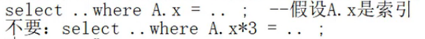
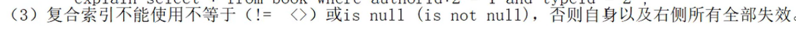
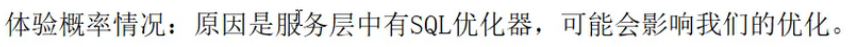
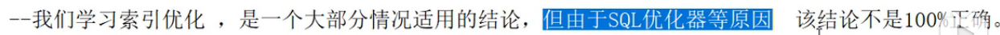

# 两表优化


```sql
create table teacher2(
    tid int(4) primary key,
    cid int(4) not null
);

insert into teacher2 values(1,2);
insert into teacher2 values(2,1);
insert into teacher2 values(3,3);

create table course2(
    cid int(4),
    cname varchar(20)
);

insert into course2 values(1,'java');
insert into course2 values(2,'python');
insert into course2 values(3,'kotlin');
commit;
```

```sql
-- 左连接(以左表为基础,左表为基础的意思就是左表中的全部数据都要匹配)
explain select * from teacher2 t left outer join course2 c on t.cid=c.cid where c.cname='java';
+----+-------------+-------+------+---------------+------+---------+------+------+--------------------------------+
| id | select_type | table | type | possible_keys | key  | key_len | ref  | rows | Extra                          |
+----+-------------+-------+------+---------------+------+---------+------+------+--------------------------------+
|  1 | SIMPLE      | t     | ALL  | NULL          | NULL | NULL    | NULL |    3 |                                |
|  1 | SIMPLE      | c     | ALL  | NULL          | NULL | NULL    | NULL |    3 | Using where; Using join buffer |
+----+-------------+-------+------+---------------+------+---------+------+------+--------------------------------+

-- 优化,要加索引,往哪里加?    --小表驱动大表
-- 将数据小的表放到左边,也就是当编写on t.cid=c.cid时,将数据量小的表放左边(这里是假设t表小)
where 小表.x = 大表.y;
```


>外层循环越小,内层循环越大,对于程序的性能是越高的.这个是编程的一个原则.

```sql
-- 索引要建立在经常使用的字段上
where 小表.x = 大表.y;
-- 假设小表是10条,大表是300表,左边的10条数据中的每一条数据,都要比较300次,因此左边表的数据使用量比较大
-- 左边的x字段使用的频率比较高,因此就需要给x字段加索引
-- 左连接,是以左表为基础,左表为基础的意思就是左表中的全部数据都要匹配,也就是左表
-- 的使用频率必然很频繁,所以要给左表加索引
-- 右连接,以右表为基础,给右表加索引
```

```sql
-- 给左表加索引
alter table teacher2 add index index_teacher2_cid(cid);

explain select * from teacher2 t left outer join course2 c on t.cid=c.cid where c.cname='java';
-- teacher2的type已经为index,而且增加了索引覆盖,extra变为using index了
+----+-------------+-------+-------+--------------------+--------------------+---------+------+------+--------------------------------+
| id | select_type | table | type  | possible_keys      | key                | key_len | ref  | rows | Extra                          |
+----+-------------+-------+-------+--------------------+--------------------+---------+------+------+--------------------------------+
|  1 | SIMPLE      | t     | index | index_teacher2_cid | index_teacher2_cid | 4       | NULL |    3 | Using index                    |
|  1 | SIMPLE      | c     | ALL   | NULL               | NULL               | NULL    | NULL |    3 | Using where; Using join buffer |
+----+-------------+-------+-------+--------------------+--------------------+---------+------+------+--------------------------------+

-- 还有一个字段是必须加索引的,那就是cname,因为要根据cname查询东西,如果不给cname加索引,效率太低了.
alter table course2 add index index_course2_cname(cname);

explain select * from teacher2 t left outer join course2 c on t.cid=c.cid where c.cname='java';
-- 很明显,给cname加完索引后,course的type变为ref了,
+----+-------------+-------+------+---------------------+---------------------+---------+------------+------+-------------+
| id | select_type | table | type | possible_keys       | key                 | key_len | ref        | rows | Extra       |
+----+-------------+-------+------+---------------------+---------------------+---------+------------+------+-------------+
|  1 | SIMPLE      | c     | ref  | index_course2_cname | index_course2_cname | 63      | const      |    1 | Using where |
|  1 | SIMPLE      | t     | ref  | index_teacher2_cid  | index_teacher2_cid  | 4       | myBD.c.cid |    1 | Using index |
+----+-------------+-------+------+---------------------+---------------------+---------+------------+------+-------------+
```


其实就是你这个sql写的太差了,mysql看不下去了,它给你加了连接缓存.后面我们改进了之后,mysql觉得你写的差不多,就给你加了.

# 三表优化

- 小表驱动大表
- 索引建立在经常查询的字段上,你有a,b,c三张表,你有20个字段,没有必要20个字段全部加索引,你只需要看这3张表这么多字段里面哪些字段经常在查询,哪些字段 经常在where后面,只需要将经常在where后面,以及常用的字段加上索引就完了,其他用的少的字段就不用管.

# 避免索引失效的一些原则

我们有时候建立了索引,但是索引有时候会失效,比较典型的就是in语句.其他失效情况:

- 复合索引的时候,不要跨列,或者无序使用(最佳左前缀),要严格按照这个顺序使用,你建了个索引(a,b,c),在使用时,就是先a,再b,后c,  where a... and b... order by c,不要 where c.. order by a.
- 在使用复合索引的时候,尽量使用全索引匹配,你建了个索引(a,b,c),尽量把a,b,c都用了,比如你要找一个学生,现根据学校找(a),再根据年级找(b),再根据班级(c),这样可能更快点,如果你只使用3个中的2个,这样虽然可以,但是不太好.所以尽量全部用上.
- 不要在索引上进行任何操作(计算/函数运算/类型转换),因为这会导致索引失效.



```sql
-- 使用之前的book表演示
show index from book;
+-------+------------+----------+--------------+-------------+-----------+-------------+----------+--------+------+------------+---------+---------------+
| Table | Non_unique | Key_name | Seq_in_index | Column_name | Collation | Cardinality | Sub_part | Packed | Null | Index_type | Comment | Index_comment |
+-------+------------+----------+--------------+-------------+-----------+-------------+----------+--------+------+------------+---------+---------------+
| book  |          0 | PRIMARY  |            1 | bid         | A         |           2 |     NULL | NULL   |      | BTREE      |         |               |
| book  |          1 | idx_atb  |            1 | authorid    | A         |           4 |     NULL | NULL   |      | BTREE      |         |               |
| book  |          1 | idx_atb  |            2 | typeid      | A         |           4 |     NULL | NULL   |      | BTREE      |         |               |
| book  |          1 | idx_atb  |            3 | bid         | A         |           4 |     NULL | NULL   |      | BTREE      |         |               |
+-------+------------+----------+--------------+-------------+-----------+-------------+----------+--------+------+------------+---------+---------------+

explain select * from book where authorid=1 and typeid=2;
-- key_len为8,所以authorid和typeid2个索引都用上了
+----+-------------+-------+------+---------------+---------+---------+-------------+------+-------+
| id | select_type | table | type | possible_keys | key     | key_len | ref         | rows | Extra |
+----+-------------+-------+------+---------------+---------+---------+-------------+------+-------+
|  1 | SIMPLE      | book  | ref  | idx_atb       | idx_atb | 8       | const,const |    1 |       |
+----+-------------+-------+------+---------------+---------+---------+-------------+------+-------+

explain select * from book where authorid=1 and typeid * 2 =2;
-- key_len为4,所以看到你只用了一个.后面的typeid失效了
+----+-------------+-------+------+---------------+---------+---------+-------+------+-------------+
| id | select_type | table | type | possible_keys | key     | key_len | ref   | rows | Extra       |
+----+-------------+-------+------+---------------+---------+---------+-------+------+-------------+
|  1 | SIMPLE      | book  | ref  | idx_atb       | idx_atb | 4       | const |    1 | Using where |
+----+-------------+-------+------+---------------+---------+---------+-------+------+-------------+

explain select * from book where authorid*2=1 and typeid * 2 =2;
-- 没有使用索引,因为都失效了
+----+-------------+-------+------+---------------+------+---------+------+------+-------------+
| id | select_type | table | type | possible_keys | key  | key_len | ref  | rows | Extra       |
+----+-------------+-------+------+---------------+------+---------+------+------+-------------+
|  1 | SIMPLE      | book  | ALL  | NULL          | NULL | NULL    | NULL |    4 | Using where |
+----+-------------+-------+------+---------------+------+---------+------+------+-------------+

explain select * from book where authorid*2=1 and typeid =2;
-- 用到0个索引,对于复合索引,如果左边失效,右侧全部失效,这里就是authorid失效了,typeid也跟着失效了
-- typeid失效了,对authorid没影响,看我们定义idx_atb的顺序: authorid typeid bid
-- 如果左边失效,右侧全部失
-- 如果typeid失效,bid也失效,注意这里是针对复合索引
-- 如果authorid typeid bid是3个单独的索引,是没有这种约束的.如果authorid typeid bid是3个单独的索引,typeid失效了,对其他2个没有影响
+----+-------------+-------+------+---------------+------+---------+------+------+-------------+
| id | select_type | table | type | possible_keys | key  | key_len | ref  | rows | Extra       |
+----+-------------+-------+------+---------------+------+---------+------+------+-------------+
|  1 | SIMPLE      | book  | ALL  | NULL          | NULL | NULL    | NULL |    4 | Using where |
+----+-------------+-------+------+---------------+------+---------+------+------+-------------+

-- 改成3个单值索引
drop index idx_atb on book;
alter table book add index idx_authorid(authorid);
alter table book add index idx_typeid(typeid);

explain select * from book where authorid*2=1 and typeid =2;
-- 可以看到,单值索引是互不影响的.
+----+-------------+-------+------+---------------+------------+---------+-------+------+-------------+
| id | select_type | table | type | possible_keys | key        | key_len | ref   | rows | Extra       |
+----+-------------+-------+------+---------------+------------+---------+-------+------+-------------+
|  1 | SIMPLE      | book  | ref  | idx_typeid    | idx_typeid | 4       | const |    2 | Using where |
+----+-------------+-------+------+---------------+------------+---------+-------+------+-------------+
```

```sql
explain select * from book where authorid=1 and typeid =2;
-- sql优化是一种概率优化,不是100%成功,这里可以看到,预测用到2个索引,但实际使用了1个
+----+-------------+-------+------+-------------------------+--------------+---------+-------+------+-------------+
| id | select_type | table | type | possible_keys           | key          | key_len | ref   | rows | Extra       |
+----+-------------+-------+------+-------------------------+--------------+---------+-------+------+-------------+
|  1 | SIMPLE      | book  | ref  | idx_authorid,idx_typeid | idx_authorid | 4       | const |    1 | Using where |
+----+-------------+-------+------+-------------------------+--------------+---------+-------+------+-------------+
```



```sql
explain select * from book where authorid!=1 and typeid =2;
-- 不等号将authorid失效了,所以只剩下typeid了.
+----+-------------+-------+------+-------------------------+------------+---------+-------+------+-------------+
| id | select_type | table | type | possible_keys           | key        | key_len | ref   | rows | Extra       |
+----+-------------+-------+------+-------------------------+------------+---------+-------+------+-------------+
|  1 | SIMPLE      | book  | ref  | idx_authorid,idx_typeid | idx_typeid | 4       | const |    2 | Using where |
+----+-------------+-------+------+-------------------------+------------+---------+-------+------+-------------+

explain select * from book where authorid!=1 and typeid !=2;
+----+-------------+-------+------+-------------------------+------+---------+------+------+-------------+
| id | select_type | table | type | possible_keys           | key  | key_len | ref  | rows | Extra       |
+----+-------------+-------+------+-------------------------+------+---------+------+------+-------------+
|  1 | SIMPLE      | book  | ALL  | idx_authorid,idx_typeid | NULL | NULL    | NULL |    4 | Using where |
+----+-------------+-------+------+-------------------------+------+---------+------+------+-------------+
```

# 体验概率情况

原因: sql里面有一层叫服务层,服务层有一个sql优化器,当我们写一条语句,你虽然优化了,但是优化器会干扰你的优化,所以结果就不是你想的样子.



```sql
drop index idx_typeid on book;
drop index idx_authorid on book;
alter table book add index idx_book_at(authorid,typeid);

-- 复合索引全部使用了
explain select * from book where authorid =1 and typeid = 2;
+----+-------------+-------+------+---------------+-------------+---------+-------------+------+-------+
| id | select_type | table | type | possible_keys | key         | key_len | ref         | rows | Extra |
+----+-------------+-------+------+---------------+-------------+---------+-------------+------+-------+
|  1 | SIMPLE      | book  | ref  | idx_book_at   | idx_book_at | 8       | const,const |    1 |       |
+----+-------------+-------+------+---------------+-------------+---------+-------------+------+-------+

explain select * from book where authorid>1 and typeid = 2;
-- 复合索引中有>,则自身和右侧索引全部失效
+----+-------------+-------+------+---------------+------+---------+------+------+-------------+
| id | select_type | table | type | possible_keys | key  | key_len | ref  | rows | Extra       |
+----+-------------+-------+------+---------------+------+---------+------+------+-------------+
|  1 | SIMPLE      | book  | ALL  | idx_book_at   | NULL | NULL    | NULL |    4 | Using where |
+----+-------------+-------+------+---------------+------+---------+------+------+-------------+

explain select * from book where authorid=1 and typeid > 2;
-- authorid没有失效,typeid也没有失效,这种就是概率情况
+----+-------------+-------+-------+---------------+-------------+---------+------+------+-------------+
| id | select_type | table | type  | possible_keys | key         | key_len | ref  | rows | Extra       |
+----+-------------+-------+-------+---------------+-------------+---------+------+------+-------------+
|  1 | SIMPLE      | book  | range | idx_book_at   | idx_book_at | 8       | NULL |    1 | Using where |
+----+-------------+-------+-------+---------------+-------------+---------+------+------+-------------+

-- 明显的概率问题,sql优化器干扰了.
explain select * from book where authorid<1 and typeid = 2;
+----+-------------+-------+-------+---------------+-------------+---------+------+------+-------------+
| id | select_type | table | type  | possible_keys | key         | key_len | ref  | rows | Extra       |
+----+-------------+-------+-------+---------------+-------------+---------+------+------+-------------+
|  1 | SIMPLE      | book  | range | idx_book_at   | idx_book_at | 4       | NULL |    1 | Using where |
+----+-------------+-------+-------+---------------+-------------+---------+------+------+-------------+

explain select * from book where authorid<4 and typeid = 2;
-- 索引全部失效,对比上一条,可以印证sql优化器干扰了.
+----+-------------+-------+------+---------------+------+---------+------+------+-------------+
| id | select_type | table | type | possible_keys | key  | key_len | ref  | rows | Extra       |
+----+-------------+-------+------+---------------+------+---------+------+------+-------------+
|  1 | SIMPLE      | book  | ALL  | idx_book_at   | NULL | NULL    | NULL |    4 | Using where |
+----+-------------+-------+------+---------------+------+---------+------+------+-------------+
```



>一般而言,范围查询(>,<,in),之后的索引都失效了,但是自身没有失效.

# 补救

尽量使用索引覆盖(using index),这个结论是不会出错的,是100%没问题的.

like尽量以"常量开头",不要以%开头,否则索引失效.

```sql
explain select * from teacher where tname like '%x%';
-- tname索引失效
+----+-------------+---------+------+---------------+------+---------+------+------+-------------+
| id | select_type | table   | type | possible_keys | key  | key_len | ref  | rows | Extra       |
+----+-------------+---------+------+---------------+------+---------+------+------+-------------+
|  1 | SIMPLE      | teacher | ALL  | NULL          | NULL | NULL    | NULL |    4 | Using where |
+----+-------------+---------+------+---------------+------+---------+------+------+-------------+

explain select * from teacher where tname like 'x%';
+----+-------------+---------+-------+---------------+------------+---------+------+------+-------------+
| id | select_type | table   | type  | possible_keys | key        | key_len | ref  | rows | Extra       |
+----+-------------+---------+-------+---------------+------------+---------+------+------+-------------+
|  1 | SIMPLE      | teacher | range | index_name    | index_name | 63      | NULL |    1 | Using where |
+----+-------------+---------+-------+---------------+------------+---------+------+------+-------------+

explain select tname from teacher where tname like '%x%';
-- 这里是用到了索引覆盖,也就是你要select的数据全部在索引里面的,所以type就是index,extra就是using index,
+----+-------------+---------+-------+---------------+------------+---------+------+------+--------------------------+
| id | select_type | table   | type  | possible_keys | key        | key_len | ref  | rows | Extra                    |
+----+-------------+---------+-------+---------------+------------+---------+------+------+--------------------------+
|  1 | SIMPLE      | teacher | index | NULL          | index_name | 63      | NULL |    4 | Using where; Using index |
+----+-------------+---------+-------+---------------+------------+---------+------+------+--------------------------+
-- 如果使用%x%进行模糊查询,可以使用索引覆盖来挽救一部分,就是要 查询的列全部在索引里面,不需要回表查询.
```

# 尽量不要使用类型转换(显示/隐式)

显式/隐式的类型转换会使索引失效.

```sql
explain select * from teacher where tname = 'abc';
+----+-------------+---------+------+---------------+------------+---------+-------+------+-------------+
| id | select_type | table   | type | possible_keys | key        | key_len | ref   | rows | Extra       |
+----+-------------+---------+------+---------------+------------+---------+-------+------+-------------+
|  1 | SIMPLE      | teacher | ref  | index_name    | index_name | 63      | const |    1 | Using where |
+----+-------------+---------+------+---------------+------------+---------+-------+------+-------------+

explain select * from teacher where tname = 123;
-- 程序底层将123转换成了'123',即进行了类型转换,因此索引失效,所以key是null
+----+-------------+---------+------+---------------+------+---------+------+------+-------------+
| id | select_type | table   | type | possible_keys | key  | key_len | ref  | rows | Extra       |
+----+-------------+---------+------+---------------+------+---------+------+------+-------------+
|  1 | SIMPLE      | teacher | ALL  | index_name    | NULL | NULL    | NULL |    4 | Using where |
+----+-------------+---------+------+---------------+------+---------+------+------+-------------+
```

# 尽量不要使用or,否则索引失效

```sql
explain select * from teacher where tname = '123' and tcid >1;
+----+-------------+---------+------+--------------------+------------+---------+-------+------+-------------+
| id | select_type | table   | type | possible_keys      | key        | key_len | ref   | rows | Extra       |
+----+-------------+---------+------+--------------------+------------+---------+-------+------+-------------+
|  1 | SIMPLE      | teacher | ref  | index_name,uk_tcid | index_name | 63      | const |    1 | Using where |
+----+-------------+---------+------+--------------------+------------+---------+-------+------+-------------+

explain select * from teacher where tname = '123' or tcid >1;
-- or左侧的tname也失效了.
+----+-------------+---------+------+--------------------+------+---------+------+------+-------------+
| id | select_type | table   | type | possible_keys      | key  | key_len | ref  | rows | Extra       |
+----+-------------+---------+------+--------------------+------+---------+------+------+-------------+
|  1 | SIMPLE      | teacher | ALL  | index_name,uk_tcid | NULL | NULL    | NULL |    4 | Using where |
+----+-------------+---------+------+--------------------+------+---------+------+------+-------------+
```