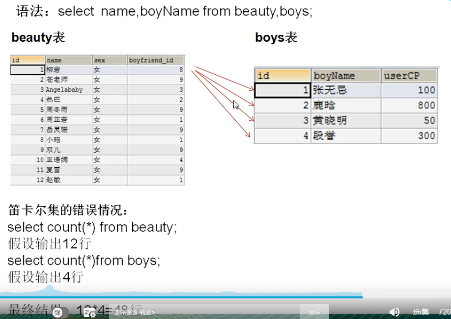
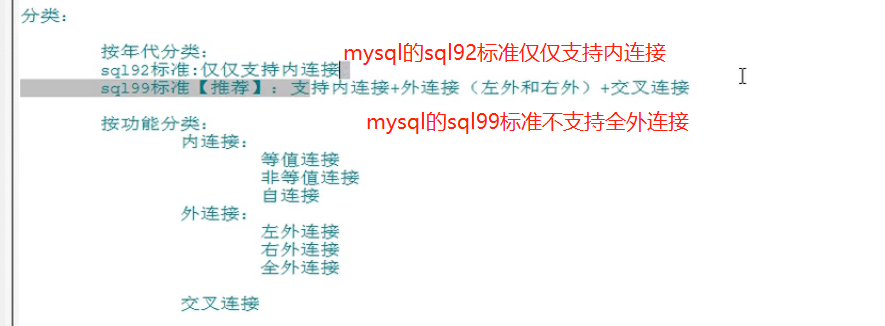
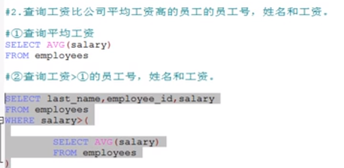
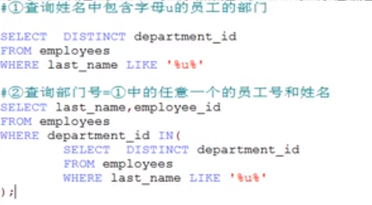
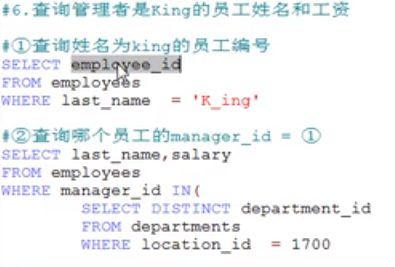
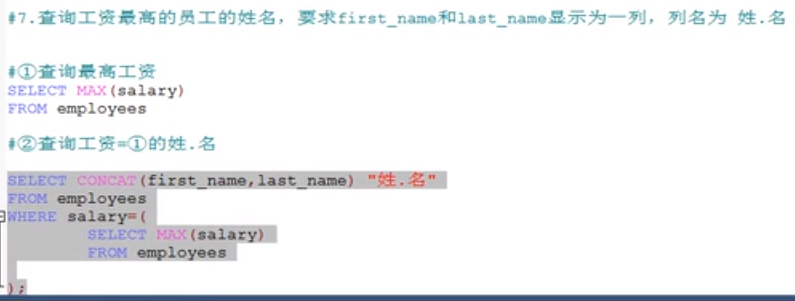
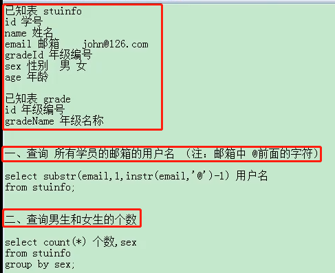
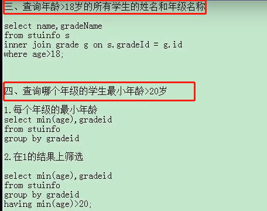
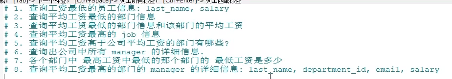
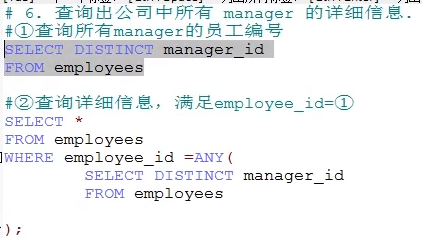

# SQL编写顺序和解析顺序

```sql
-- 编写顺序: select distinct ..from ..join ..on ..where ..group by ..having ...order by ..limit...
SELECT DISTINCT
    < select_list >
FROM
    < left_table > < join_type >
JOIN < right_table > ON < join_condition >
WHERE
    < where_condition >
GROUP BY
    < group_by_list >
HAVING
    < having_condition >
ORDER BY
    < order_by_condition >
LIMIT < limit_number >
```

```sql
-- 解析顺序: from ..on..  join... where... group by ...having...  select distinct .. order by limit...
FROM <left_table>
ON <join_condition>
<join_type> JOIN <right_table>
WHERE <where_condition>
GROUP BY <group_by_list>
HAVING <having_condition>
SELECT 
DISTINCT <select_list>
ORDER BY <order_by_condition>
LIMIT <limit_number>
```

- [每个关键字的说明文章](https://www.cnblogs.com/annsshadow/p/5037667.html)

# 连接查询(多表查询)

查询的字段来自于多个表的时候就会用到多表查询.

---
    笛卡尔乘积现象: 表1 有m行 表2 有n行, 结果=m*n行
    
    笛卡尔乘积发生原因: 没有有效的连接条件
    我们要避免笛卡尔乘积,因为笛卡尔乘积的结果没有意义.
    如何避免: 添加有效的连接条件
---



```sql
-- 会出现一个女的4个boys,这个就是笛卡尔现象
-- 这种其实是sql92语法的笛卡尔乘积的实现,后面会介绍92语法
-- sql99语法的笛卡尔乘积的实现是使用交叉连接(cross join)
SELECT NAME,boyName FROM beauty, boys;

-- 需要添加有效的连接条件才可以避免笛卡尔乘积
SELECT NAME,boyName FROM beauty, boys where beauty.boyfriend_id = boys.id;
```



# 多表查询练习


```sql
-- 1.
SELECT b.*, bo.* FROM beauty b 
LEFT JOIN boys bo 
ON b.boyfriend_id = bo.id
WHERE b.id > 3;

-- 2.
SELECT l.`city`, d.`department_id` 
FROM `locations` l
LEFT JOIN `departments` d
ON l.location_id = d.location_id
WHERE d.`department_id` IS NULL;

-- 3.
-- 因为有的部门可能没有员工,所以要以部门表为主表
SELECT e.*,d.`department_name`
FROM `departments` d
LEFT OUTER JOIN `employees` e
ON d.`department_id` = e.`department_id`
WHERE d.`department_name` IN ('SAL', 'IT');
```


```sql
-- 查询和zlotkey相同部门的员工姓名和工资
-- 第一步: 查询zlotkey所在部门
SELECT `department_id` FROM `employees` WHERE `last_name` = 'zlotkey'
-- 第二步: 查询部门id等于第一步的员工姓名和工资
SELECT `last_name`, `salary` FROM `employees` WHERE `department_id` = (
		SELECT `department_id` FROM `employees` WHERE `last_name` = 'zlotkey'
);
```



```sql
-- 第一步: 查询每个部门的平均工资
SELECT AVG(salary) FROM `employees` GROUP BY `department_id`
-- 第二步: 连接第一步的结果集和employees表,进行筛选
SELECT `employee_id`,`last_name`, `salary` FROM `employees` e
INNER JOIN (
    SELECT AVG(salary) ag, department_id 
    FROM `employees` 
    GROUP BY `department_id`
) avg_dep 
ON e.`department_id` = avg_dep.department_id
WHERE e.salary > avg_dep.ag;
```



```sql
-- 查询在部门location_id 为1700的部门工作的员工的员工号
-- 第一步查询location_id为1700的部门
SELECT `department_id` FROM `departments` WHERE `location_id` = 1700
-- 第二步: 查询部门id等于第一步中任意一个的员工号
SELECT `employee_id` FROM `employees` WHERE `department_id` = ANY(
    SELECT `department_id` FROM `departments` WHERE `location_id` = 1700
);
-- 注意=Any等价于案例4中的in
```










```sql
-- 案例1
-- 第一步查询最低的工资
SELECT MIN(salary) FROM employees;
-- 第二步: 查询工资等于第一步的员工信息: last_name,salary
SELECT last_name,salary FROM employees WHERE salary = (
	SELECT MIN(salary) FROM employees
);

-- 案例2:
-- 方式1:
-- 第一步: 查询每个部门的平均工资
SELECT AVG(salary), `department_id` FROM `employees` 
GROUP BY `department_id`;
-- 第二步: 查询最低平均工资的部门编号
SELECT `department_id` FROM `employees` 
GROUP BY `department_id`
ORDER BY AVG(`salary`)
LIMIT 0,1;
-- 第三步: 查询部门编号等于第二步的部门信息
SELECT * FROM `departments` WHERE `department_id` = (
    SELECT `department_id` FROM `employees` 
    GROUP BY `department_id`
    ORDER BY AVG(`salary`)
    LIMIT 0,1
);

-- 方式2:
-- 第一步: 查询每个部门的平均工资
SELECT AVG(salary), `department_id` FROM `employees` 
GROUP BY `department_id`;
-- 第二步: 查询最低平均工资
SELECT MIN(ag) FROM (
    SELECT AVG(salary) ag, `department_id` FROM `employees` GROUP BY `department_id`
) ag_dep;
-- 第三步: 查询平均工资等于第二步的部门编号
SELECT `department_id` 
FROM `employees` 
GROUP BY `department_id`
HAVING AVG(salary) = (
    SELECT MIN(ag) 
        FROM (
            SELECT AVG(salary) ag, `department_id` 
            FROM `employees` 
            GROUP BY `department_id`
    ) ag_dep
);
-- 第四步: 查询部门编号等于第三步的部门信息
SELECT * FROM `departments`
WHERE `department_id` = (
	SELECT `department_id` FROM `employees` GROUP BY `department_id`
	HAVING AVG(salary) = (
		SELECT MIN(ag) FROM (
			SELECT AVG(salary) ag, `department_id` 
			FROM `employees` 
			GROUP BY `department_id`
		) ag_dep
	)
);
```

```sql
-- 案例3
-- 第一步: 查询每个部门的平均工资
SELECT AVG(salary), `department_id` FROM `employees` 
GROUP BY `department_id`;
-- 第二步,查询平均工资等于第一步的部门信息和平均工资
SELECT d.*, ag 
FROM `departments` d
INNER JOIN (
	SELECT AVG(salary) ag, `department_id` FROM `employees` 
	GROUP BY `department_id`
) ag_dep
ON d.`department_id` = ag_dep.`department_id`
ORDER BY ag_dep.ag
LIMIT 1;
```

```sql
-- 案例4:
-- 第一步查询平均工资最高的job_id
SELECT AVG(salary),job_id FROM `employees` 
GROUP BY job_id
ORDER BY AVG(salary) DESC
LIMIT 1;
-- 第二步:查询job_id等于第一步的job信息
-- where jobs.job_id = (标量子查询)
SELECT * FROM jobs
WHERE jobs.job_id = (
	SELECT job_id FROM `employees` 
	GROUP BY job_id
	ORDER BY AVG(salary) DESC
	LIMIT 1
);
```

```sql
-- 案例5
-- 查询平均工资高于公司平均工资的部门有哪些?
-- 第一步: 查询公司的平均工资
SELECT AVG(salary) FROM `employees`;
-- 第二步: 查询每个部门的平均工资
SELECT AVG(salary) FROM `employees`
GROUP BY `department_id`;
-- 第三步: 过滤第二步结果集中大于第一步的数据
SELECT AVG(salary), `department_id` FROM `employees`
GROUP BY `department_id`
HAVING AVG(salary) > (
    SELECT AVG(salary) FROM `employees`
);
```



```sql
-- 案例7
-- 第一步: 查询平均工资最高的部门id
SELECT department_id FROM employees GROUP BY department_id ORDER BY MAX(salary) LIMIT 1;
-- 第二步: 查询第一步结果的那个部门的最低工资
SELECT MIN(salary) FROM employees WHERE department_id = (
    SELECT department_id FROM employees GROUP BY department_id ORDER BY MAX(salary) LIMIT 1
);
```

```sql
-- 案例8
-- 第一步: 查询平均工资最高的部门id
SELECT `department_id` FROM `employees`
GROUP BY `department_id` 
ORDER BY MAX(`salary`) DESC
LIMIT 1;
-- 第二步: ON m.`employee_id` = d.`manager_id`相当于是把employees中是领导的筛选了出来
SELECT m.`last_name`,m.`department_id`,m.`email`,m.`salary`
FROM `employees` m
INNER JOIN `departments` d
ON m.`employee_id` = d.`manager_id`
WHERE m.`department_id` = (
    SELECT `department_id` FROM `employees`
	GROUP BY `department_id` 
	ORDER BY MAX(`salary`) DESC
	LIMIT 1
);
```