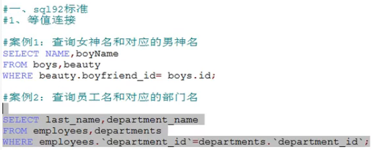
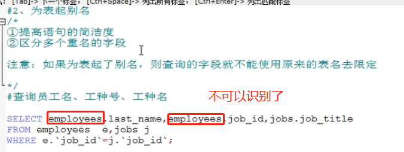
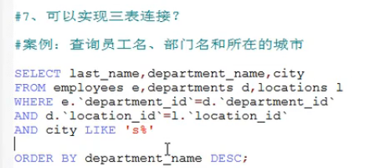
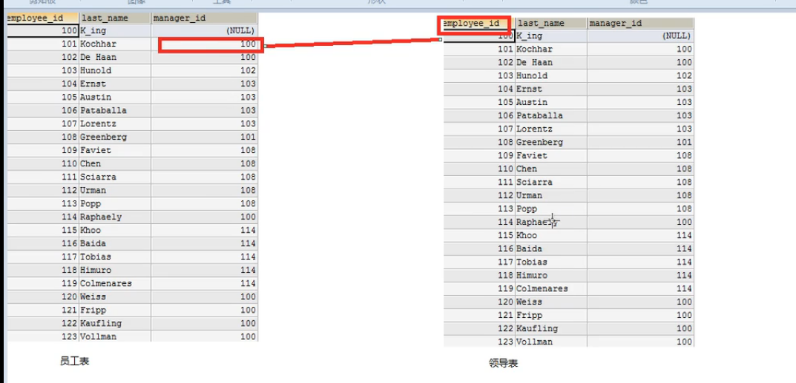

# sql92标准

- 等值连接
- 三表连接
- 非等值连接

## 等值连接

>多表等值连接的结果为多个表的交集部分.

```sql
-- 查询每个城市的部门个数
SELECT COUNT(*) 部门个数,city FROM departments d,locations l WHERE d.location_id = l.location_id GROUP BY city;

-- 查询出有奖金的每个部门的部门名和部门的领导编号和该部门的最低工资
SELECT department_name 部门名,d.manager_id 部门的领导编号,MIN(salary) 最低工资 
FROM departments d,employees e 
WHERE d.department_id = e.department_id AND e.`commission_pct` IS NOT NULL
GROUP BY d.department_name;

 -- 查询每个工种的工种名和员工的个数,并且按员工个数降序
 SELECT job_title 工种名,COUNT(*) AS 员工个数 
 FROM jobs j,employees e 
 WHERE j.job_id = e.job_id 
 GROUP BY job_title
 ORDER BY COUNT(*) DESC;

-- 查询每个国家的部门个数大于2的国家编号
SELECT country_id, COUNT(*) 部门个数
FROM locations l,departments d
WHERE l.location_id = d.location_id
GROUP BY country_id
HAVING COUNT(*) > 2;
-- 可以先看看中间的数据,然后就可以理解了
select * from locations l,departments d WHERE l.location_id = d.location_id;
```





## 三表连接



## 非等值连接

```sql
-- 查询员工的工资和工资级别
SELECT e.salary,j.grade_level FROM employees e,job_grades j
WHERE e.salary BETWEEN j.lowest_sal AND j.highest_sal;
```

## 自连接

```sql
-- 查询员工姓名和上级的名称
SELECT e.`last_name`, m.last_name FROM employees e, employees m WHERE e.manager_id = m.employee_id;
```

