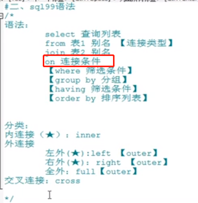
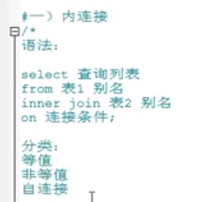
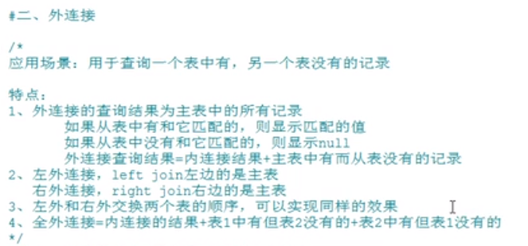
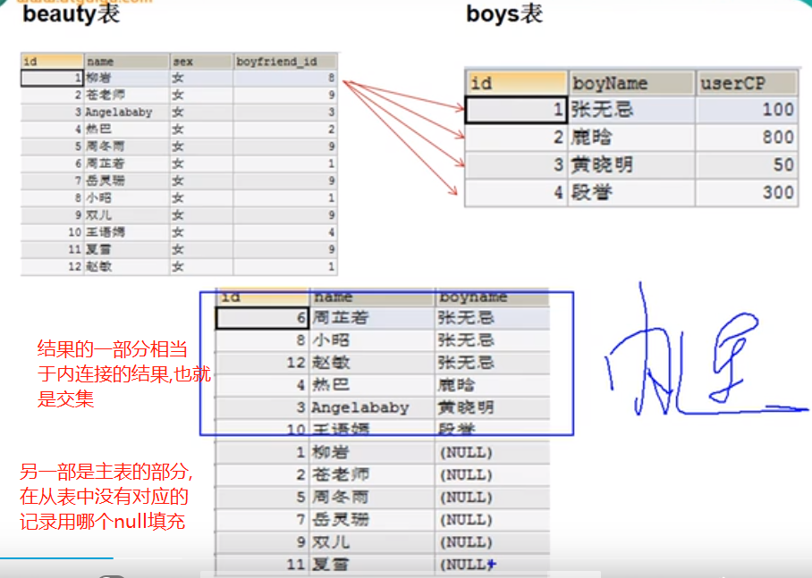
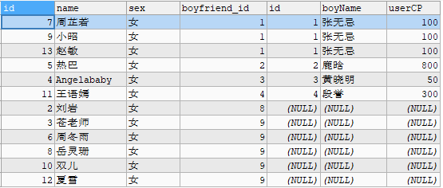

# sql99语法(建议使用99语法,因为功能较多)




>sql92中的条件连接使用的是where,sql99使用的是on.

# 内连接



## 等值连接


```sql
-- 案例1
SELECT last_name,department_name
FROM employees e
INNER JOIN departments d
ON e.department_id = d.department_id;

-- 案例2:
SELECT `last_name`, `job_title`
FROM employees e
INNER JOIN jobs j
ON e.job_id = j.job_id
WHERE e.last_name LIKE '%e%';

-- 案例3
-- 先去查询每个城市的部门个数
-- 在上面的结果上去筛选满足条件的.
SELECT city,COUNT(*) 部门个数
FROM locations l
INNER JOIN departments d
ON d.location_id = l.location_id
GROUP BY city
HAVING COUNT(*) >= 3;

-- 案例4
SELECT `department_name`,COUNT(*) 员工个数
FROM departments d
INNER JOIN employees e
ON d.`department_id` = e. `department_id`
GROUP BY `department_name`
HAVING COUNT(*) >= 3
ORDER BY COUNT(*) DESC;

-- 案例5
SELECT `last_name`, `department_name`, `job_title`
FROM employees e
INNER JOIN departments d ON e.`department_id` = d.`department_id`
INNER JOIN jobs j ON e.`job_id` = j.`job_id`
ORDER BY `department_name` DESC;
```

## 非等值连接

```sql
-- 查询员工的工资级别
SELECT salary, `grade_level`
FROM `employees` e
JOIN `job_grades` j
ON e.salary BETWEEN `lowest_sal` AND `highest_sal`;

-- 查询工资级别的个数>2的个数,并且工资降序.
SELECT `grade_level`, COUNT(*) 个数
FROM `employees` e
JOIN `job_grades` j
ON e.salary BETWEEN `lowest_sal` AND `highest_sal`
GROUP BY grade_level
HAVING COUNT(*) >= 2
ORDER BY grade_level DESC;
```

## 自连接

```sql
-- 查询员工姓名和上级的名称
SELECT e.`last_name`, m.last_name FROM employees e INNER JOIN employees m ON e.manager_id = m.employee_id WHERE e.last_name LIKE '%e%';
```

# 外连接

    应用场景: 用于查询一个表中有,另一个表没有的记录.



    你要查询的信息来自于哪张表,哪个表就是主表.
    全外连接: mysql不支持,oracle是支持的.
    


```sql
-- 以左外连接举例
-- 以beauty表为主表
-- 查询女神的男朋友不在男神表的女神信息
   
-- 先看下不过滤的中间表
SELECT b.*, bo.* FROM beauty b LEFT JOIN boys bo
ON b.boyfriend_id = bo.id;

-- 在上面的结果集上筛选就行,因为没有用到分组函数的话,不用having,直接用where即可.
SELECT b.*, bo.* FROM beauty b LEFT JOIN boys bo
ON b.boyfriend_id = bo.id where bo.id is null;
-- 思考这里为什么用bo.id?  因为这个id是主键,肯定不为null
```



```sql
 -- 以boys为主表,查询没有女朋友的男神
 -- 中间的过渡表
SELECT b.*, bo.* FROM boys bo LEFT JOIN beauty b
ON b.boyfriend_id = bo.id;
-- 以中间的过渡表为基础来筛选
SELECT b.*, bo.* FROM boys bo LEFT JOIN beauty b
ON b.boyfriend_id = bo.id WHERE b.id IS NULL;
```

```sql
-- 第一步查询中间表,因为departments是主表,所以如果`employees`表中有的对应的数据,
-- 会正常显示出来,如果`employees`中没有对应的数据,就以null填充
SELECT d.*,e.* FROM departments d
LEFT JOIN employees e
ON d.`department_id` = e.`department_id`;
-- 第二步: 以上面的结果过滤没有员工的
SELECT d.*,e.* FROM departments d
LEFT JOIN employees e
ON d.`department_id` = e.`department_id`
WHERE e.`employee_id` IS NULL;
```

>全外连接

```sql
-- 如果查询表1中有,表2没有,或者表2中有,表1没有的结果,
-- 要在全外连接的基础之上进行添加where筛选,where boys.id is null and beauty.id is null;
SELECT b.*, bo.* FROM boys bo outer JOIN beauty b
ON b.boyfriend_id = bo.id WHERE b.id IS NULL and bo.id is null;
```

# 交叉连接

```sql
-- 交叉连接的结果就是笛卡尔乘积的结果
-- 也就是交叉连接是使用sql99语法的标准实现的笛卡尔乘积
SELECT b.*, bo.* FROM boys bo cross JOIN beauty b;
```

```sql
-- sql92语法的笛卡尔乘积的实现
SELECT boys.*,beauty.* FROM beauty, boys;
```