# 子查询

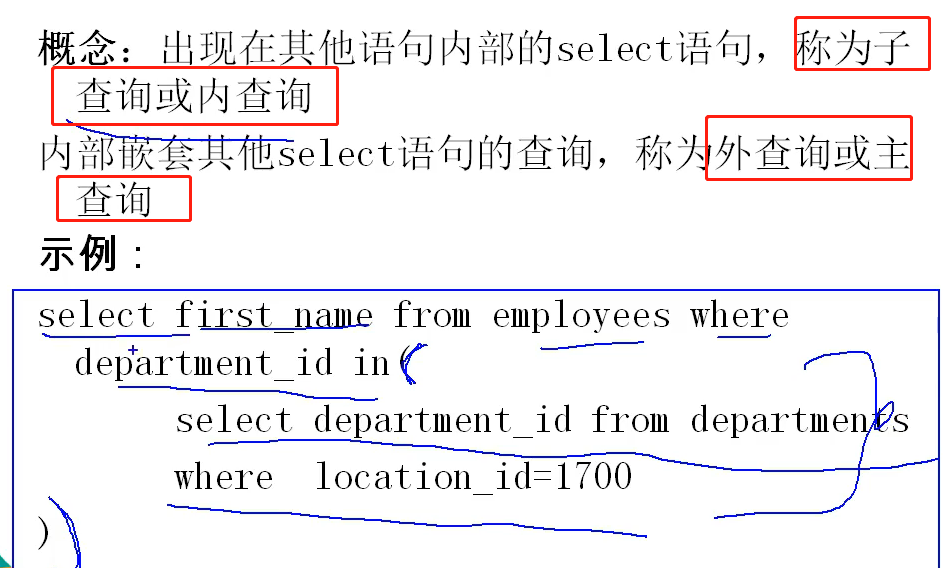
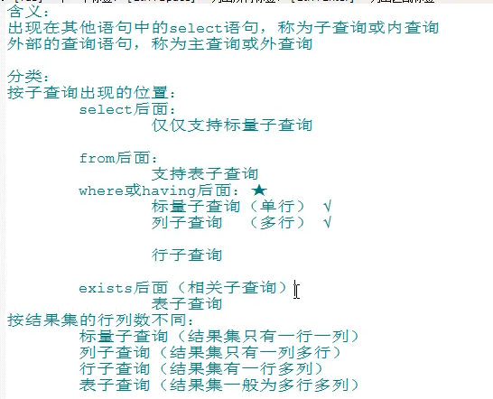

子查询的执行优先于主查询的执行,主查询的条件用到了子查询的结果.

# where或having后面的子查询

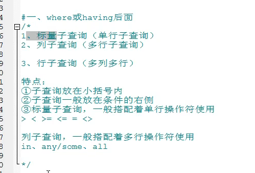

## 标量子查询(子查询结果是一行一列)

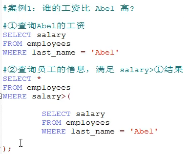
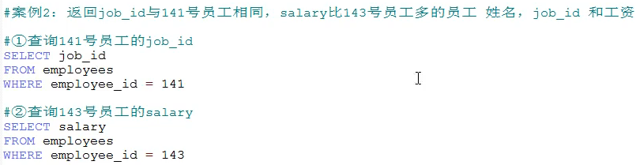
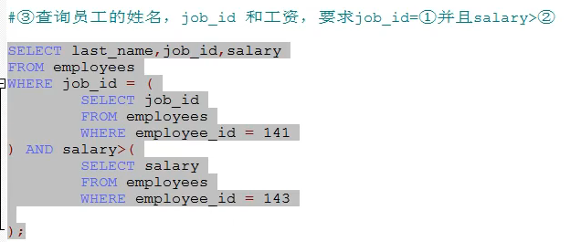
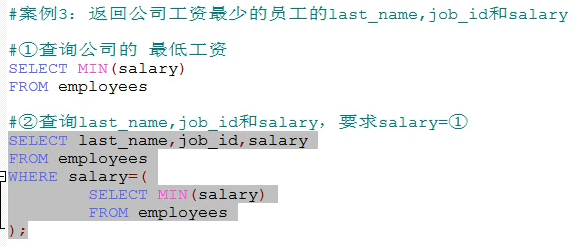
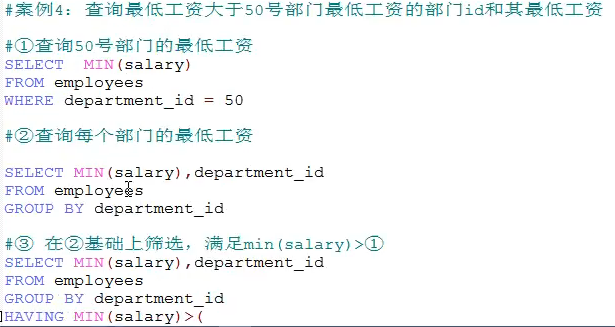

```sql
SELECT MIN(salary),department_id 
FROM employees 
GROUP BY department_id
HAVING MIN(salary) > (
	SELECT MIN(salary) FROM employees WHERE department_id = 50
);
```

    非法使用标量子查询

```sql
-- 部门id=50的salary有很多种,所以子查询中的结果就不是一行一列的,就会出现错误.
SELECT MIN(salary),department_id 
FROM employees 
GROUP BY department_id
HAVING MIN(salary) > (
	SELECT salary FROM employees WHERE department_id = 50
);
```

## 列子查询(子查询是一列多行,又称为多行子查询)


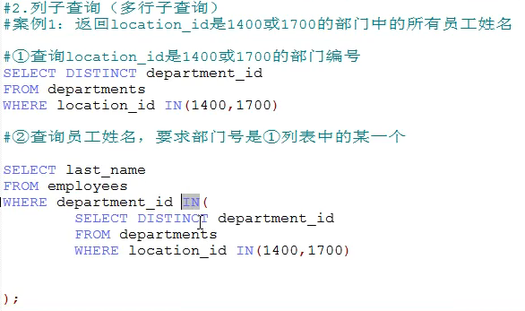
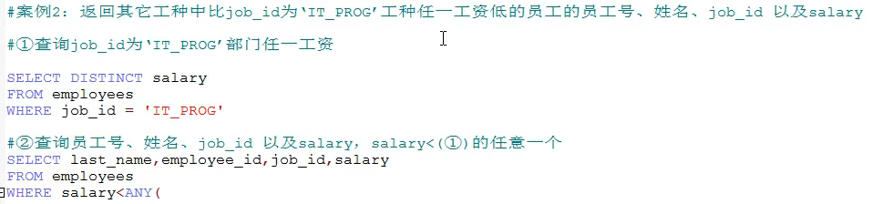

```sql
SELECT last_name,job_id,salary 
FROM employees 
WHERE salary < ANY(
	SELECT DISTINCT salary FROM employees WHERE job_id = 'IT_PROG'
);
```

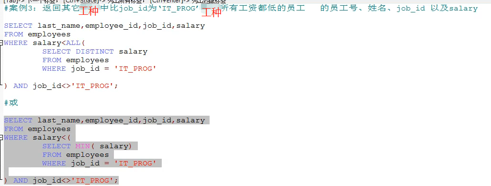

## 行子查询

>结果集一行多列或多行多列(用的较少,了解即可)

```sql
-- 查询员工编号最小并且工资最高的员工信息(这种员工可能不存在)
-- 1. 查询最小的员工编号
SELECT MIN(employee_id) FROM employees;

-- 2. 查询最高的工资
SELECT MAX(salary) FROM employees;

-- 3. 根据1和2来查询这样的员工
SELECT * FROM employees 
WHERE employee_id = (
	SELECT MIN(employee_id) FROM employees
) AND salary = (
	SELECT MAX(salary) FROM employees
);

-- 4. 直接使用行子查询实现上面的效果
SELECT * FROM employees 
WHERE (employee_id,salary) = (
	SELECT MIN(employee_id),MAX(salary) FROM employees
);
```

# 将子查询放在select后面的子查询(仅支持标量子查询)

```sql
-- 案例1: 查询每个部门的员工个数
-- 第一步先感受一下:
select d.*, (
    select count(*) from employees e
) 员工个数 from departments d;
-- 第二步: 在第一步的基础上加条件
select d.*, (
    select count(*) from employees e where e.department_id = d.department_id
) 员工个数 from departments d;
```

# 将子查询放在from后面

>放到from后面的一般都是表,也就是将子查询的结果集充当一个表来使用.这个表必须要起别名

```sql
-- 案例查询每个部门的平均工资的工资等级
-- 第一步: 查询每个部门的平均工资
SELECT AVG(salary) ag,department_id FROM employees GROUP BY department_id;

-- 第二步: 连接第一步的结果集和job_grades表,筛选条件: 平均工资 between lowest_sal and highest_sal
SELECT ag_dep.ag, `grade_level` FROM (
    SELECT AVG(salary) ag,department_id FROM employees GROUP BY department_id
) ag_dep INNER JOIN job_grades g 
ON ag_dep.ag BETWEEN `lowest_sal` AND `highest_sal`;
```


# exists后面(相关子查询)

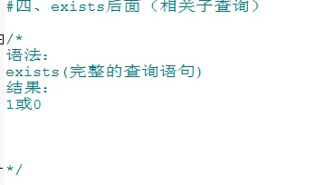

```sql
-- 查询有员工的部门名
-- 因为子查询涉及到了主查询的字段,所以叫相关子查询,本例就是d.department_id
-- exists(子句)返回0/1
SELECT `department_name` 
FROM `departments` d
WHERE EXISTS(
  SELECT * FROM `employees` e
  WHERE e.`department_id` = d.`department_id`
);

-- 看看满足这个条件的有没有
SELECT * FROM `employees` e WHERE e.`department_id` = d.`department_id`

-- 使用in的方式
SELECT `department_name` 
FROM `departments` d
where d.department_id in (
    select e.department_id from employees e
);
```

```sql
-- 查询没有女朋友的男神信息
-- 使用in的方式
SELECT bo.* FROM boys bo 
WHERE bo.id NOT IN (
  SELECT b.`boyfriend_id` FROM `beauty` b
);

-- 使用exists的方式
-- 意思就是SELECT bo.* FROM boys bo 不在后面的b.`boyfriend_id` = bo.id条件里面的
-- 也就是不满足后面的b.`boyfriend_id` = bo.id条件里面的
SELECT bo.*
FROM boys bo
WHERE NOT EXISTS(
	SELECT b.`boyfriend_id` FROM `beauty` b WHERE b.`boyfriend_id` = bo.id
);
```