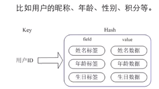

# 散列类型(hash)-使用拉链法解决冲突

## 使用场景

结构化存储,hash特别适合用于存储对象.

举个例子： 最近做的一个电商网站项目的首页就使用了redis的hash数据结构进行缓存，因为一个网站的首页访问量是最大的，所以通常网站的首页可以通过redis缓存来提高性能和并发量。



想取得文章的标题，必须把整个文章数据字符串取出来反序列化，而其中占用空间最大的文章內容部分却是不需要的，这样会在传输和处理时造成资源浪费!!
不仅取数据时会有资源浪费，在修改数据时也会有这个问题，比如当你只想更改文章的标题时也不得不把整个文章数据字符串更新一遍。

>散列类型的键值是一种字典结构，`其存储了字段（field）和字段值的映射，但字段值只能是字符串，不支持其他数据类型`，散列类型不能嵌套其他的数据类型。一个散列类型键可以包含至多2^32-1个字段。

除了散列类型，Redis的其他数据类型同样不支持数据类型嵌套。比如集合类型的每个元素都只能是字符串，不能是另一个集合或散列表等。

```shell
# 散列类型适合存储对象,可以自由地为任何键增减字段而不影响其他键,不会有字段冗余

# 使用对象类别和ID构成键名
car:2

# 字段field表示对象的属性
color
# 字段值value则存储属性值
white

# 字段filed:
name
# 字段值:
奥迪

# 字段: 
price
# 字段值:
90万
---------------------------------------

# 赋值
HSET key field value [field value …]

# 取值
HGET key field [field …]

# 得到某一个键对应的所有的字段和值,将HGETALL的返回结果封装成编程语言中的对象，处理起来就非常方便了
HGETALL key

# 判断字段是否存在,存在返回1，否则0（如果键不存在也会返回0）
HEXISTS key field

# 当字段不存在时赋值,如果字段已经存在，HSETNX命令将不执行任何操作,HSETNX 中的“NX”表示“if Not eXists”,HSETNX命令是原子操作，不用担心竞态条件
HSETNX key field value

# 增加数字,散列类型没有HINCR命令,如果键不存在，默认初始值为0，然后增加
HINCRBY key field increment

# 删除字段,返回值是被删除的字段个数
HDEL key field [field …]

# 只获取字段名或字段值
HKEYS key
HVALS key

# 获得字段数量
HLEN key
```

>`HSET当执行的是插入操作时（即之前字段不存在）HSET命令会返回1，当执行的是更新操作时（即之前字段已经存在）HSET命令会返回0。`

>在Redis中每个键都属于一个明确的数据类型，通过HSET命令建立的键是散列类型，通过SET命令建立的键是字符串类型等。使用一种数据类型的命令操作另一种数据类型的键会提示错误：“ERR Operation against a key holding the wrong kind of value”。`注释：并不是所有命令都是如此，比如SET命令可以覆盖已经存在的键而不论原来键是什么类型。`

## 使用散列类型存储文章缩略名和文章的id

>读者可能会知道发布文章时一般需要指定一个缩略名（slug）来构成该篇文章的网址的一部分，缩略名必须符合网址规范且最好可以与文章标题含义相似，如“This Is A Great Post!”的缩略名可以为“this-is-a-great-post”。每个文章的`缩略名`必须是唯一的，所以在发布文章时程序需要验证用户输入的缩略名是否存在，同时也需要`通过缩略名获得文章的ID。`

```shell
# 使用一个`散列类型的键slug.to.id`来存储文章`缩略名`和`ID`之间的映射关系。
# 其中字段用来记录缩略名，字段值用来记录缩略名对应的ID。
# 这样就可以使用HEXISTS命令来判断缩略名是否存在，使用HGET命令来获得缩略名对应的文章ID了。
slug.to.id  ->  slug    ->  id
```
 