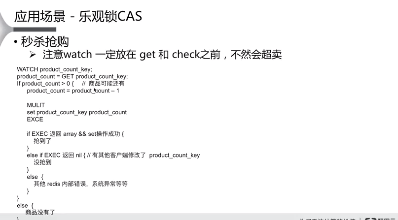
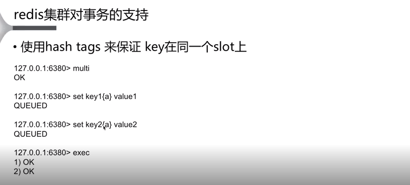

## 事务

### 概念

Redis事务是一组命令的集合。事务同命令一样都是Redis的最小执行单位.

一个事务中的命令要么都执行，要么都不执行(原子操作).使用事务的场景就是希望一串命令在执行的时候不被中断以及不被其他命令插入.

```shell
# 事务的原理: 将属于一个事务的命令发送给Redis，然后再让Redis依次执行这些命令:

# MULTI告诉Redis:“下面我发给你的命令属于同一个事务，你先不要执行，而是把它们暂时存起来:
# 事务开始
NUMTI

# 实现关注和被关注操作
SADD "user:1:following" 2

# 返回QUEUED表示这两条命令已经进入等待执行的事务队列中了
SADD "user:2:followers" 1

# Redis将等待执行的事务队列中的所有命令,按照发送顺序依次执行,返回值是这些命令的返回值组成的列表
# 事务执行
EXEC
```

>如果在发送EXEC命令前客户端断线了，则Redis会清空事务队列，事务中的所有命令都不会执行。而一旦客户端发送了EXEC命令，所有的命令就都会被执行，即使此后客户端断线也没关系，因为Redis中已经记录了所有要执行的命令

# 事务的错误处理

## 语法错误

只要有一个命令有`语法错误`，执行EXEC命令后Redis就会直接返回错误，连语法正确的命令也不会执行.`语法错误完全可以在开发时找出并解决.不应该出现在生产阶段`

>注意：Redis 2.6.5之前的版本会忽略有语法错误的命令，然后执行事务中其他语法正确的命令,2.6.5之前的版本用的不多了,redis >= 2.6.5,如果在exec之前出错了,所有的命令都不会被执行.

```shell
redis＞MULTI
OK
redis＞SET key value
QUEUED
redis＞SET key
(error)ERR wrong number of arguments for 'set' command
redis＞ ERRORCOMMAND key
(error) ERR unknown command 'ERRORCOMMAND'
redis＞ EXEC
(error) EXECABORT Transaction discarded because of previous errors.
```

## 运行错误

在命令执行时出现的错误，比如使用散列类型的命令操作集合类型的键，这种错误在实际执行之前Redis是无法发现的，所以这样的命令是会被Redis接受并执行的。

如果事务里的一条命令出现了`运行错误`，事务里其他的命令依然会继续执行(这是和关系数据库的区别),事务不会回滚(保证redis的简单快速).

>如果能够很好地规划数据库（保证键名规范等）的使用，是不会出现如命令与数据类型不匹配这样的运行错误的

```shell
redis＞MULTI
OK
redis＞SET key 1
QUEUED
redis＞SADD key 2
QUEUED
redis＞SET key 3
QUEUED
redis＞EXEC
1) OK
2) (error) ERR Operation against a key holding the wrong kind of value
3) OK
redis＞GET key
"3"
```

>Redis的事务没有关系数据库事务提供的回滚（rollback） 功能。为此开发者必须在事务执行出错后自己收拾剩下的摊子（将数据库复原回事务执行前的状态等）。
不过由于Redis不支持回滚功能，也使得Redis在事务上可以保持简洁和快速

### WATCH命令介绍(可以防止竞态条件)

>WATCH命令可以监控一个或多个键，一旦其中有一个键在事务EXEC执行前被修改了（或删除），那么之后的事务就`都不会执行`,整个事务都会被取消,exec返回nil-reply来表示事务被取消,监控一直持续到EXEC命令（事务中的命令是在EXEC之后才执行的）.

有些情况下需要先获得一条命令的返回值，然后再根据这个值执行下一条命令.

```shell
# 执行WATCH命令后、事务执行前修改了key的值
SET key 1
WATCH key
SET key 2

MULTI
# 不会执行修改key的操作
SET key 3
# 不会执行修改key2的操作
set key2 a
# 事务中的命令SET key 3没有执行，EXEC命令返回空结果nil
EXEC

GET key
GET key2
```

#### WATCH命令如何来防止竞态条件?

watch常用来实现乐观锁,

```shell
# 伪代码
# EXEC命令返回值是多行字符串类型，所以代码中使用result[0]来获得其中第一个结果
def incr( key)
WATCH key
value=GET key
if not value
value=0
value= value+1
MULTI
SET key, value
result=EXEC
return result[0]
```

>提示:由于WATCH命令的作用只是当被监控的键值被修改后阻止另一个事务(`另一个同时想要修改被监控键的事务`)的执行，而不能限制其他客户端一直不修改这一键值(其他客户端虽然这次修改被阻止了，但是下一次还要修改)，所以被阻止的事务的客户端`需要在EXEC执行失败后重新执行整个函数.`

执行EXEC命令后会取消对所有键的监控，如果不想执行事务中的命令也可以使用UNWATCH命令来取消监控

```shell
# 作用是仅当字段存在时才赋值。为了避免竞态条件我们使用事务来完成这一功能：
def hsetxx( key, field, value)
WATCH key
isFieldExists = HEXISTS key, field
# 代码中会判断要赋值的字段是否存在，如果字段不存在的话就不执行事务中的命令，
# 但需要使用UNWATCH命令来保证下一个事务的执行不会受到影响.(如果不unwatch的话，多个客户端同时修改会有问题)
if isFieldExists is 1
MULTI
HSET key, field, value
EXEC
else
UNWATCH
return isFieldExists
```

# DISCARD

事务取消的命令: DISCARD

会清空该客户端的事务命令队列,将客户端状态修改为非事务.

```shell
# 把客户端打标为事务状态
multi

set name "yourname"

# 把客户端打标为非事务状态
discard 

# 把客户端打标为非事务状态
exec
```

exec, discard,unwatch命令都会清除本连接上的所有watch状态.

# 事务的应用场景

- 事务原子性-业务上需要一起执行,不能中断的业务就放在事务中.
- 实现乐观锁CAS(Check And Set)



# redis集群如何支持事务?

[](https://videocdn.taobao.com/oss/taobao-ugc/4821a751b2134245b3b32cf70697dcc5/1496888185/video.mp4)


上图中是阿里云的redis集群设计的支持事务的折中的方式,因为key2和key1不在同一个slot(槽),所以相当于是语法错误,key2在入队的时候,直接报错,事务中的命令都不会被执行.

下图中的key1和key2都加了hash tag,可以保证在同一个槽.



# 事务 vs pipeline(管道)

pipeline可以将多个命令一起发送到服务器,然后等待命令的回复.可以节省大量往返时延(RTT时间),但是pipeline不能保证原子性.pipeline主要是为了性能

事务和pipeline很像,但是不一样,很多用户只是想用pipeline,但是带上了事务,导致单机无法升级到集群(因为集群对事务的支持都是有限的).


# 使用管道的场景

`客户端和Redis使用TCP协议连接`。不论是客户端向Redis发送命令还是Redis向客户端返回命令的执行结果，都需要经过网络传输，这两个部分的总耗时称为`往返时延`。根据网络性能不同，往返时延也不同，大致来说到本地回环地址（loopback address）的往返时延在数量级上相当于Redis处理一条简单命令（如LPUSH list 1 2 3）的时间。`如果执行较多的命令，每个命令的往返时延累加起来对性能还是有一定影响的。`
在执行多个命令时每条命令都需要等待上一条命令执行完（即收到Redis的返回结果）才能执行，即使命令不需要上一条命令的执行结果。如要获得post:1、post:2和post:3这3个键中的title字段，需要执行三条命令:

### 管道的好处以及使用前提

Redis的底层通信协议对管道（pipelining）提供了支持。`通过管道可以一次性发送多条命令并在执行完后一次性将结果返回`，当一组命令中`每条命令都不依赖于之前命令的执行结果时`就可以将这组命令一起通过管道发出。管道通过减少客户端与Redis的通信次数来实现`降低往返时延累计值`的目的，

# LUA脚本和事务


LUA脚本本身就是一种事务,