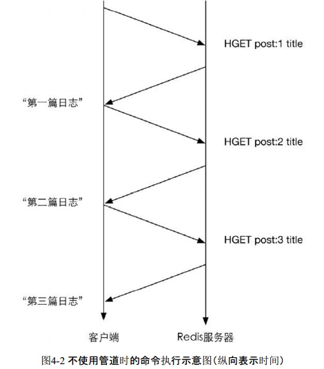
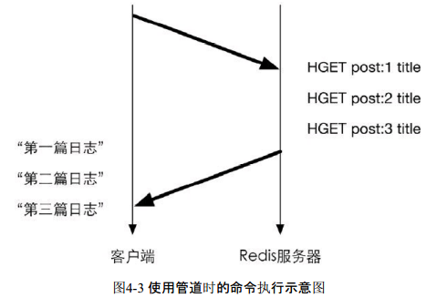

## 管道

### 使用管道的场景

`客户端和Redis使用TCP协议连接`。不论是客户端向Redis发送命令还是Redis向客户端返回命令的执行结果，都需要经过网络传输，这两个部分的总耗时称为`往返时延`。根据网络性能不同，往返时延也不同，大致来说到本地回环地址（loopback address）的往返时延在数量级上相当于Redis处理一条简单命令（如LPUSH list 1 2 3）的时间。`如果执行较多的命令，每个命令的往返时延累加起来对性能还是有一定影响的。`
在执行多个命令时每条命令都需要等待上一条命令执行完（即收到Redis的返回结果）才能执行，即使命令不需要上一条命令的执行结果。如要获得post:1、post:2和post:3这3个键中的title字段，需要执行三条命令:

### 管道的好处以及使用前提

Redis的底层通信协议对管道（pipelining）提供了支持。`通过管道可以一次性发送多条命令并在执行完后一次性将结果返回`，当一组命令中`每条命令都不依赖于之前命令的执行结果时`就可以将这组命令一起通过管道发出。管道通过减少客户端与Redis的通信次数来实现`降低往返时延累计值`的目的，