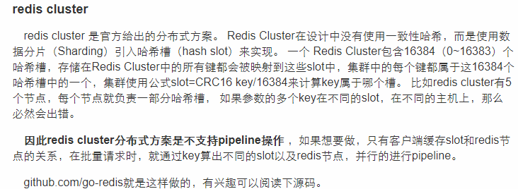

# redis cluster实战

不要听信网上对于Redis-Cluster的毁谤（实践出真知），对于这一点我很赞同，我们从Redis-Cluster beta版 RC1~4 到现在的3.0-release均没有遇到什么大问题（线上维护600个实例）。

redis集群有两种:

一种是redis sentinel，高可用集群，只有一个master+多个slave，master+slave各实例数据保持一致；

一种是redis cluster，分布式集群，同时有多个master，数据分片部署在各个master上。每个master上的数据不同.

3.0版本之前的redis是不支持cluster的，3.0版本之前想要搭建redis集群的话需要中间件来找到存值和取值的对应节点。

# redis集群投票机制

redis集群中有多台redis服务器不可避免会有服务器挂掉。redis集群服务器之间通过互相的ping-pong判断是否节点可以连接上。如果有一半以上的节点去ping一个节点的时候没有回应，集群就认为这个节点宕机了。

# redis集群搭建

我们这里用一台server模拟搭建包含6个redis实例的集群，实际工作中与使用多台服务器搭建是一个操作。

1. 安装redis到usr/local/redis目录下
2. cd usr/local/ && mkdir redis-cluster && cd redis-cluster
3. mkdir redis1 redis2 redis3 redis4 redis5 redis6
4. 把usr/local/redis/redis.conf和redis-server分别复制到6个redis文件夹
5. 把usr/local/redis/redis-cli复制到redis-cluster
6. 修改6个redis.conf,包括port,bind地址改成0.0.0.0,cluster-enabled改为yes.修改daemonize为true,表示后台启动
7. 分别在每个目录下启动 redis实例,例如./redis2/redis-server ./redis.conf,然后通过`ps aux|grep redis`看6个实例是否启动成功.(注意防火墙要打开端口,包括redis以及redis集群的端口)
8. 创建集群: redis-cli --cluster create 公网ip:6379 公网ip:6380 公网ip:6381 公网ip:6382 公网ip:6383 公网ip:6384 --cluster-replicas 1 (注意,地址必须是公网地址,如果是127.0.0.1,就只能本机访问,0.0.0.0也不行)
9. 以上`--cluster-replicas 1`表示创建了3个master,3个slave,
10. 8步必须要执行,因为是创建集群,否则会报: `redis.clients.jedis.exceptions.JedisNoReachableClusterNodeException: No reachable node in cluster`
11. 注意,第8步在redis5.0之前是使用ruby脚本创建redis集群的,5.0之后使用redis-cli替代.
12. 可以使用shell脚本简化上面的过程
13. 注意,如果重新启动集群,是不用上面的`redis-cli --cluster create` 命令的,因为这个命令 是创建集群,而且创建集群的时候,如果实例下面有dump.rdb,就会创建失败,如果之前已经有dump.rdb了,就不能使用`redis-cli --cluster create`了

[http://www.redis.com.cn/topics/cluster-tutorial](http://www.redis.com.cn/topics/cluster-tutorial)

# 测试故障迁移
