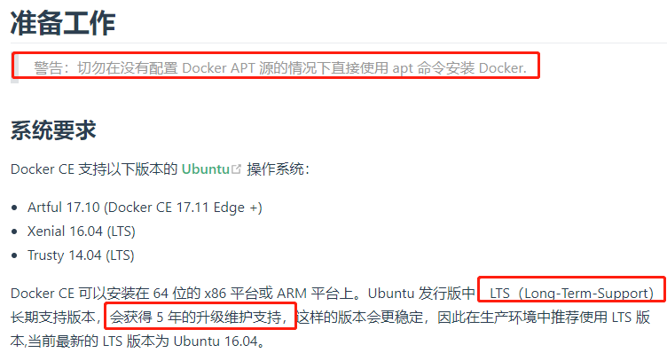
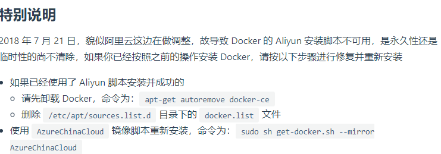

# Ubuntu 安装 Docker



这里,我们只使用使用脚本自动安装,不使用apt-get命令安装,在测试或开发环境中 Docker 官方为了简化安装流程，提供了一套便捷的安装脚本，Ubuntu 系统上可以使用这套脚本安装：

```shell script
# 安装第一步是从官网下载安装脚本
curl -fsSL get.docker.com -o get-docker.sh
# 将docker数据源替换为aliyun的
sudo sh get-docker.sh --mirror Aliyun  
```



```shell script
# 安装完成后，运行下面的命令，验证是否安装成功
$ docker version
# docker version会显示我们安装了2个东西,一个是Server,一个是Client
# 所以docker是以c/s的架构方式运行的.
# 我们后面用的命令,例如docker images就是从client端访问server的方式
# 是通过一种叫docker rest api的 方式请求的.docker images显示的结果是
# server端返回给我们的.
```

# 配置 Docker 镜像加速器


# Docker常用命令

```shell script
# Docker 需要用户具有 sudo 权限，为了避免每次命令都输入sudo，可以把用户加入 Docker 用户组（官方文档）
$ sudo usermod -aG docker $USER

# Docker 是服务器-客户端架构。命令行运行docker命令的时候，需要本机的Docker服务(docker server)启动.
# 启动docker的用法
service docker start

# systemctl 命令的启动docker的用法
systemctl start docker

service docker status
```

[Docker CE 的安装请参考官方文档](https://docs.docker.com/install/linux/docker-ce/centos/)