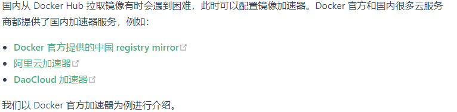
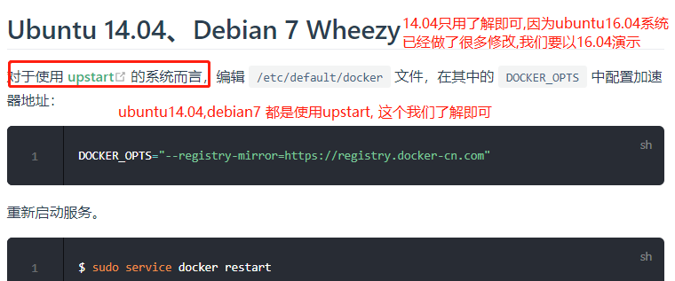
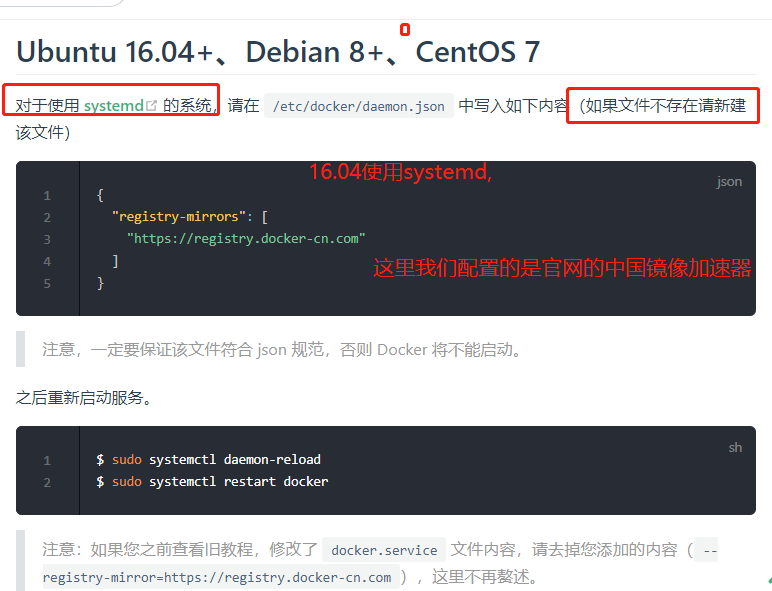
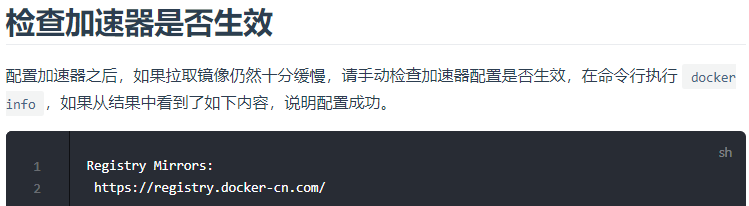
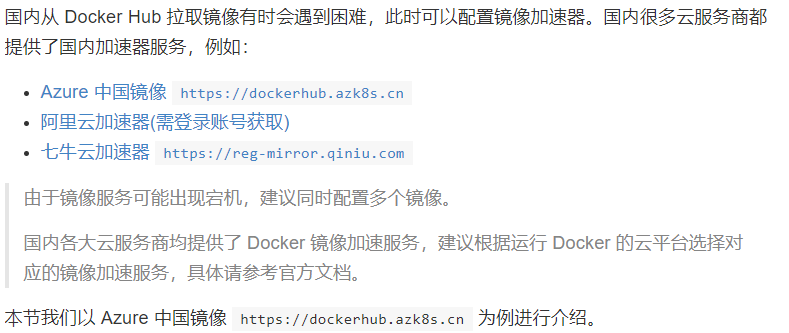
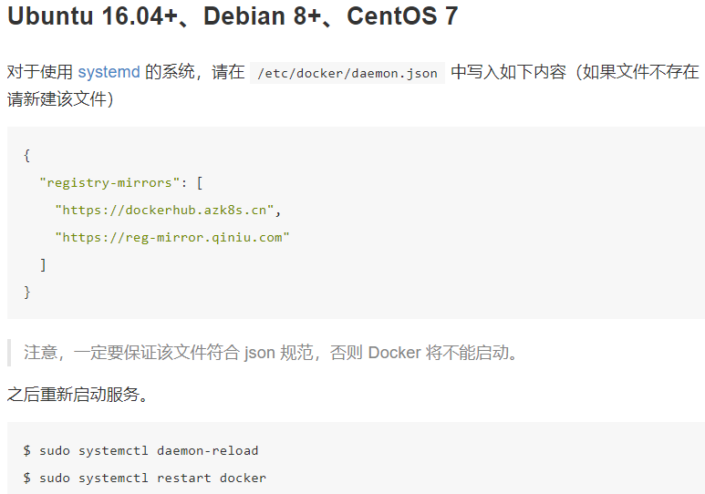
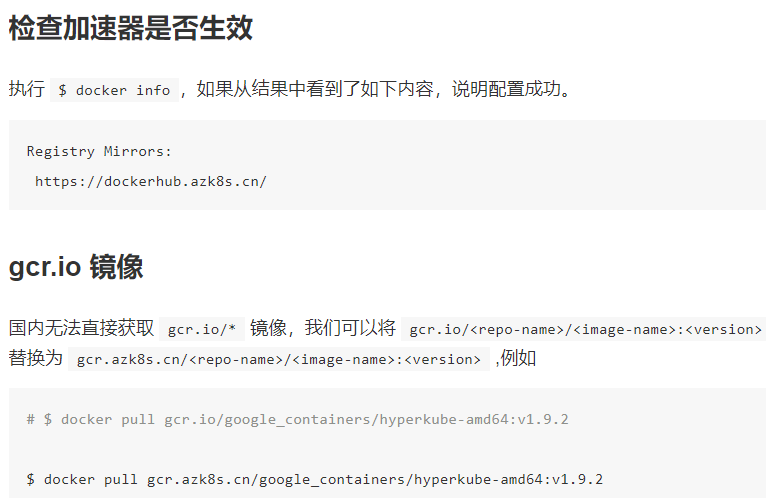

# 配置 Docker 镜像加速器

- [配置镜像加速说明](https://yeasy.gitbooks.io/docker_practice/content/install/mirror.html)









>/etc/docker/daemon.json

```shell
{
  "registry-mirrors": [
    "https://dockerhub.azk8s.cn",
    "https://reg-mirror.qiniu.com",
    "https://registry.docker-cn.com",
    "https://docker.mirrors.ustc.edu.cn"
  ]
}
```

# 配置阿里云docker镜像加速

- [地址](https://cr.console.aliyun.com/cn-hangzhou/instances/mirrors)