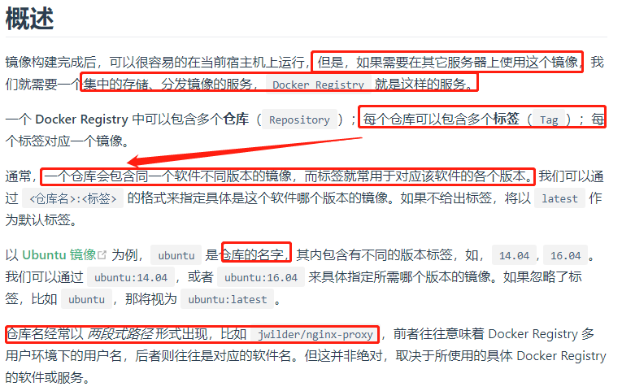
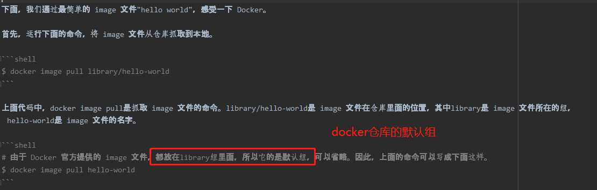
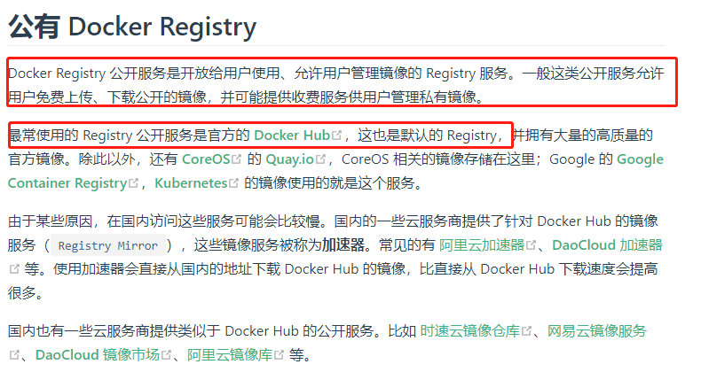
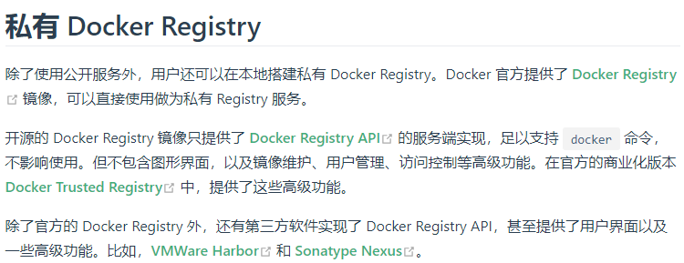

# Docker仓库

>根据是否是官方提供，仓库名可以分为2类:

1. 一种是类似ubuntu这样的镜像，被称为基础镜像或官方镜像。这样的镜像往往使用单个单词作为名字。
2. 还有一种类型，比如 tianon/centos 镜像，它是由 Docker 的用户创建并维护的，往往带有用户名称前缀。可以通过前缀 username/来指定使用某个用户提供的镜像，比如 tianon 用户。

