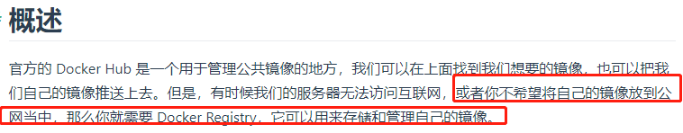
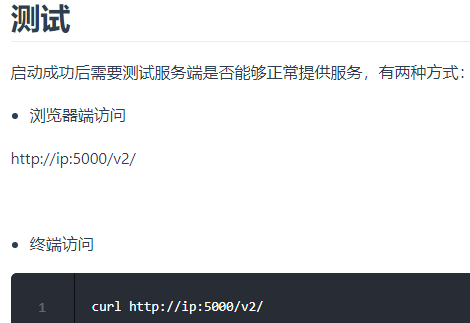
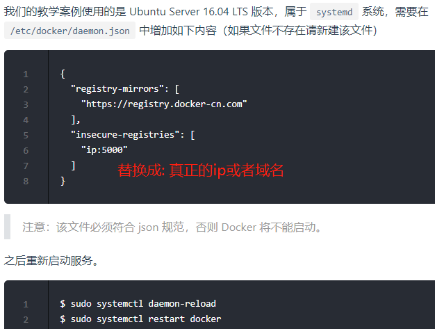
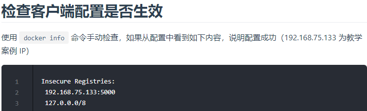
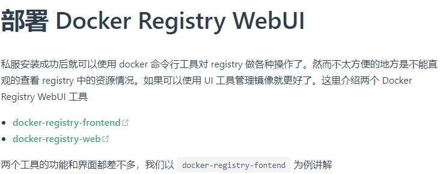

# 安装Docker私服

    作用: 用来存储我们自己的docker镜像.



```shell script
cd /usr/local/docker/ && mkdir registry && cd registry
vim docker-compose.yml
docker-compose up -d
```

```yaml
# docker-compose.yml
version: '3.1'
services:
  registry:
    image: registry
    restart: always
    container_name: registry
    ports:
      - 5000:5000
    volumes:
      - /usr/local/docker/registry/data:/var/lib/registry
```



# 配置Docker Registry客户端





# 测试镜像上传

```shell script
# 注意下要把ip换成真实的ip或者域名
docker pull redis
# 将本地的redis标记为: ip+port/名称:tag,这里tag没有,也就是默认是latest
docker tag redis ip:5000/redis
# 正常情况下去拉去镜像的时候,要的是完整的: ip+port/镜像名称:tag,但是如果我不带 "ip+port/" 前缀的话,默认从官服中央仓库中走
# 现在应该要用我们自己的,所以要说明我们自己的私有的redis镜像的ip+port

# 这个时候我们来push,push 的是完整的镜像名称: ip+port/名称:tag,这里没有tag,默认就是latest的
docker push ip:5000/redis

# 所以我们从官方拉去镜像的时候,默认给我们提供了ip和端口,但实际上一个完整的镜像名称是包含了ip和端口的:ip:port/image_name:tag

# 查看全部镜像或者访问浏览器.
curl -XGET http://ip:5000/v2/_catalog
# 查看指定镜像的列表,这里是查看redis的.
curl -XGET http://ip:5000/v2/redis/tags/list

# 测试拉取镜像(在另一台机器上执行)
# 先删除镜像(在另一台机器上执行)
docker rmi redis
docker rmi ip:5000/redis
# 再拉取镜像(在另一台机器上执行)
docker pull ip:5000/redis

# 我们可以搞一个有版本号(tag)的镜像
docker tag redis ip:5000/redis:8.5.32
# 第二次push就快了,因为docker是分层结构,所以复用了第一次上传的
docker push ip:5000/redis:8.5.32
```

# 部署 Docker Registry WebUI



    docker-registry-frontend

>我们使用 docker-compose 来安装和运行，docker-compose.yml 配置如下：

```yaml
# 可以把这部分归并到上面registry的docker-compose.yml中,因为docker-compose.yml就是管理多个容器服务的.
version: '3.1'
services:
  frontend:
    # konradkleine表示第三方的人上传的,不是官方的,这个代表的是用户名
    # 因为走的是官方的docker hub,所以不必给ip和port,但是你要给一个用户名,也就是konradkleine
    # 其实完整的路径是 "ip+port/用户名/镜像名:tag" 其中如果是个人的,是有用户名的,如果没有用户名,一般就是官方的.
    image: konradkleine/docker-registry-frontend:v2
    ports:
      - 8080:80
    volumes:
      # 这里的点是相对于docker-compose.yml路径的.
      - ./certs/frontend.crt:/etc/apache2/server.crt:ro
      - ./certs/frontend.key:/etc/apache2/server.key:ro
    environment:
      #  docker私有Registry的host
      - ENV_DOCKER_REGISTRY_HOST=127.0.0.1
      # docker私有Registry的端口
      - ENV_DOCKER_REGISTRY_PORT=5000
```

    注意：请将配置文件中的主机和端口换成自己仓库的地址

运行成功后在浏览器访问：http://ip:8080