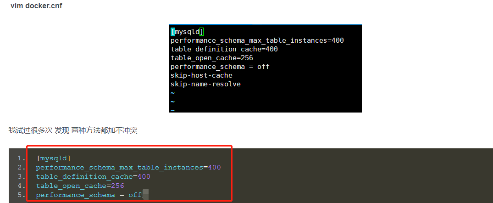

# 安装mysql

```shell
docker search mysql

# 这里我们拉取官方的镜像
docker pull mysql

# 运行容器：
docker run -p 3306:3306 --name mysql \
-v /usr/local/docker/mysql/conf:/etc/mysql \
-v /usr/local/docker/mysql/logs:/var/log/mysql \
-v /usr/local/docker/mysql/data:/var/lib/mysql \
-e MYSQL_ROOT_PASSWORD=123456 \
-d mysql

# 或者使用下面简洁的命令:docker run --name some-mysql -e MYSQL_ROOT_PASSWORD=my-secret-pw -d mysql:tag 

docker run -p 3306:3306 --name blog-mysql \
-e MYSQL_ROOT_PASSWORD=zFO#8mWT4@ \
-d mysql

# 命令参数：

# -p 3306:3306：将容器的3306端口映射到主机的3306端口(-P is telling the container to map port 3306 of your localhost to port 3306 of the container)

# --name: some-mysql is the name you want to assign to your container

# tag is the tag specifying the MySQL version(注意上面的命令省略了tag,意思就是使用latest)

# -v /usr/local/docker/mysql/conf:/etc/mysql：将主机当前目录下的 conf 挂载到容器的 /etc/mysql
#-v /usr/local/docker/mysql/logs:/var/log/mysql：将主机当前目录下的 logs 目录挂载到容器的 /var/log/mysql
#-v /usr/local/docker/mysql/data:/var/lib/mysql：将主机当前目录下的 data 目录挂载到容器的 /var/lib/mysql

#-e MYSQL\_ROOT\_PASSWORD=123456：初始化root用户的密码,-e is creating the environment variable MYSQL_ROOT_PASSWORD and setting it’s value to 123456.

# -d this is telling Docker to run the container in the background.

# 查看容器启动情况
docker ps

#使用客户端工具连接 MySQL

# 拷贝文件
docker cp 1d14196b5876:/etc/mysql/my.cnf /usr/local/docker/
docker cp /usr/local/docker/my.cnf 1d14196b5876:/etc/mysql/my.cnf
```

# 遇到的问题

启动mysql容器的时候,可能会遇到`Error response from daemon: Cannot start container b005715c40ea7d5821b15c44f5b7f902d4b39da7c83468f3e5d7c042e5fe3fbd: iptables failed: iptables --wait -t filter -A DOCKER ! -i docker0 -o docker0 -p tcp -d 172.17.0.43 --dport 80 -j ACCEPT: iptables: No chain/target/match by that name.
 (exit status 1)`的问题,解决方法:

```shell
# 1. Clear all chains:
sudo iptables -t filter -F
sudo iptables -t filter -X

# 2. Then restart Docker Service:
systemctl restart docker
```

# docker mysql内存优化

docker mysql内存占用大概500M,经常自己挂掉,要优化,docker本身并不对内存有过多需求，这也就是为什么人家说比虚拟化要牛逼的原因之一，你要减少内存使用，那就要看你在docker里跑的是什么了，从应用入手.

这个不是 docker 的问题，一个 mysql 运行起来就需要差不多500M内存，如果内存不够就 OOM 退出喽

主要就是修改docker-mysql中的 /etc/mysql/conf.d/docker.cnf或者/etc/mysql/my.cnf



- [docker 安装 MySQL 8，并减少内存占用记录](https://www.bbsmax.com/A/xl56bo415r/)