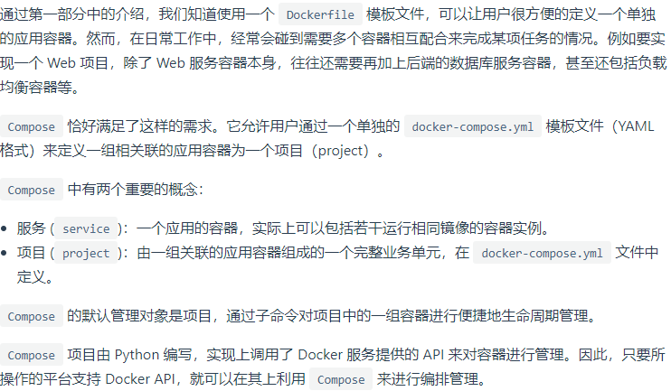

# Docker Compose

学Docker,Compose是必会的.

[Compose](https://docs.docker.com/compose/) 定位是 「定义和运行多个 Docker 容器的应用」



你需要定义一个 YAML 格式的docker-compose.yml，写好多个容器之间的调用关系。然后，只要一个命令，就能同时启动/关闭这些容器

# Docker Compose 的安装

Mac 和 Windows 在安装 docker 的时候，会一起安装 docker compose。[Linux 系统下的安装参考官方文档](https://docs.docker.com/compose/install/#install-compose)

```shell
$ docker-compose version
```

[安装与卸载](https://yeasy.gitbooks.io/docker_practice/compose/install.html)

# Docker Compose 入门

```shell script
cd /usr/local/docker/tomcat && vim docker-compose.yml
```

    简单的先使用docker-compose启动一个tomcat

>注意yml中不要有制表符,不能按table,只能有空格.

```shell script
version: '3' # 这个不是随便写的,是docker-compose配置语言的版本
services: # 多个容器(服务)集合
  tomcat: # 名字随便起,但是要有意义.
    restart: always # 代表总是开机启动
    image: tomcat # 使用哪个image
    container_name: compose-tomcat # 容器名
    ports: # 指定端口映射
      - 8080:8080 # 第一个5000是宿主机端口，第二个是容器port
```

# Docker Compose 常用命令

```shell script
# 注意docker-compose必须在有docker-compose.yml的目录下执行,如果当前目录没有这个yml文件,需要指定文件路径,例如docker-compose -f /usr/local/tomcat/docker-compose.yml up,但是一般不这么玩.

# 在 docker-compose.yml 所在路径下执行命令就会自动构建镜像并使用镜像启动容器:
# 前台运行
docker-compose up

# 启动并后台运行容器
docker-compose up -d

# ps：列出所有运行容器
docker-compose ps

# 守护态运行查看日志输出
docker-compose logs [container-name]

#启动
docker-compose start

#停止
docker-compose stop

#停止并移除容器
docker-compose down
```

# Docker Compose 实战部署项目到容器

```shell script
# MySQL5
version: '3.1'
services:
  tomcat:
    restart: always
    image: tomcat
    container_name: web_container
    ports:
      - 8080:8080
    volumes:
      - /usr/local/docker/tomcat/webapps/test:/usr/local/tomcat/webapps/test # 左边宿主,右边容器
    environment:
      TZ: Asia/Shanghai
  mysql:
    restart: always
    image: mysql:5.7.22
    container_name: mysql_myshop_container
    ports:
      - 3306:3306
    environment:
      TZ: Asia/Shanghai
      MYSQL_ROOT_PASSWORD: 123456
    command:
      --character-set-server=utf8mb4
      --collation-server=utf8mb4_general_ci
      --explicit_defaults_for_timestamp=true
      --lower_case_table_names=1
      --max_allowed_packet=128M # 初始化参数
      --sql-mode="STRICT_TRANS_TABLES,NO_AUTO_CREATE_USER,NO_ENGINE_SUBSTITUTION,NO_ZERO_DATE,NO_ZERO_IN_DATE,ERROR_FOR_DIVISION_BY_ZERO"
    volumes:
      - mysql-data:/var/lib/mysql #  给容器的/var/lib/mysql目录起了一个叫mysql-data的名字,启动后可通过docker volume ls查看到叫mysql-data的volume

volumes: # 数据卷可以单独管理,也可以统一管理,这是2种写法,这里mysql是统一管理,tomcat是单独管理.,这里的volumes是和 services是对齐的.
  mysql-data: # 这里的mysql-data在宿主机的路径是: /var/lib/docker/volumes/myshop_mysql-data/_data下.
```

```shell script
# MySQL8
version: '3.1'
services:
  tomcat:
    restart: always
    image: tomcat
    container_name: tomcat
    ports:
      - 8080:8080
    volumes:
      - /usr/local/docker/tomcat/webapps/test:/usr/local/tomcat/webapps/test
    environment:
      TZ: Asia/Shanghai
  db:
    image: mysql
    restart: always
    environment:
      MYSQL_ROOT_PASSWORD: 123456
    command:
      --default-authentication-plugin=mysql_native_password
      --character-set-server=utf8mb4
      --collation-server=utf8mb4_general_ci
      --explicit_defaults_for_timestamp=true
      --lower_case_table_names=1
    ports:
      - 3306:3306
    volumes:
      - ./data:/var/lib/mysql

  adminer:
    image: adminer
    restart: always
    ports:
      - 8080:8080
```

>注意连接mysql的时候,数据源要正确.

# 参考

[Compose模板文件](https://yeasy.gitbooks.io/docker_practice/compose/compose_file.html)