# 创建Dockerfile

```shell script
# Dockerfile中的每一行表示一层,分层技术的使用.每多加一行,就表示多加一层

# FROM 指定基础镜像, 一个 Dockerfile 中 FROM 是必备的指令，并且必须是第一条指令
FROM tomcat
# 将工作目录换到这个 /usr/local/tomcat/webapps/ROOT/目录,我们进入tomcat容器,默认是在/usr/local/tomcat目录下
# 使用WORKDIR除了可以切换目录,还可以改变进入tomcatr容器的默认目录
# 所以当我们从我们自己的image进入这个容器的时候,会直接进入到这个/usr/local/tomcat/webapps/ROOT/目录
WORKDIR /usr/local/tomcat/webapps/ROOT/
# RUN是用于执行命令行命令的(用shell执行命令)
# 删除ROOT下的没用的内容
RUN rm -rf *
# 创建我们自己的index.html
RUN echo '<h1>Hello, Docker!</h1>' > /usr/local/tomcat/webapps/ROOT/index.html
# 拷贝命令,下面的./index.html是上下文的index.html,不是宿主机下的index.html,是相对于docker server端上下文的文件路径
# COPY ./index.html /usr/local/tomcat/webapps/ROOT/index.html
```

# 构建镜像

```shell script
cd /usr/local/docker/tomcat
# myshop为镜像名称,tag(标签名称)省略了,image没有带tag,意思就是latest
# .表示Dockerfile的所在位置
# 当然这个点还有更重要的意义就是表示上下文路径,
# 也就是build的时候,会把这个路径下的所有的文件打成压缩包,然后通过请求REST api的方式发送给Docker引擎Server端
# (这个过程还带着点这个目录的压缩包),Server端能拿到这个压缩包.解压这个文件后,在服务端的Dockerfile所在目录就是上下文.
docker build -t myshop .
# 注意,重复构建同名镜像的时候(镜像的tag也相同),如果之前的旧镜像没有删除,就会出现虚悬镜像.这个镜像是没有意义的,我们应该将虚悬镜像删除.
# 重复重新构建一个同名,同tag的镜像的时候,新镜像构建成功,旧的镜像就变成虚悬镜像了,所以要删除.
# (或者由于某种原因构建镜像失败了,也可能出现虚悬镜像)
# 查看我们的镜像
docker images
# 指定端口映射启动容器
docker run -p 8080:8080 image-name -d
```

# 镜像构建上下文（Context）

>Docker是服务器客户端模式,我们平时用的docker命令都是在client执行,然后发送给docker引擎(server)来执行,然后server返回给我们执行的结果.上面的我们使用docker build构建docker镜像也是在服务端构建的,只不过要把构建镜像需要的文件从client打包发送到server端.然后在servver端完成构建.这里有一个压缩和解压缩的过程.我们看不到.

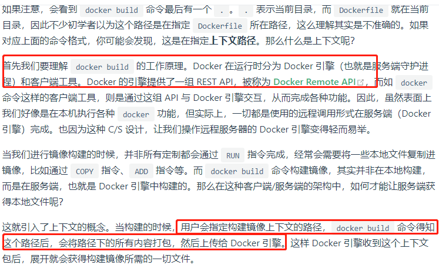
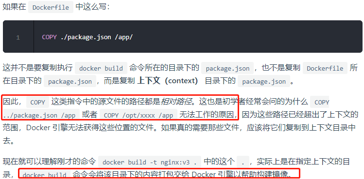
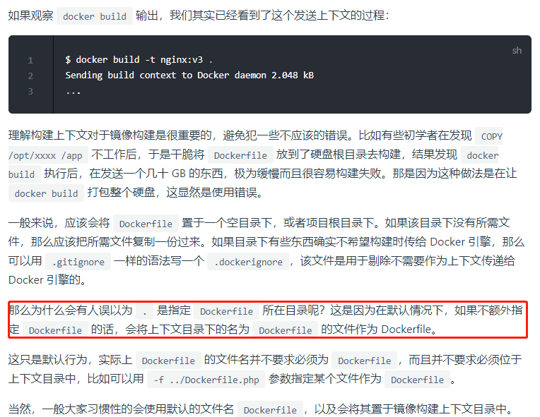

# 部署myshop

```shell script
FROM tomcat
# 切换工作目录(镜像中的目录)
WORKDIR /usr/local/tomcat/webapps/ROOT
# 删除原来ROOT下的所有文件,删除的原因,因为我们zip包的web.xml要覆盖ROOT/WEB-INF/web.xml
# 这个肯定需要和我们人交互,问我们是否要删除,而构建容器的时候无法交互,所以为了避免无法覆盖web.xml,我们提前删除了
RUN rm -rf *
# COPY第一个参数是指 上下文路径下的zip包, 第二个参数指要拷贝到 镜像中的哪个目录下
# 因为上面已经切换到/usr/local/tomcat/webapps/ROOT,所以zip包就拷贝到这个目录下.
COPY my-shop-web-admin-1.0.0-SNAPSHOT.zip .
# 这个RUN会启动一个容器,如果这个Dockerfile构建失败了,会生成一个虚悬镜像
# 但是由于RUN启动了一个容器,导致这个虚悬镜像无法删除,所以要先删除RUN启动的容器,才可以删除虚悬镜像.
RUN unzip my-shop-web-admin-1.0.0-SNAPSHOT.zip

# 解压缩完成后,要删除这个zip
RUN rm -rf my-shop-web-admin-1.0.0-SNAPSHOT.zip
# 切换会默认的tomcat工作目录.
WORKDIR /usr/local/tomcat
```

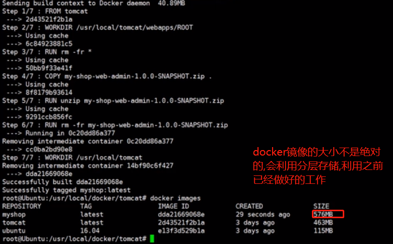

# Dockerfile 指令

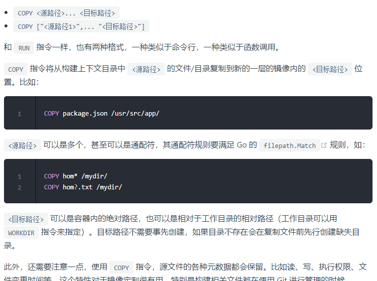

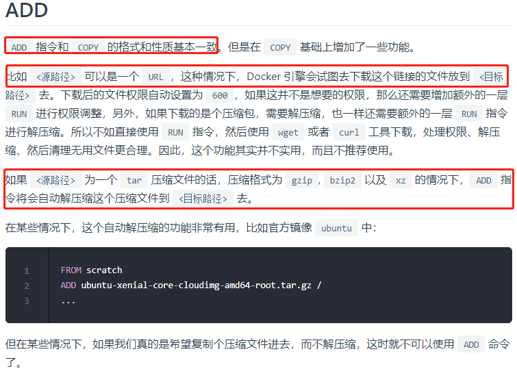
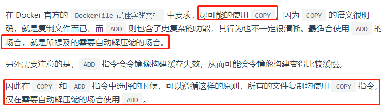

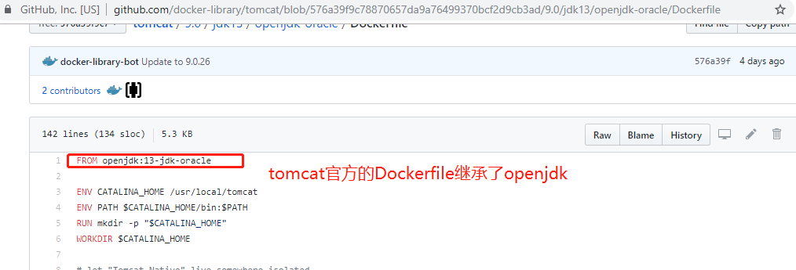
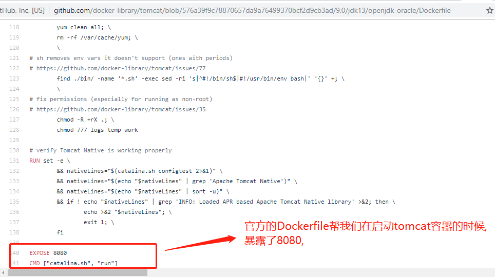

>EXPOSE将容器的端口暴露出来,也就是tomcat容器默认是使用8080端口,CMD指定了容器里面的程序启动的命令.
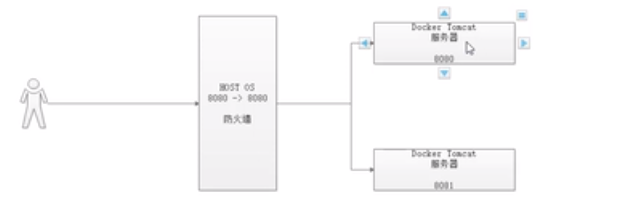

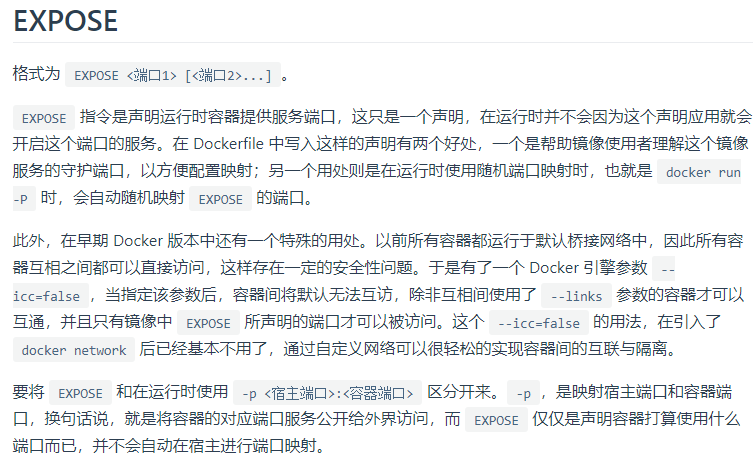

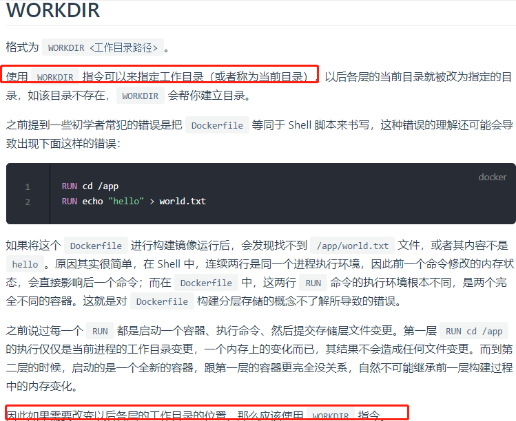

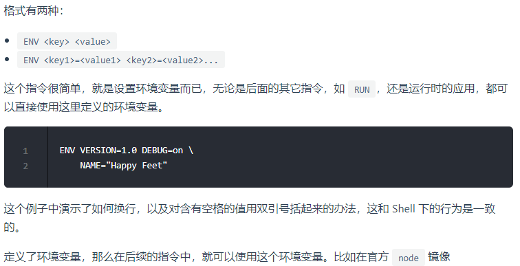